Decontaminating ASVs and samples from the gadid eDNA metabarcoding
dataset
================
Kimberly Ledger
2023-09-22

This script is a modified version of the decontamination pipeline.
Inputs: This code starts with the ASV table output from DADA2 pipeline
in my sequence_filtering.Rmd (eDNA_metabarcoding R project).

Outputs: We will end up with a decontaminated ASV table that can be used
for additional analyses.

Decontamination will involve **5 steps**:

**1. Estimate tag-jumping** - There is the potential for barcodes (that
are used to identify the individual samples in a MiSeq run) to be
assigned to the wrong sample for a variety of reasons. While we can’t
tell exactly which mechanism generated these errors, we can still
estimate the occurrence of tag-jumping and account for it in our
dataset. To do this, we will consider our positive control samples
(which have known composition and are extremely unlikely to be present
in the environmental samples) as representatives of the amount of
tag-jumping occuring across the entire dataset. Specifically, what we
will do is subtract the proportion of reads observed in the control
samples from each environmental sample. The output will be a dataset
with the same number of samples and ASVs as before, but with fewer reads
of certain sequences (ASVs). We expect this bias in tag-jumping to be
frequency-dependent (i.e. the more abundant ASVs are more likely to be
found in samples where they are not suppose to be.)

**2. Account for contaminants in positive and negative controls** - We
can use the reads that show up where we know they shouldn’t be (i.e. the
controls) to further clean up the dataset. We will remove ASVs that only
occur in controls and not in environmental samples. And then we will
subtract the maximum number of reads from ASVs found in either the
extraction or pcr controls from all samples. The output will be a
dataset with the same number of samples as before but with fewer ASVs.

**3. Discard PCR replicates with low numbers of reads** - Sometimes PCR
replicates have low read numbers, and therefore will have skewed
relative read proportions. These should be removed. To do this we will
fit the number of reads assigned to each sample to a normal distribution
and discard those samples with a **97.5%** probability of not fitting in
that distribution. The output will be a dataset with fewer samples and
potentially fewer ASVs.

**4. Hierarchical Occupancy Modeling** - We can use occupancy modeling
to help determine if rare ASVs are real or a PCR artifact. We will
remove the ASVs that probably aren’t real. The output will be a dataset
with the same number of samples as before but with fewer ASVs.

**5. Dissimilarity between PCR (biological) replicates** - PCR
replicates should be similar (this is not the case for biological
replicates because of the many stochastic processes involved in the
sequencing of a sample, but anyways…). This step removes samples for
which the dissimilarity between PCR replicates exceeds the normal
distribution of dissimilarities observed in samples. The objective of
this step is to remove any technical replicates that look like they do
not belong. The output will be a dataset with fewer samples and
potentially fewer ASVs.

# Load libraries and data

load libraries

``` r
library(stringi)
library(rstan)
```

    ## Loading required package: StanHeaders

    ## Loading required package: ggplot2

    ## rstan (Version 2.21.8, GitRev: 2e1f913d3ca3)

    ## For execution on a local, multicore CPU with excess RAM we recommend calling
    ## options(mc.cores = parallel::detectCores()).
    ## To avoid recompilation of unchanged Stan programs, we recommend calling
    ## rstan_options(auto_write = TRUE)

``` r
library(broom)
library(tibble)
library(vegan)
```

    ## Loading required package: permute

    ## Loading required package: lattice

    ## This is vegan 2.6-4

``` r
library(reshape)
library(tidyverse)
```

    ## ── Attaching packages
    ## ───────────────────────────────────────
    ## tidyverse 1.3.2 ──

    ## ✔ tidyr   1.3.0     ✔ dplyr   1.1.2
    ## ✔ readr   2.1.3     ✔ stringr 1.5.0
    ## ✔ purrr   1.0.1     ✔ forcats 0.5.2
    ## ── Conflicts ────────────────────────────────────────── tidyverse_conflicts() ──
    ## ✖ tidyr::expand()  masks reshape::expand()
    ## ✖ tidyr::extract() masks rstan::extract()
    ## ✖ dplyr::filter()  masks stats::filter()
    ## ✖ dplyr::lag()     masks stats::lag()
    ## ✖ dplyr::rename()  masks reshape::rename()

``` r
library(dplyr)
library(readr)
```

load ASV table and metadata

``` r
asv_table <- read.csv("/genetics/edna/workdir/gadids/20230918_aquaria/trimmed/filtered/outputs/ASVtable.csv") %>%
  dplyr::rename(Sample_ID = X)

asv_table$Sample_ID <- as.factor(asv_table$Sample_ID)

metadata <- read.csv("/home/kimberly.ledger/gadid_metabarcoding/gadid_aquariaDBO_metadata.csv")

#illumina output changed "_" to "-"
metadata$Sample_ID <- gsub("_", "-", metadata$Sample_ID) 
```

let’s start by taking a closer looks at our dataset

``` r
## number of ASVs 
sum(grepl("ASV", colnames(asv_table)))  
```

    ## [1] 350

``` r
## number of samples in ASV table 
nrow(asv_table)
```

    ## [1] 520

Before diving into the decontamination steps, let’s get a feel for what
the data look like.

### positive controls

add column to the ASV table that labels the sample type

``` r
asv_table_with_sample_type <- metadata %>%
  filter(MiSeq_run == "A") %>%
  dplyr::select(Sample_ID, sample_type) %>%
  left_join(asv_table, by = "Sample_ID")
```

let’s start by visualizing the reads in the positive control samples

``` r
asv_table_with_sample_type %>%
  pivot_longer(cols = c(3:352), names_to = "ASV", values_to = "reads") %>%
  filter(sample_type == "positive") %>%
  ggplot(aes(x=Sample_ID, y=reads, fill=ASV)) +
  geom_bar(stat = "identity") + 
    theme_bw() +
  labs(
    y = "number of sequencing reads",
    x = "sample ID",
    title = "ASV reads in positive controls") + 
  theme(
    axis.text.x = element_text(angle = 90, hjust = 0.95),
    legend.text = element_text(size = 8),
    legend.key.size = unit(0.3, "cm"),
    legend.position = "none",
    legend.title = element_blank()
  )
```

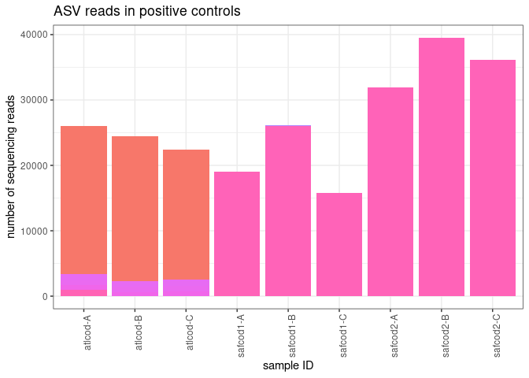<!-- -->

top asvs in positive controls

``` r
asvs_PC <- asv_table_with_sample_type %>%
  pivot_longer(cols = c(3:352), names_to = "ASV", values_to = "reads") %>%
  filter(sample_type == "positive") %>%
  group_by(ASV) %>%
  summarise(total = sum(reads)) %>%
  arrange(desc(total))

head(asvs_PC, 10)
```

    ## # A tibble: 10 × 2
    ##    ASV     total
    ##    <chr>   <int>
    ##  1 ASV7   168412
    ##  2 ASV10   64728
    ##  3 ASV36    2743
    ##  4 ASV38    2403
    ##  5 ASV42    2043
    ##  6 ASV71     989
    ##  7 ASV310     36
    ##  8 ASV6       28
    ##  9 ASV328     25
    ## 10 ASV337     14

### field blanks

let me look into the reads that got into the field blanks

``` r
asv_table_with_sample_type %>%
  pivot_longer(cols = c(3:352), names_to = "ASV", values_to = "reads") %>%
  filter(sample_type == "field_blank") %>%
  ggplot(aes(x=Sample_ID, y=reads, fill=ASV)) +
  geom_bar(stat = "identity") + 
    theme_bw() +
  labs(
    y = "number of sequencing reads",
    x = "sample ID",
    title = "ASV reads in field negatives") + 
  theme(
    axis.text.x = element_text(angle = 90, hjust = 0.95),
    legend.text = element_text(size = 8),
    legend.key.size = unit(0.3, "cm"),
    legend.position = "none",
    legend.title = element_blank()
  )
```

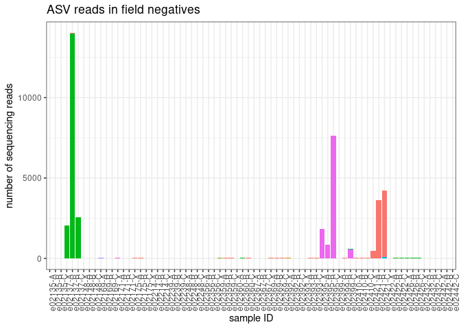<!-- -->

``` r
asvs_FN <- asv_table_with_sample_type %>%
  pivot_longer(cols = c(3:352), names_to = "ASV", values_to = "reads") %>%
  filter(sample_type == "field_blank") %>%
  group_by(ASV) %>%
  summarise(total = sum(reads)) %>%
  arrange(desc(total))

head(asvs_FN, 10)
```

    ## # A tibble: 10 × 2
    ##    ASV    total
    ##    <chr>  <int>
    ##  1 ASV2   18886
    ##  2 ASV4   10895
    ##  3 ASV1    8786
    ##  4 ASV284    77
    ##  5 ASV22     41
    ##  6 ASV5      39
    ##  7 ASV17     36
    ##  8 ASV12     32
    ##  9 ASV321    30
    ## 10 ASV342    12

\*\*note: take a closer look at e02137, e02395, and e02421.

### extraction blanks

let me look into the reads that got into the extraction blanks

``` r
asv_table_with_sample_type %>%
  pivot_longer(cols = c(3:352), names_to = "ASV", values_to = "reads") %>%
  filter(sample_type == "extraction_blank") %>%
  ggplot(aes(x=Sample_ID, y=reads, fill=ASV)) +
  geom_bar(stat = "identity") + 
    theme_bw() +
  labs(
    y = "number of sequencing reads",
    x = "sample ID",
    title = "ASV reads - extraction blanks") + 
  theme(
    axis.text.x = element_text(angle = 90, hjust = 0.95),
    legend.text = element_text(size = 8),
    legend.key.size = unit(0.3, "cm"),
    legend.position = "none",
    legend.title = element_blank()
  )
```

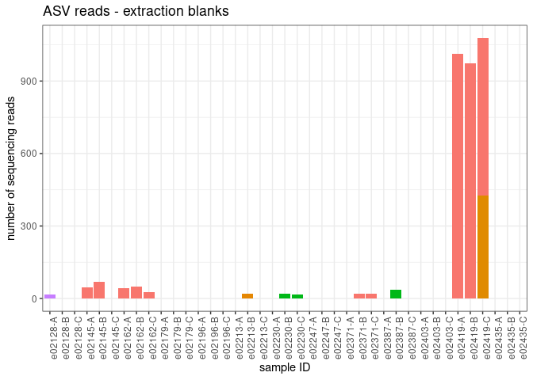<!-- -->

``` r
asvs_EC <- asv_table_with_sample_type %>%
  pivot_longer(cols = c(3:352), names_to = "ASV", values_to = "reads") %>%
  filter(sample_type == "extraction_blank") %>%
  group_by(ASV) %>%
  summarise(total = sum(reads)) %>%
  arrange(desc(total))

head(asvs_EC, 10)
```

    ## # A tibble: 10 × 2
    ##    ASV    total
    ##    <chr>  <int>
    ##  1 ASV1    2912
    ##  2 ASV124   425
    ##  3 ASV2      71
    ##  4 ASV12     20
    ##  5 ASV335    17
    ##  6 ASV10      0
    ##  7 ASV100     0
    ##  8 ASV101     0
    ##  9 ASV102     0
    ## 10 ASV103     0

### pcr blanks

let me look into the reads that got into the pcr blanks

``` r
asv_table_with_sample_type %>%
  pivot_longer(cols = c(3:352), names_to = "ASV", values_to = "reads") %>%
  filter(sample_type == "PCR_blank") %>%
  ggplot(aes(x=Sample_ID, y=reads, fill=ASV)) +
  geom_bar(stat = "identity") + 
    theme_bw() +
  labs(
    y = "number of sequencing reads",
    x = "sample ID",
    title = "ASV reads - pcr negatives") + 
  theme(
    axis.text.x = element_text(angle = 90, hjust = 0.95),
    legend.text = element_text(size = 8),
    legend.key.size = unit(0.3, "cm"),
    legend.position = "none",
    legend.title = element_blank()
  )
```

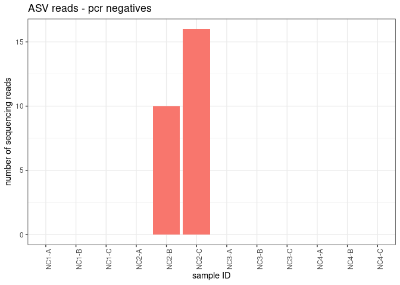<!-- -->

``` r
asvs_PCRN <- asv_table_with_sample_type %>%
  pivot_longer(cols = c(3:352), names_to = "ASV", values_to = "reads") %>%
  filter(sample_type == "PCR_blank") %>%
  group_by(ASV) %>%
  summarise(total = sum(reads)) %>%
  arrange(desc(total))

head(asvs_PCRN, 10)
```

    ## # A tibble: 10 × 2
    ##    ASV    total
    ##    <chr>  <int>
    ##  1 ASV1      26
    ##  2 ASV10      0
    ##  3 ASV100     0
    ##  4 ASV101     0
    ##  5 ASV102     0
    ##  6 ASV103     0
    ##  7 ASV104     0
    ##  8 ASV105     0
    ##  9 ASV106     0
    ## 10 ASV107     0

okay, now how many positive control reads (saffron cod or atlantic cod)
made it into the other samples? -

``` r
saffron_ASV_list <- c("ASV7", "ASV198", "ASV217", "ASV262", "ASV316")
atlantic_ASV_list <- c("ASV10", "ASV36", "ASV38", "ASV42", "ASV71", "ASV95", "ASV138", "ASV169")

x_in_samples <- asv_table_with_sample_type %>%
  pivot_longer(cols = c(3:352), names_to = "ASV", values_to = "reads") %>%
  group_by(Sample_ID) %>%
  mutate(total_reads = sum(reads)) %>%
  filter(ASV %in% atlantic_ASV_list) %>%
  select(!ASV) %>%
  unique() %>%
  mutate(x_reads=sum(reads)) %>%
  select(!reads) %>%
  unique() %>%
  mutate(prop_x = x_reads/total_reads) %>%
  #arrange(desc(prop_sturgeon)) %>%
  group_by(sample_type) %>%
  summarise(max_reads_x = max(x_reads),
            max_prop_x = max(prop_x),
            avg_reads_x = mean(x_reads), 
            avg_prop_x = mean(prop_x))

x_in_samples
```

    ## # A tibble: 5 × 5
    ##   sample_type      max_reads_x max_prop_x avg_reads_x avg_prop_x
    ##   <chr>                  <int>      <dbl>       <dbl>      <dbl>
    ## 1 PCR_blank                  0        NaN          0     NaN    
    ## 2 extraction_blank           0        NaN          0     NaN    
    ## 3 field_blank                0        NaN          0     NaN    
    ## 4 positive               26034          1       8101.      0.333
    ## 5 sample                     0        NaN          0     NaN

only a very small number of saffron reads made it into samples, none in
blanks. no atlantic cod reads in samples or blanks

# 1. Estimate index hopping

subtract the proportion of reads that jumped into the positive control
samples from each environmental sample

identify the maximum proportion of reads for each ASV found in the
positive controls

``` r
prop_asvs_in_positives <- asv_table_with_sample_type %>%
  filter(sample_type == "positive") %>%
  pivot_longer(cols = c(3:352), names_to = "ASV", values_to = "reads") %>%
  group_by(Sample_ID) %>%
  mutate(TotalReadsPerSample = sum(reads)) %>%
  mutate(Prop = reads/TotalReadsPerSample) %>%
  group_by(ASV) %>%
  summarise(max_prop = max(Prop))
```

let’s plot the max proportion of reads for each ASV found in the
positive controls vs the abundance of reads for that ASV (total)

``` r
reads_per_asv <-  asv_table_with_sample_type %>%
  pivot_longer(cols = c(3:352), names_to = "ASV", values_to = "reads") %>%
  group_by(ASV) %>%
  summarise(TotalReadsPerASV = sum(reads))

for_plot <- prop_asvs_in_positives %>%
  left_join(reads_per_asv, by = "ASV") #%>%
  #filter(ASV != "ASV7") %>% ## remove the most abundant asvs from this plot
  #filter(ASV != "ASV10")
  
ggplot(for_plot, aes(x = TotalReadsPerASV, y = max_prop)) + 
  geom_point()
```

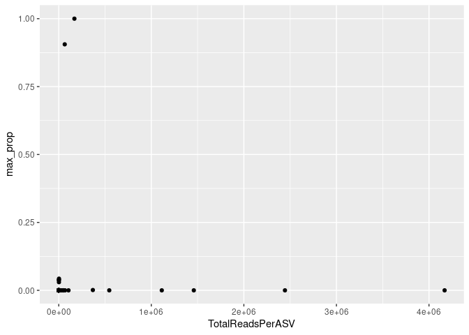<!-- -->

subtract the max proportion of tag-jumped reads for each ASV from all
samples

``` r
indexhop_table <- asv_table_with_sample_type %>%
  pivot_longer(cols = c(3:352), names_to = "ASV", values_to = "reads") %>%
  group_by(Sample_ID) %>%
  mutate(TotalReadsPerSample = sum(reads)) %>%
  left_join(prop_asvs_in_positives, by = "ASV") %>%
  mutate(IndexHoppingReads = TotalReadsPerSample*max_prop) %>%
  mutate(reads_IndexHop_removed = reads - IndexHoppingReads) %>%
  mutate(reads_IndexHop_removed = if_else(reads_IndexHop_removed < 0, 0, reads_IndexHop_removed))
head(indexhop_table)
```

    ## # A tibble: 6 × 8
    ## # Groups:   Sample_ID [1]
    ##   Sample_ID sample_type ASV   reads TotalReadsPerSample max_prop
    ##   <chr>     <chr>       <chr> <int>               <int>    <dbl>
    ## 1 e02112-A  sample      ASV1      0               28441  0      
    ## 2 e02112-A  sample      ASV2  14845               28441  0      
    ## 3 e02112-A  sample      ASV3      0               28441  0      
    ## 4 e02112-A  sample      ASV4   8086               28441  0      
    ## 5 e02112-A  sample      ASV5   5004               28441  0      
    ## 6 e02112-A  sample      ASV6      0               28441  0.00107
    ## # ℹ 2 more variables: IndexHoppingReads <dbl>, reads_IndexHop_removed <dbl>

clean up the table by removing columns no longer needed

``` r
asv_table_filter1 <- indexhop_table %>%
  dplyr::select(Sample_ID, sample_type, ASV, reads_IndexHop_removed) %>%
  dplyr::rename(reads = reads_IndexHop_removed)
```

this is a summary of the number of reads removed by ASV and sample_ID

``` r
decontaminated_1 <- indexhop_table %>%
  dplyr::select(Sample_ID, ASV, IndexHoppingReads) %>%
  pivot_wider(names_from = "ASV", values_from = "IndexHoppingReads")
head(decontaminated_1)
```

    ## # A tibble: 6 × 351
    ## # Groups:   Sample_ID [6]
    ##   Sample_ID  ASV1  ASV2  ASV3  ASV4  ASV5  ASV6  ASV7  ASV8  ASV9  ASV10 ASV11
    ##   <chr>     <dbl> <dbl> <dbl> <dbl> <dbl> <dbl> <dbl> <dbl> <dbl>  <dbl> <dbl>
    ## 1 e02112-A      0     0     0     0     0  30.5 28441     0     0 25756.     0
    ## 2 e02205-A      0     0     0     0     0  28.9 26979     0     0 24432.     0
    ## 3 e02114-A      0     0     0     0     0  24.9 23237     0     0 21044.     0
    ## 4 e02207-A      0     0     0     0     0  26.9 25112     0     0 22742.     0
    ## 5 e02116-A      0     0     0     0     0  32.6 30369     0     0 27502.     0
    ## 6 e02209-A      0     0     0     0     0  27.5 25660     0     0 23238.     0
    ## # ℹ 339 more variables: ASV12 <dbl>, ASV13 <dbl>, ASV14 <dbl>, ASV15 <dbl>,
    ## #   ASV16 <dbl>, ASV17 <dbl>, ASV18 <dbl>, ASV19 <dbl>, ASV20 <dbl>,
    ## #   ASV21 <dbl>, ASV22 <dbl>, ASV23 <dbl>, ASV24 <dbl>, ASV25 <dbl>,
    ## #   ASV26 <dbl>, ASV27 <dbl>, ASV28 <dbl>, ASV29 <dbl>, ASV30 <dbl>,
    ## #   ASV31 <dbl>, ASV32 <dbl>, ASV33 <dbl>, ASV34 <dbl>, ASV35 <dbl>,
    ## #   ASV36 <dbl>, ASV37 <dbl>, ASV38 <dbl>, ASV39 <dbl>, ASV40 <dbl>,
    ## #   ASV41 <dbl>, ASV42 <dbl>, ASV43 <dbl>, ASV44 <dbl>, ASV45 <dbl>, …

and a list of the proportion of reads from ASVs removed

``` r
prop_removed_1 <- prop_asvs_in_positives %>%
  arrange(desc(max_prop))
head(prop_removed_1)
```

    ## # A tibble: 6 × 2
    ##   ASV   max_prop
    ##   <chr>    <dbl>
    ## 1 ASV7    1     
    ## 2 ASV10   0.906 
    ## 3 ASV36   0.0429
    ## 4 ASV38   0.0382
    ## 5 ASV71   0.0379
    ## 6 ASV42   0.0301

okay, just to be clear. subtracting the max proportion of ASVs found in
the positive controls from the environmental samples and negative
controls accounts for tag-jumping. but the subtraction of max proportion
of ASVs found in the positive controls from the positive controls just
gets rid of the reads in PC completely. which i think is okay…

# 2. Account for contaminants in positive and negative controls

next we will remove ASVs that only occur in controls and not in
environmental samples. and then we will subtract the maximum number of
reads from ASVs found in the controls from all samples. i will start by
working with the extraction negatives, pcr negatives, and positive
controls (though there should not really be too many reads left in
positives after step 1).

let’s start by taking a look at what reads remain in these controls

``` r
asv_table_filter1 %>%
  filter(sample_type != "sample") %>%
  filter(sample_type != "field_blank") %>%
  ggplot(aes(x=Sample_ID, y=reads, fill=ASV)) +
  geom_bar(stat = "identity") + 
    theme_bw() +
  labs(
    y = "number of sequencing reads",
    x = "sample ID",
    title = "ASV reads - controls") + 
  theme(
    axis.text.x = element_text(angle = 90, hjust = 0.95),
    legend.text = element_text(size = 8),
    legend.key.size = unit(0.3, "cm"),
    legend.position = "none",
    legend.title = element_blank()
  )
```

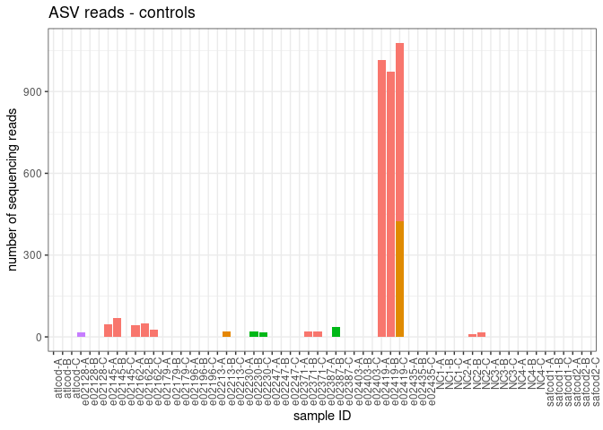<!-- -->

number of reads

``` r
tempA <- asv_table_filter1 %>%
  group_by(ASV, sample_type) %>%
  summarize(TotalReadsPerASV = sum(reads)) %>%
  arrange(ASV)
```

    ## `summarise()` has grouped output by 'ASV'. You can override using the `.groups`
    ## argument.

what ASVs have no reads in samples, but reads in the controls?

``` r
tempB <- tempA %>%
  pivot_wider(names_from = "sample_type", values_from = c("TotalReadsPerASV")) %>%
    filter(sample < 1)
head(tempB)
```

    ## # A tibble: 6 × 6
    ## # Groups:   ASV [6]
    ##   ASV    PCR_blank extraction_blank field_blank positive sample
    ##   <chr>      <dbl>            <dbl>       <dbl>    <dbl>  <dbl>
    ## 1 ASV10          0                0           0        0      0
    ## 2 ASV100         0                0           0        0      0
    ## 3 ASV101         0                0           0        0      0
    ## 4 ASV105         0                0           0        0      0
    ## 5 ASV106         0                0           0        0      0
    ## 6 ASV107         0                0           0        0      0

remove these from the data frame

``` r
asv_table_filter1.5 <- asv_table_filter1 %>%
  filter(!ASV %in% tempB$ASV)
```

calculate the maximum number of reads in an ASV to still show up in an
extraction or PCR control

``` r
reads_to_remove_per_ASV <- asv_table_filter1.5 %>%
  filter(sample_type == "extraction_blank"| sample_type == "PCR_blank") %>%
  group_by(ASV) %>%
  summarize(max_reads = max(reads))

reads_to_remove_per_sample <- asv_table_filter1.5 %>%
  left_join(reads_to_remove_per_ASV, by = "ASV") %>%
  mutate(read_minus_contamination = reads - max_reads) %>%
  mutate(read_minus_contamination = if_else(read_minus_contamination < 0, 0, read_minus_contamination))
```

for MiSeqRun 20230918 - this removes 1014 reads from ASV1, 35 reads from
ASV2, and 20 reads from ASV12,

filter the data frame

``` r
asv_table_filter2 <- reads_to_remove_per_sample %>%
  select(!reads) %>%
  select(!max_reads) %>%
  rename(reads = read_minus_contamination)
```

number of ASVs remaining

``` r
length(unique(asv_table_filter2$ASV)) 
```

    ## [1] 192

# 3. Discard PCR replicates with low numbers of reads

calculate reads per sample

``` r
all_reads <- asv_table_filter2 %>%
  group_by(Sample_ID) %>%
  summarize(ReadsPerSample = sum(reads))
```

visualize

``` r
all_reads$x_reordered <- reorder(all_reads$Sample_ID, -all_reads$ReadsPerSample)

all_reads %>%
  ggplot(aes(x = x_reordered, y = ReadsPerSample)) + 
  geom_bar(stat = "identity")
```

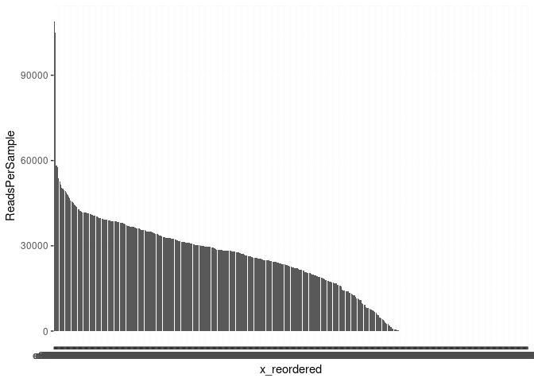<!-- -->

fit a normal distribution

``` r
fit <- MASS::fitdistr(all_reads$ReadsPerSample, "normal")

all_reads %>%  
  mutate(prob = pnorm(all_reads$ReadsPerSample, fit$estimate[[1]], fit$estimate[[2]])) -> all_reads
```

identify and remove the outliers

``` r
low_dist_probability_cutoff <- 0.05
minimum_read_cutoff <- 1000

outliers <- all_reads %>% 
  filter(prob < low_dist_probability_cutoff  | ReadsPerSample < minimum_read_cutoff)
outlierIDs <- outliers$Sample_ID
```

which samples are removed because of the 2.5%/1000 reads threshold??

``` r
replicates_removed_2 <- asv_table_filter2 %>%
  filter(Sample_ID %in% outlierIDs) %>%
  pivot_wider(names_from = "ASV", values_from = "reads")
#head(replicates_removed_2)
```

number of pcr replicates removed

``` r
nrow(replicates_removed_2)
```

    ## [1] 149

plot them

``` r
replicates_removed_2 %>%
  pivot_longer(cols = c(3:194), names_to = "ASV", values_to = "count") %>%
ggplot(aes(x=Sample_ID, y=count, fill=ASV)) +
  geom_bar(stat = "identity") + 
    theme_bw() + 
   labs(
    y = "sequencing reads",
    x = "sample ID",
    title = "samples with low read numbers")  +
  theme(
    axis.text.x = element_text(angle = 90, hjust = 0.95),
    legend.position = "none",
    legend.title = element_blank()
  )  
```

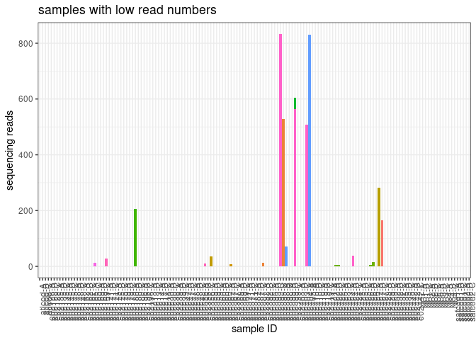<!-- -->

double check that the probability threshold is appropriate. i.e. make
sure no replicates with lots of reads (usually \>2000 are removed)

filter the data frame

``` r
asv_table_filter3 <- asv_table_filter2 %>%
  filter(!Sample_ID %in% outlierIDs)
```

how many environmental samples, control samples did we get rid of here?

``` r
removed_2_summary <- replicates_removed_2 %>%
  group_by(sample_type) %>%
  summarize(removed_2 = n())
removed_2_summary
```

    ## # A tibble: 5 × 2
    ##   sample_type      removed_2
    ##   <chr>                <int>
    ## 1 PCR_blank               12
    ## 2 extraction_blank        39
    ## 3 field_blank             65
    ## 4 positive                 9
    ## 5 sample                  24

did we lose any ASVs during this step?

``` r
length(unique(asv_table_filter3$ASV)) 
```

    ## [1] 192

it may be useful to store a list of the samples removed during
decontamination step 3

``` r
samples_removed_2 <- replicates_removed_2 %>%
  filter(sample_type == "sample") %>%
  select(Sample_ID)
#write.csv(samples_removed_2, "gadid_metabarcoding/20230918_decontamination_step3.csv")
```

# 4. Hierarchical Occupancy Modeling

this is based on work by Ryan Kelly:
<https://github.com/invertdna/OccupancyModeling_Stan/tree/master>

the hierarchical stan model used here:
<https://github.com/zjgold/gruinard_decon/blob/master/gruinard_decontam_script.R>

``` r
##Stan Model
sink("Stan_SOM_hierarchical_with_occuprob.stan")
cat(
  "data{/////////////////////////////////////////////////////////////////////
    int<lower=1> S;    // number of samples (nrow)
    int<lower=1> Species[S];    // index of species, each of which will have a different value for p11 and p10
    int<lower=1> Nspecies;    // number of species, each of which will have a different value for p11 and p10
    int<lower=1> L[S];   // index of locations or species/site combinations, each of which will have a different value psi
    int<lower=1> Nloc;   // number of locations or species/site combinations, each of which will have a different value psi
    int<lower=1> K[S];   // number of replicates per site (ncol)
    int<lower=0> N[S]; // number of detections among these replicates
    int z[S];   // integer flag to help estimate psi parameter
}

parameters{/////////////////////////////////////////////////////////////////////
    real<lower=0,upper=1> psi[Nloc];  //commonness parameter
    real<lower=0,upper=1> p11[Nspecies]; //true positive detection rate
    real<lower=0,upper=1> p10[Nspecies]; //false positive detection rate
}

transformed parameters{/////////////////////////////////////////////////////////////////////
}

model{/////////////////////////////////////////////////////////////////////
  real p[S];
  
    for (i in 1:S){
            z[i] ~ bernoulli(psi[L[i]]);
            p[i] = z[i]*p11[Species[i]] + (1-z[i])*p10[Species[i]];
            N[i] ~ binomial(K[i], p[i]);
    }; 
  
  //priors
  psi ~ beta(2,2); 
  p11 ~ beta(2,2); 
  p10 ~ beta(1,10);
}

generated quantities{
  real<lower=0,upper=1> Occupancy_prob[S];    //after inferring parameters above, now calculate occupancy probability for each observation. Equation from Lahoz-Monfort et al. 2015
  
  for (i in 1:S){
  Occupancy_prob[i]  = (psi[L[i]]*(p11[Species[i]]^N[i])*(1-p11[Species[i]])^(K[i]-N[i])) 
  / ((psi[L[i]]*(p11[Species[i]]^N[i])*(1-p11[Species[i]])^(K[i]-N[i])) 
  + (((1-psi[L[i]])*(p10[Species[i]]^N[i]))*((1-p10[Species[i]])^(K[i]-N[i])))
  );
  }
 }
  
",
fill=TRUE)
```

    ## data{/////////////////////////////////////////////////////////////////////
    ##     int<lower=1> S;    // number of samples (nrow)
    ##     int<lower=1> Species[S];    // index of species, each of which will have a different value for p11 and p10
    ##     int<lower=1> Nspecies;    // number of species, each of which will have a different value for p11 and p10
    ##     int<lower=1> L[S];   // index of locations or species/site combinations, each of which will have a different value psi
    ##     int<lower=1> Nloc;   // number of locations or species/site combinations, each of which will have a different value psi
    ##     int<lower=1> K[S];   // number of replicates per site (ncol)
    ##     int<lower=0> N[S]; // number of detections among these replicates
    ##     int z[S];   // integer flag to help estimate psi parameter
    ## }
    ## 
    ## parameters{/////////////////////////////////////////////////////////////////////
    ##     real<lower=0,upper=1> psi[Nloc];  //commonness parameter
    ##     real<lower=0,upper=1> p11[Nspecies]; //true positive detection rate
    ##     real<lower=0,upper=1> p10[Nspecies]; //false positive detection rate
    ## }
    ## 
    ## transformed parameters{/////////////////////////////////////////////////////////////////////
    ## }
    ## 
    ## model{/////////////////////////////////////////////////////////////////////
    ##   real p[S];
    ##   
    ##     for (i in 1:S){
    ##          z[i] ~ bernoulli(psi[L[i]]);
    ##          p[i] = z[i]*p11[Species[i]] + (1-z[i])*p10[Species[i]];
    ##          N[i] ~ binomial(K[i], p[i]);
    ##  }; 
    ##   
    ##   //priors
    ##   psi ~ beta(2,2); 
    ##   p11 ~ beta(2,2); 
    ##   p10 ~ beta(1,10);
    ## }
    ## 
    ## generated quantities{
    ##   real<lower=0,upper=1> Occupancy_prob[S];    //after inferring parameters above, now calculate occupancy probability for each observation. Equation from Lahoz-Monfort et al. 2015
    ##   
    ##   for (i in 1:S){
    ##   Occupancy_prob[i]  = (psi[L[i]]*(p11[Species[i]]^N[i])*(1-p11[Species[i]])^(K[i]-N[i])) 
    ##   / ((psi[L[i]]*(p11[Species[i]]^N[i])*(1-p11[Species[i]])^(K[i]-N[i])) 
    ##   + (((1-psi[L[i]])*(p10[Species[i]]^N[i]))*((1-p10[Species[i]])^(K[i]-N[i])))
    ##   );
    ##   }
    ##  }
    ## 

``` r
sink()
```

the first step is to format my data for the stan model - i need site
information so will start by getting that from the metadata

note: for the gadid aquaria samples, i will treat each tank as a ‘site’

``` r
sites <- metadata %>%
  filter(MiSeq_run == "A") %>%
  dplyr::select(Sample_ID, extraction_ID, pcr_replicate, alt_ID, tank_ID)

rep_table <- asv_table_filter3 %>%
  left_join(sites, by = "Sample_ID") %>%
  filter(tank_ID != 'NA') %>%            ##remove sample for which we don't have site locations
  arrange(tank_ID)

occu_df <- rep_table %>%
  ungroup() %>%  
  mutate(reads = ifelse(reads > 0, 1, 0)) %>% # change counts to presence/absence
  dplyr::select(ASV, tank_ID, alt_ID, Sample_ID, reads) %>%
  group_by(ASV, tank_ID, alt_ID) %>%
  summarise(K = n(),  #count the number of rows for K 
            N = sum(reads)) %>% #sum the detections (now in reads column) for N 
  dplyr::rename(Site = tank_ID,
         BiologicalRep = alt_ID) %>% ## just renaming so that it matches the naming used in the stan model
  separate(ASV, into = c(NA, "Species"), sep = 3, remove = FALSE)
```

    ## `summarise()` has grouped output by 'ASV', 'tank_ID'. You can override using
    ## the `.groups` argument.

``` r
occu_df$Species <- as.integer(occu_df$Species) #convert ASV to an integer

occu_df <- occu_df %>%
  arrange(Species)
```

**NOTE: i set the alt_ID as the biological replicate!!!**

running the occupancy model on this entire data set will take a VERY
long time, so now I will reduce the data set down to the patterns of
presence (many ASVs/species have identical patterns of presence, aka.
pattern of technical reps)

``` r
pattern.of.replication <- rep_table %>%
  ungroup() %>%  
  mutate(reads = ifelse(reads > 0, 1, 0)) %>% # change counts to presence/absence
 # filter(!grepl("-2-", Sample_ID)) %>%    ## the extraction replicates are messing thing up right now... i need to code this better in the metadata/etc eventually 
  #dplyr::select(location1, biological_replicate, pcr_replicate, ASV, reads) %>%
  dplyr::select(tank_ID, alt_ID, pcr_replicate, ASV, reads) %>%
  pivot_wider(names_from = pcr_replicate, values_from = reads) %>%
  mutate(ndetections = A + B + C) %>%
  group_by(tank_ID, ndetections, ASV) %>%
  summarize(tot = sum(!is.na(ndetections)))
```

    ## `summarise()` has grouped output by 'tank_ID', 'ndetections'. You can override
    ## using the `.groups` argument.

``` r
pattern.of.presense <- pattern.of.replication %>%
  spread(ndetections, tot, fill = 0) %>%
  unite(repetition.level, '0', '1', '2', '3', sep = '.') %>%
  select(!`<NA>`)

#select a representative 
unique.pattern <- pattern.of.presense %>%
  group_by(repetition.level) %>%
  summarise(ASV = head(ASV,1) ,
            Site = head(tank_ID, 1)) %>%
  unite(Site, ASV, col = 'key', sep = '.', remove = F)


#subset my full data frame (occu_df) to just include one representative of each unique detection pattern 
occu_df_subset <- occu_df %>%
  unite(Site, ASV, col = 'key', sep = '.', remove = F) %>%
  filter(key %in% unique.pattern$key) 
```

``` r
temp.df <- occu_df_subset

  #make a new species column to that values are consecutive
  Species <- temp.df$Species
  temp.df$Species_1 <- match(Species, unique(Species))

  #create unique identifier for combinations of site-biologicalrep-ASV; for use in hierarchical modeling
  SDS <- unite(data = temp.df, col = SDS, c("Site", "BiologicalRep", "Species")) %>% pull(SDS)
  temp.df$SiteRepSpecies <- match(SDS, unique(SDS)) #index for unique site-biologicalrep-species combinations
  
  #create unique identifier for combinations of site-ASV; for use in hierarchical modeling
  SS <- unite(data = temp.df, col = SS, c("Site", "Species")) %>% pull(SS)
  temp.df$SiteSpecies <- match(SS, unique(SS)) #index for unique site-species combinations
  
  #####################
  #run Stan model
  #note this will take a while the first time you run a particular model, because it needs to compile from C++
  #####################      
  myHierarchicalModel <- stan(file = "Stan_SOM_hierarchical_with_occuprob.stan", 
                        data = list(
                          S = nrow(temp.df),
                          Species = temp.df$Species_1,
                          Nspecies = length(unique(temp.df$Species_1)),
                          L = temp.df$SiteSpecies,
                          Nloc = length(unique(temp.df$SiteSpecies)),
                          K = temp.df$K,
                          N = temp.df$N,
                          z = ifelse(temp.df$N > 0, 1, 0)
                             ), 
                             chains = 4,   #number of chains
                             iter = 4000   #number of iterations per chain
       )
```

    ## Trying to compile a simple C file

    ## Running /opt/R/devel/lib/R/bin/R CMD SHLIB foo.c
    ## gcc -I"/opt/R/devel/lib/R/include" -DNDEBUG   -I"/home/kimberly.ledger/R/x86_64-pc-linux-gnu-library/4.2/Rcpp/include/"  -I"/home/kimberly.ledger/R/x86_64-pc-linux-gnu-library/4.2/RcppEigen/include/"  -I"/home/kimberly.ledger/R/x86_64-pc-linux-gnu-library/4.2/RcppEigen/include/unsupported"  -I"/home/kimberly.ledger/R/x86_64-pc-linux-gnu-library/4.2/BH/include" -I"/home/kimberly.ledger/R/x86_64-pc-linux-gnu-library/4.2/StanHeaders/include/src/"  -I"/home/kimberly.ledger/R/x86_64-pc-linux-gnu-library/4.2/StanHeaders/include/"  -I"/home/kimberly.ledger/R/x86_64-pc-linux-gnu-library/4.2/RcppParallel/include/"  -I"/home/kimberly.ledger/R/x86_64-pc-linux-gnu-library/4.2/rstan/include" -DEIGEN_NO_DEBUG  -DBOOST_DISABLE_ASSERTS  -DBOOST_PENDING_INTEGER_LOG2_HPP  -DSTAN_THREADS  -DBOOST_NO_AUTO_PTR  -include '/home/kimberly.ledger/R/x86_64-pc-linux-gnu-library/4.2/StanHeaders/include/stan/math/prim/mat/fun/Eigen.hpp'  -D_REENTRANT -DRCPP_PARALLEL_USE_TBB=1   -I/usr/local/include   -fpic  -g -O2  -c foo.c -o foo.o
    ## In file included from /home/kimberly.ledger/R/x86_64-pc-linux-gnu-library/4.2/RcppEigen/include/Eigen/Core:88,
    ##                  from /home/kimberly.ledger/R/x86_64-pc-linux-gnu-library/4.2/RcppEigen/include/Eigen/Dense:1,
    ##                  from /home/kimberly.ledger/R/x86_64-pc-linux-gnu-library/4.2/StanHeaders/include/stan/math/prim/mat/fun/Eigen.hpp:13,
    ##                  from <command-line>:
    ## /home/kimberly.ledger/R/x86_64-pc-linux-gnu-library/4.2/RcppEigen/include/Eigen/src/Core/util/Macros.h:628:1: error: unknown type name ‘namespace’
    ##  namespace Eigen {
    ##  ^~~~~~~~~
    ## /home/kimberly.ledger/R/x86_64-pc-linux-gnu-library/4.2/RcppEigen/include/Eigen/src/Core/util/Macros.h:628:17: error: expected ‘=’, ‘,’, ‘;’, ‘asm’ or ‘__attribute__’ before ‘{’ token
    ##  namespace Eigen {
    ##                  ^
    ## In file included from /home/kimberly.ledger/R/x86_64-pc-linux-gnu-library/4.2/RcppEigen/include/Eigen/Dense:1,
    ##                  from /home/kimberly.ledger/R/x86_64-pc-linux-gnu-library/4.2/StanHeaders/include/stan/math/prim/mat/fun/Eigen.hpp:13,
    ##                  from <command-line>:
    ## /home/kimberly.ledger/R/x86_64-pc-linux-gnu-library/4.2/RcppEigen/include/Eigen/Core:96:10: fatal error: complex: No such file or directory
    ##  #include <complex>
    ##           ^~~~~~~~~
    ## compilation terminated.
    ## make: *** [/opt/R/devel/lib/R/etc/Makeconf:168: foo.o] Error 1
    ## 
    ## SAMPLING FOR MODEL 'Stan_SOM_hierarchical_with_occuprob' NOW (CHAIN 1).
    ## Error in sampler$call_sampler(args_list[[i]]) : 
    ##   Must use algorithm="Fixed_param" for model that has no parameters.
    ## [1] "In addition: Warning message:" "In sink() : no sink to remove"

    ## error occurred during calling the sampler; sampling not done

``` r
  #myHierarchicalStanResults <- tidy(tibble(as.data.frame(myHierarchicalModel)))
  
  #write_rds(myHierarchicalStanResults, "gadid_metabarcoding/20230918_gadid_aquariaDBO/20230918_MiSeqrun_occupancy_output_20230922.rds")
```

``` r
myHierarchicalStanResults <- read_rds("~/gadid_metabarcoding/20230918_gadid_aquariaDBO/20230918_MiSeqrun_occupancy_output_20230922.rds")

  ## occupancy probabilities 
  myHierarchicalStanResults_occu <- myHierarchicalStanResults %>%
    filter(grepl("Occupancy_prob", column)) %>%
    separate(column, into=c("column","SiteRepSpecies"), sep="([\\[\\]])")
```

    ## Warning: Expected 2 pieces. Additional pieces discarded in 71 rows [1, 2, 3, 4, 5, 6, 7,
    ## 8, 9, 10, 11, 12, 13, 14, 15, 16, 17, 18, 19, 20, ...].

``` r
  myHierarchicalStanResults_occu$SiteRepSpecies <- as.numeric(myHierarchicalStanResults_occu$SiteRepSpecies)
  
  occupancy_prob <- temp.df %>% 
    select(ASV, Species, Site, SiteSpecies, SiteRepSpecies) %>%
    left_join(myHierarchicalStanResults_occu, by = "SiteRepSpecies") %>% 
    group_by(ASV, Site, SiteSpecies) %>%
    summarise(max_Occupancy_prob = max(mean))
```

    ## `summarise()` has grouped output by 'ASV', 'Site'. You can override using the
    ## `.groups` argument.

``` r
# join my occupancy probabilities the unique.pattern df and then the pattern of presence... 
occu_with_key <- occupancy_prob %>%
  unite(Site, ASV, col = 'key', sep = '.', remove = F) %>%
  left_join(unique.pattern, by = c('key', 'ASV', 'Site')) 

occu_with_key_to_join <- occu_with_key[, c("repetition.level", "max_Occupancy_prob")]

site.asv_occupancy_probs <- pattern.of.presense %>%
  left_join(occu_with_key_to_join)
```

    ## Joining with `by = join_by(repetition.level)`

``` r
keepers <- site.asv_occupancy_probs %>%
  filter(max_Occupancy_prob >= 0.8) %>%
  unite(tank_ID, ASV, col = 'filter_id', sep = '.', remove = F)
discard <- site.asv_occupancy_probs %>%
  filter(max_Occupancy_prob < 0.8)
```

**do i need to go back and remove the tap water “T” tank_ID samples?**

``` r
asv_table_filter4 <- rep_table %>% 
  unite(tank_ID, ASV, col = 'loc.asv', sep = '.', remove = F) %>%
  filter(loc.asv %in% keepers$filter_id)
```

how many unique ASVs are now in the data set?

``` r
length(unique(asv_table_filter4$ASV)) 
```

    ## [1] 39

# 5. Dissimilarity between PCR (biological) replicates

This step removes samples for which the dissimilarity between PCR
replicates exceeds the normal distribution of dissimilarities observed
in samples. The objective of this step is to remove any technical
replicates that look like they do not belong.

are there any samples that have made it to this point that don’t
actually have any reads?

``` r
asv_table_filter4 %>%
  group_by(Sample_ID) %>%
  summarise(total_reads = sum(reads)) %>%
  arrange(total_reads)
```

    ## # A tibble: 365 × 2
    ##    Sample_ID total_reads
    ##    <chr>           <dbl>
    ##  1 e02165-B            0
    ##  2 e02395-A            0
    ##  3 e02395-C            0
    ##  4 e02421-B            0
    ##  5 e02421-C            0
    ##  6 e02137-A         2029
    ##  7 e02137-C         2518
    ##  8 e02177-C         2706
    ##  9 e02416-A         3424
    ## 10 e02428-A         3577
    ## # ℹ 355 more rows

let’s get rid of samples with no/few reads.

``` r
remove_5 <- c("e02165-B", "e02395-A", "e02395-C", "e02421-B", "e02421-C")

temp_table <- asv_table_filter4 %>%
  filter(!Sample_ID %in% remove_5)
```

instead of filtering by the biological replicates, i need to filter by
the unique extractions. the ‘dist_to_centroid’ function later on doesn’t
like the different number of replicates or that there are so many for a
few.. not sure exactly.

how many pcr replicates does each extraction replicate have?

``` r
temp_table %>%
  group_by(extraction_ID) %>%
  summarise(nrep = n_distinct(Sample_ID)) %>%
  filter(nrep == 2)  # there are zero 
```

    ## # A tibble: 0 × 2
    ## # ℹ 2 variables: extraction_ID <chr>, nrep <int>

``` r
  #filter(nrep == 1) # there are zero
```

good to go.

first, i’ll calculate an eDNA index

``` r
normalized <- temp_table %>%
  group_by(Sample_ID) %>%
  mutate(Tot = sum(reads),
         Prop_reads = reads/Tot) %>%
  dplyr::group_by(ASV) %>%
  mutate(Colmax = max(Prop_reads, na.rm = TRUE),
         Normalized_reads = Prop_reads/Colmax)

#add a new sample id column that also includes the location - will use this for dissimilarity measures
normalized <- normalized %>%
  unite(site_biorep, tank_ID, alt_ID, sep = "_", remove = FALSE) %>%
  unite(new_ID, site_biorep, pcr_replicate, sep = "-", remove = FALSE)
```

``` r
tibble_to_matrix <- function (tb) {
  
  tb %>%
  #normalized %>%
    group_by(new_ID, ASV) %>% 
    summarise(nReads = sum(Normalized_reads)) %>% 
    spread ( key = "ASV", value = "nReads", fill = 0) %>%
    ungroup() -> matrix_1
    samples <- pull (matrix_1, new_ID)
    matrix_1[,-1] -> matrix_1
    data.matrix(matrix_1) -> matrix_1
    dimnames(matrix_1)[[1]] <- samples
    vegdist(matrix_1) -> matrix_1
}
```

``` r
all.distances.full <- tibble_to_matrix(normalized)
```

    ## `summarise()` has grouped output by 'new_ID'. You can override using the
    ## `.groups` argument.

``` r
# Do all samples have a name?
summary(is.na(names(all.distances.full)))
```

    ##    Mode 
    ## logical

make the pairwise distances a long table

``` r
as_tibble(subset(melt(as.matrix(all.distances.full)))) -> all.distances.melted
```

    ## Warning in type.convert.default(X[[i]], ...): 'as.is' should be specified by the
    ## caller; using TRUE

    ## Warning in type.convert.default(X[[i]], ...): 'as.is' should be specified by the
    ## caller; using TRUE

``` r
# Any major screw ups
summary(is.na(all.distances.melted$value))
```

    ##    Mode   FALSE 
    ## logical  129600

``` r
# Now, create a three variables for all distances, they could be PCR replicates, BIOL replicates, or from the same site

all.distances.melted %>%
  separate (X1, into = "Bottle1", sep = "\\-", remove = FALSE) %>%
  separate (Bottle1, into = "Site1", remove = FALSE) %>%
  separate (X2, into ="Bottle2", sep = "\\-", remove = FALSE) %>%
  separate (Bottle2, into = "Site2", remove = FALSE) %>%
  mutate ( #Day.site1 = str_sub(Bottle1, start = 1, end = -2),
           #Day.site2 = str_sub(Bottle2, start = 1, end = -2),
           Distance.type = case_when( Bottle1 == Bottle2 ~ "PCR.replicates",
                                      #Day.site1 == Day.site2 ~ "Biol.replicates",
                                      Site1 == Site2 ~ "Same Site",
                                      TRUE ~ "Different Site"
                                     )) %>%
  dplyr::select(Sample1 = X1, Sample2 = X2 , value , Distance.type) %>%
  filter (Sample1 != Sample2) -> all.distances.to.plot
```

    ## Warning: Expected 1 pieces. Additional pieces discarded in 129600 rows [1, 2, 3, 4, 5,
    ## 6, 7, 8, 9, 10, 11, 12, 13, 14, 15, 16, 17, 18, 19, 20, ...].

    ## Warning: Expected 1 pieces. Additional pieces discarded in 129600 rows [1, 2, 3, 4, 5,
    ## 6, 7, 8, 9, 10, 11, 12, 13, 14, 15, 16, 17, 18, 19, 20, ...].
    ## Expected 1 pieces. Additional pieces discarded in 129600 rows [1, 2, 3, 4, 5,
    ## 6, 7, 8, 9, 10, 11, 12, 13, 14, 15, 16, 17, 18, 19, 20, ...].
    ## Expected 1 pieces. Additional pieces discarded in 129600 rows [1, 2, 3, 4, 5,
    ## 6, 7, 8, 9, 10, 11, 12, 13, 14, 15, 16, 17, 18, 19, 20, ...].

``` r
# Checking all went well

sapply(all.distances.to.plot, function(x) summary(is.na(x)))
```

    ##       Sample1   Sample2   value     Distance.type
    ## Mode  "logical" "logical" "logical" "logical"    
    ## FALSE "129240"  "129240"  "129240"  "129240"

``` r
all.distances.to.plot$Distance.type <- all.distances.to.plot$Distance.type  %>% fct_relevel("PCR.replicates", "Same Site")

ggplot (all.distances.to.plot) +
  geom_histogram (aes (fill = Distance.type, x = value, after_stat(ndensity)), position = "dodge",  alpha = 0.9, bins = 50) +
  facet_wrap( ~ Distance.type) +
  labs (x = "Pairwise dissimilarity", y = "density" ,
        Distance.type = "Distance") +
    guides (fill = "none")
```

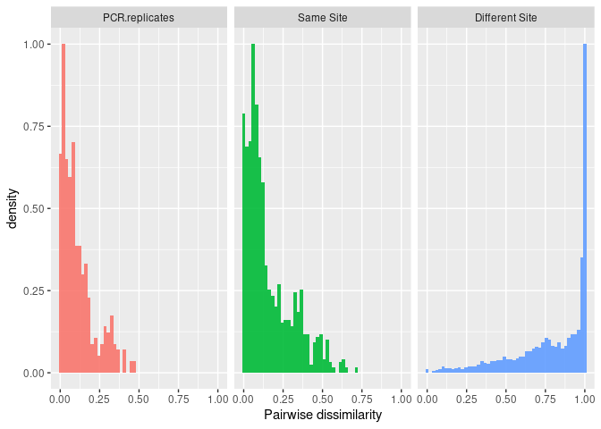<!-- -->

``` r
  #ggsave("visual.anova.png", dpi = "retina")
```

this looks as expected, lowest dissimilarity in pcr reps, then samples
from the same site, then samples from different sites. cool.

next i will follow what was done here:
(<https://github.com/ramongallego/eDNA.and.Ocean.Acidification.Gallego.et.al.2020/blob/master/Scripts/Denoising.all.runs.Rmd>)
and instead of choosing outliers based on the pairwise distances, we can
do a similar thing using the distance to centroid.

now identify and discard outliers

``` r
normalized %>%
  group_by(extraction_ID) %>% nest() -> nested.cleaning 

nested.cleaning %>% 
  mutate(matrix = map(data, tibble_to_matrix)) -> nested.cleaning

nested.cleaning %>% mutate(ncomparisons = map(matrix, length)) -> nested.cleaning
```

``` r
dist_to_centroid <- function (x,y) {
  
  #biol <- rep(y, dim(x)[[1]])
  biol <- rep(y, length(x))
  
  if (length(biol) == 1) {
    output = rep(x[1]/2,2)
    names(output) <- attr(x, "Labels")
  }else{ 
    
  dispersion <- betadisper(x, group = biol)
  output = dispersion$distances
  }
  output
    }
```

``` r
nested.cleaning.temp <- nested.cleaning %>% 
  mutate(distances = map2(matrix, extraction_ID, dist_to_centroid))
```

    ## Warning: There were 2 warnings in `mutate()`.
    ## The first warning was:
    ## ℹ In argument: `distances = map2(matrix, extraction_ID, dist_to_centroid)`.
    ## ℹ In group 15: `extraction_ID = "e02143"`.
    ## Caused by warning in `betadisper()`:
    ## ! some squared distances are negative and changed to zero
    ## ℹ Run `dplyr::last_dplyr_warnings()` to see the 1 remaining warning.

``` r
all_distances <- nested.cleaning.temp %>%
  unnest_longer(distances) %>%
  dplyr::select(extraction_ID, distances_id, distances)

hist(all_distances$distances)
```

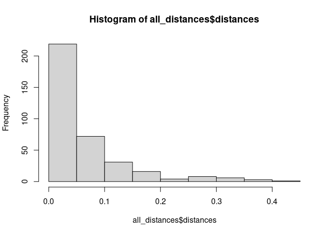<!-- -->

calculate normal distribution of distances to centroid

``` r
normparams <- MASS::fitdistr(all_distances$distances, "normal")$estimate                                      
probs <- pnorm(all_distances$distances, normparams[1], normparams[2])
outliers_centroid <- which(probs>0.99)

discard_centroid <- all_distances$distances_id[outliers_centroid]
discard_centroid
```

    ##  [1] "10_171-B" "10_335-A" "24_124-B" "24_379-C" "32_351-C" "32_313-C"
    ##  [7] "38_247-A" "38_240-A" "7_366-C"  "7_199-C"  "73_127-B" "73_490-B"
    ## [13] "73_77-B"  "79_202-B" "79_281-B" "79_216-B" "86_141-C" "9_320-C" 
    ## [19] "98_314-C"

output the samples that pass this filter

``` r
asv_table_filter5 <- temp_table %>%
  unite(site_biorep, tank_ID, alt_ID, sep = "_", remove = FALSE) %>%
  unite(new_ID, site_biorep, pcr_replicate, sep = "-", remove = FALSE) %>%
  filter(!new_ID %in% discard_centroid)
```

which extraction IDs were removed??

``` r
to_discard <- data.frame(discard_centroid) %>%
  separate(discard_centroid, into = c("tank_ID", "alt_ID", "rep_ID"))

removed_step5 <- temp_table %>%
  filter(alt_ID %in% to_discard$alt_ID)
```

maybe just plot a few.

these samples have at least one dissimilar pcr replicates

``` r
unique(removed_step5$extraction_ID)
```

    ##  [1] "e02436" "e02437" "e02228" "e02231" "e02235" "e02237" "e02430" "e02431"
    ##  [9] "e02197" "e02186" "e02388" "e02389" "e02390" "e02396" "e02397" "e02402"
    ## [17] "e02133" "e02414" "e02218"

``` r
length(unique(removed_step5$extraction_ID))  ## these are just the extraction_ID with at least one PCR rep removed 
```

    ## [1] 19

``` r
first_six <- unique(removed_step5$extraction_ID)[1:6]
first_three <- unique(removed_step5$extraction_ID)[1:3]

removed_step5 %>%
  filter(extraction_ID %in% first_three) %>%
  group_by(Sample_ID) %>%
  mutate(sum=sum(reads)) %>%
  mutate(prop = reads/sum) %>%
  ggplot(aes(x=Sample_ID, y=prop, fill=ASV)) +
  geom_bar(stat = "identity") + 
  facet_wrap(~alt_ID, scales = 'free', ncol = 3) +
  theme_bw() + 
  theme(
    axis.text.x = element_text(angle = 90, hjust = 0.95),
    legend.position = "none",
    legend.title = element_blank()
  )  
```

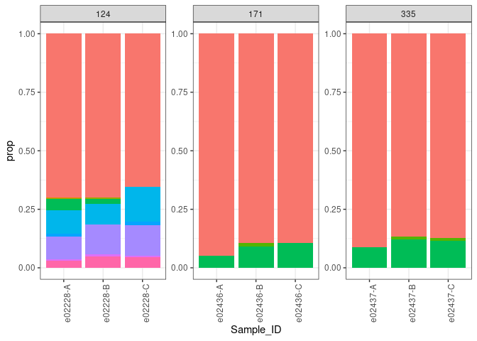<!-- -->

**HOLD ON** according to the pairwise dissimilarity and distance to
centroid calculations, all pcr replicates have \<0.5 dissimilarity…
maybe that means that we can keep them all? because it don’t seem
necessary to toss out the ones plots above…

# Some results of read decontamination

**tank 10**

``` r
asv_table_filter5 %>%
  group_by(Sample_ID) %>%
  mutate(sum=sum(reads)) %>%
  mutate(prop = reads/sum) %>%
  filter(tank_ID == 10) %>%
  ggplot(aes(x=Sample_ID, y=prop, fill=ASV)) +
  geom_bar(stat = "identity") + 
  facet_wrap(~extraction_ID, scales = 'free', ncol = 3) +
  theme_bw() + 
  theme(
    axis.text.x = element_text(angle = 90, hjust = 0.95),
    legend.position = "none",
    legend.title = element_blank()
  )  
```

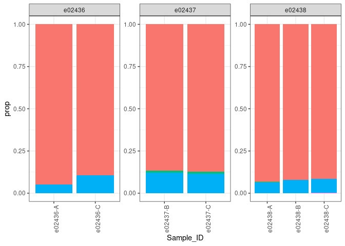<!-- -->

**tank 11**

``` r
asv_table_filter5 %>%
  group_by(Sample_ID) %>%
  mutate(sum=sum(reads)) %>%
  mutate(prop = reads/sum) %>%
  filter(tank_ID == 11) %>%
  ggplot(aes(x=Sample_ID, y=prop, fill=ASV)) +
  geom_bar(stat = "identity") + 
  facet_wrap(~extraction_ID, scales = 'free', ncol = 3) +
  theme_bw() + 
  theme(
    axis.text.x = element_text(angle = 90, hjust = 0.95),
    legend.position = "none",
    legend.title = element_blank()
  )  
```

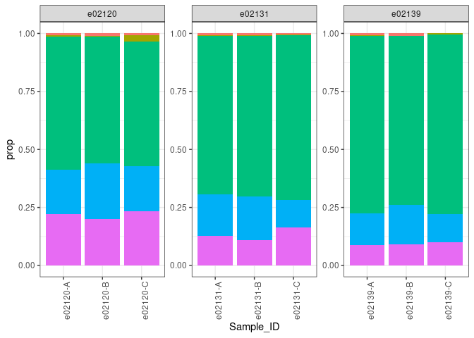<!-- -->

okay, for this dataset I will NOT include decontamintion step 5.

how many ASV’s do we have in our post-decontamination dataset

``` r
length(unique(asv_table_filter4$ASV))
```

    ## [1] 39

save the post-decontamination table

``` r
#write.csv(asv_table_filter4, "gadid_metabarcoding/20230918_decontamination_output_20230922.csv", row.names = FALSE)
```
