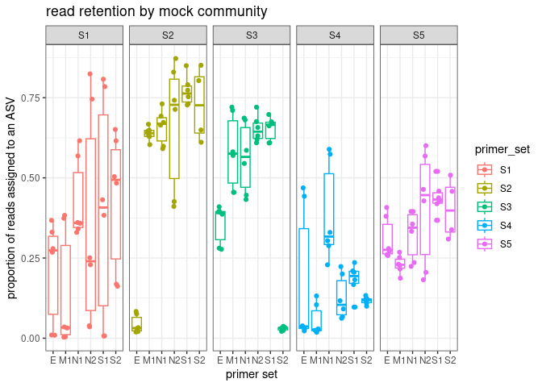

filter tracking
================
Kimberly Ledger
2023-01-18

``` r
library(tidyverse)
```

    ## ── Attaching packages ─────────────────────────────────────── tidyverse 1.3.2 ──
    ## ✔ ggplot2 3.4.0      ✔ purrr   0.3.5 
    ## ✔ tibble  3.1.8      ✔ dplyr   1.0.10
    ## ✔ tidyr   1.2.1      ✔ stringr 1.4.1 
    ## ✔ readr   2.1.3      ✔ forcats 0.5.2 
    ## ── Conflicts ────────────────────────────────────────── tidyverse_conflicts() ──
    ## ✖ dplyr::filter() masks stats::filter()
    ## ✖ dplyr::lag()    masks stats::lag()

### read in dada2 sequence filtering output

``` r
track_S1 <- read.csv("/genetics/edna/workdir/gadids/20230111/S1_ND1_529_789/trimmed/filtered/outputs/track.csv") %>%
  mutate(primer_set = "S1")
track_S2 <- read.csv("/genetics/edna/workdir/gadids/20230111/S2_ND1_651_862/trimmed/filtered/outputs/track.csv") %>%
  mutate(primer_set = "S2")
track_S3 <- read.csv("/genetics/edna/workdir/gadids/20230111/S3_ND5_547_800/trimmed/filtered/outputs/track.csv") %>%
  mutate(primer_set = "S3")
track_S4 <- read.csv("/genetics/edna/workdir/gadids/20230111/S4_COX3_422v1_598/trimmed/filtered/outputs/track.csv") %>%
  mutate(primer_set = "S4")
track_S5 <- read.csv("/genetics/edna/workdir/gadids/20230111/S5_COX3_422v2_598/trimmed/filtered/outputs/track.csv") %>%
  mutate(primer_set = "S5")
```

### read in gadid metadata

``` r
metadata <- read.csv("/genetics/edna/workdir/gadids/20230111/20230111_gadidmetadata.csv")

#illumina output changed "_" to "-"
metadata$SampleID <- gsub("_", "-", metadata$SampleID) 
```

### join to metadata

``` r
track_all <- bind_rows(track_S1, track_S2, track_S3, track_S4, track_S5) %>%
  rename(SampleID = X)

join <- metadata %>%
  filter(primer_set != "S6") %>%
  left_join(track_all, by = c("SampleID", "primer_set"))

join$primer_set <- as.factor(join$primer_set)
join$shortID <- as.factor(join$shortID)
join$replicate <- as.factor(join$replicate)
join$seq_depth <- as.factor(join$seq_depth)

summary(join)
```

    ##    SampleID            shortID   primer_set replicate seq_depth 
    ##  Length:255         B      :35   S1:51      1:90      H   :105  
    ##  Class :character   aquaria:30   S2:51      2:75      L   :105  
    ##  Mode  :character   E      :30   S3:51      3:75      NA's: 45  
    ##                     M1     :30   S4:51      4: 5                
    ##                     N1     :30   S5:51      5: 5                
    ##                     N2     :30              6: 5                
    ##                     (Other):70                                  
    ##      input           filtered        denoisedF        denoisedR     
    ##  Min.   :     0   Min.   :     0   Min.   :     0   Min.   :     0  
    ##  1st Qu.: 17974   1st Qu.: 16774   1st Qu.: 15868   1st Qu.: 15886  
    ##  Median : 25122   Median : 23618   Median : 21912   Median : 21968  
    ##  Mean   : 32763   Mean   : 30738   Mean   : 29757   Mean   : 29659  
    ##  3rd Qu.: 44774   3rd Qu.: 41704   3rd Qu.: 40886   3rd Qu.: 40588  
    ##  Max.   :208137   Max.   :192832   Max.   :189779   Max.   :191515  
    ##                                                                     
    ##      merged       correct_length     nonchim     
    ##  Min.   :     0   Min.   :    0   Min.   :    0  
    ##  1st Qu.:  5984   1st Qu.: 1180   1st Qu.: 1180  
    ##  Median : 12874   Median : 7059   Median : 6948  
    ##  Mean   : 16095   Mean   : 9933   Mean   : 9546  
    ##  3rd Qu.: 22590   3rd Qu.:15225   3rd Qu.:14708  
    ##  Max.   :136720   Max.   :56920   Max.   :56920  
    ## 

### okay, i’ll filter out the non mock community samples and all blanks for this

``` r
mytab <- join %>%
  filter(seq_depth != "NA") %>%
  filter(shortID != "B") %>%
  filter(input > 5) %>%
  mutate(prop_retained = nonchim/input)
```

``` r
mytab %>%
  ggplot(aes(x = primer_set, y = prop_retained, color = primer_set)) +
  geom_boxplot() +
  geom_jitter(position = position_jitter(0.15)) + 
  theme_bw() +
  labs(
    y = "proportion reads assigned to an ASV",
    x = "primer set",
    title = "read retention")
```

<!-- -->

### any mock community specific bias?

``` r
mytab %>%
  ggplot(aes(x = shortID, y = prop_retained, color = primer_set)) +
  geom_boxplot() +
  geom_jitter(position = position_jitter(0.15)) + 
  facet_grid(~primer_set, scales = 'free') + 
  theme_bw() +
  labs(
    y = "proportion of reads assigned to an ASV",
    x = "primer set",
    title = "read retention by mock community")
```

<!-- -->
