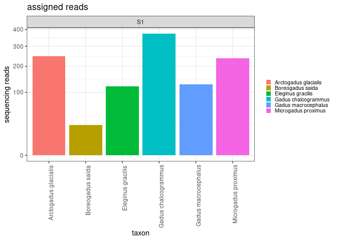
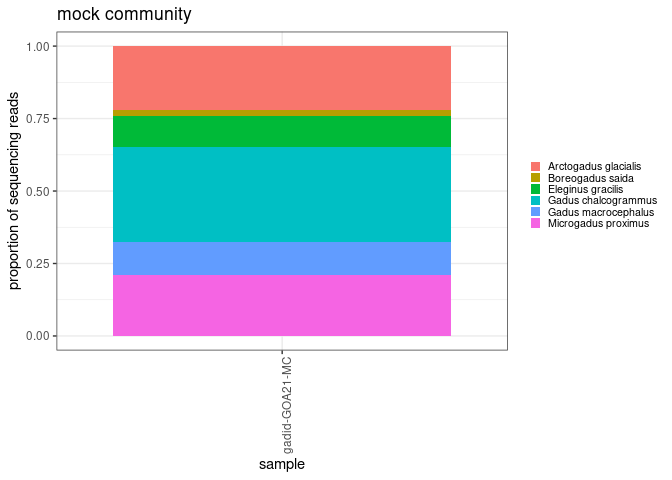
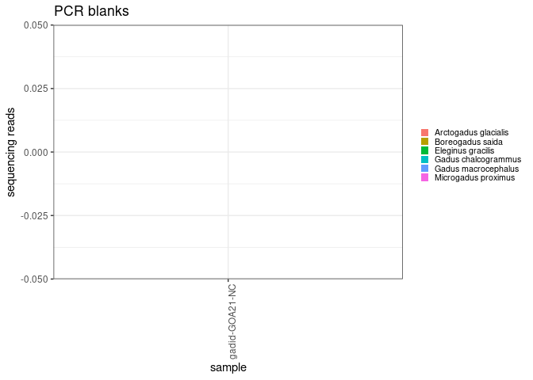
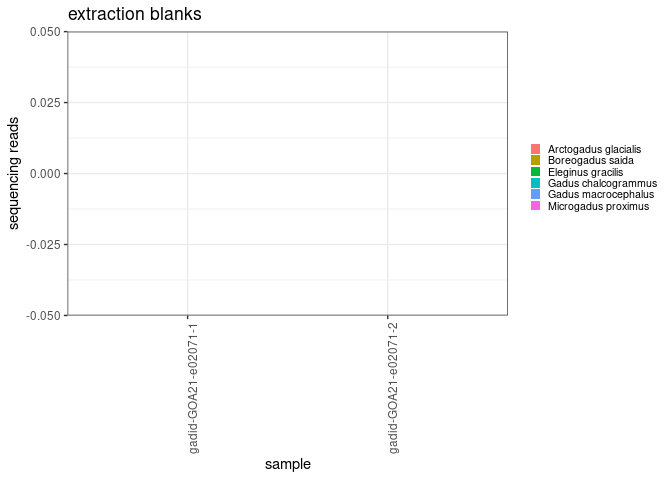
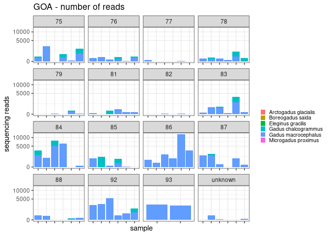
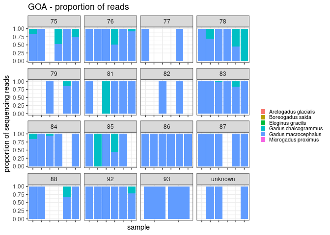

asv analysis
================
Kimberly Ledger
2023-04-06

analysis of gadid sequences from March 13 2023 sequencing run samples
from the Gulf of Alaska

load libraries

``` r
library(tidyverse)
```

    ## ── Attaching packages ─────────────────────────────────────── tidyverse 1.3.2 ──
    ## ✔ ggplot2 3.4.0      ✔ purrr   0.3.5 
    ## ✔ tibble  3.1.8      ✔ dplyr   1.0.10
    ## ✔ tidyr   1.2.1      ✔ stringr 1.4.1 
    ## ✔ readr   2.1.3      ✔ forcats 0.5.2 
    ## ── Conflicts ────────────────────────────────────────── tidyverse_conflicts() ──
    ## ✖ dplyr::filter() masks stats::filter()
    ## ✖ dplyr::lag()    masks stats::lag()

``` r
library(ggplot2)
```

read in gadid metadata

``` r
#20230216 has same sample metadata as the run on 20230221 so i'll just use that 
metadata <- read.csv("/genetics/edna/workdir/gadids/20230313_GOA/20230313_S1_GOA_metadata.csv")

#illumina output changed "_" to "-"
metadata$SampleID <- gsub("_", "-", metadata$SampleID) 
```

read in all primer set’s taxonomic identification tables and samples by
asv tables

``` r
taxon_S1 <- read.csv("/genetics/edna/workdir/gadids/20230313_GOA/trimmed/filtered/outputs/asv_taxonomy_blastn.csv", row.names = 1) 

asv_table_S1 <- read.csv("/genetics/edna/workdir/gadids/20230313_GOA/trimmed/filtered/outputs/ASVtable.csv") %>%
  rename(SampleID = X)
```

look at the number of ASVs for each species by primer set

``` r
asvs1 <- taxon_S1 %>%
  group_by(taxon) %>%
  summarise(S1_ASVs = n())
asvs1
```

    ## # A tibble: 6 × 2
    ##   taxon                S1_ASVs
    ##   <chr>                  <int>
    ## 1 Arctogadus glacialis       1
    ## 2 Boreogadus saida           1
    ## 3 Eleginus gracilis          1
    ## 4 Gadus chalcogrammus        8
    ## 5 Gadus macrocephalus       13
    ## 6 Microgadus proximus        1

now, join taxon and asv tables for each primer set separately

``` r
read_summary_S1 <- asv_table_S1 %>%
  pivot_longer(cols = starts_with("ASV"), names_to = "ASV", values_to = "count") %>%
  left_join(taxon_S1, by = "ASV") %>%
  filter(count > 0) %>%
  filter(taxon != "NA") %>%
  group_by(SampleID, taxon) %>%
  summarise(total_read_count = sum(count)) %>%
  pivot_wider(names_from = "taxon", values_from = "total_read_count") %>%
  replace(is.na(.), 0) %>%
  mutate(primer_set = "S1")
```

    ## `summarise()` has grouped output by 'SampleID'. You can override using the
    ## `.groups` argument.

join to metadata

``` r
join <- metadata %>%
  left_join(read_summary_S1, by = c("SampleID", "primer_set"))

join_long <- join %>%
  pivot_longer(cols = 8:13, names_to = "taxon", values_to = "reads") %>%
  mutate(reads = ifelse(is.na(reads), 0, reads))

join_long$Project<- as.factor(join_long$Project)
join_long$shortID<- as.factor(join_long$shortID)
join_long$primer_set <- as.factor(join_long$primer_set)
join_long$replicate <- as.factor(join_long$replicate)
join_long$taxon <- as.factor(join_long$taxon)
join_long$sample_type <- as.factor(join_long$sample_type)
join_long$pcod_set <- as.factor(join_long$pcod_set)

summary(join_long)
```

    ##    SampleID          Project       shortID    primer_set replicate
    ##  Length:576         GOA21:576          : 12   S1:576     1:300    
    ##  Class :character               e00603 : 12              2:276    
    ##  Mode  :character               e00604 : 12                       
    ##                                 e00605 : 12                       
    ##                                 e00606 : 12                       
    ##                                 e00607 : 12                       
    ##                                 (Other):504                       
    ##            sample_type     pcod_set                    taxon   
    ##  extraction_blank: 12   75     : 36   Arctogadus glacialis:96  
    ##  PCR_blank       :  6   76     : 36   Boreogadus saida    :96  
    ##  positive_control:  6   77     : 36   Eleginus gracilis   :96  
    ##  sample          :552   78     : 36   Gadus chalcogrammus :96  
    ##                         79     : 36   Gadus macrocephalus :96  
    ##                         (Other):372   Microgadus proximus :96  
    ##                         NA's   : 24                            
    ##      reads        
    ##  Min.   :    0.0  
    ##  1st Qu.:    0.0  
    ##  Median :    0.0  
    ##  Mean   :  119.9  
    ##  3rd Qu.:    0.0  
    ##  Max.   :12219.0  
    ## 

# now let’s check out data!

## take a look at the gblock mock communities used as the positive control

make some general plots for read counts

``` r
join_long %>%
  filter(sample_type == "positive_control") %>%
  ggplot(aes(x= taxon, y = reads, fill = taxon)) +
  geom_bar(stat = "identity") + 
  scale_y_sqrt() +
  facet_grid(~primer_set, scales = 'free') + 
  theme_bw() +
  labs(
    y = "sequencing reads",
    x = "taxon",
    title = "assigned reads") + 
  theme(
    axis.text.x = element_text(angle = 90, hjust = 0.95),
    legend.text = element_text(size = 8),
    legend.key.size = unit(0.3, "cm"),
    legend.position = "right",
    legend.title = element_blank()
  )
```

<!-- -->

``` r
join_long %>%
  filter(sample_type == "positive_control") %>% 
  group_by(SampleID) %>%
  mutate(sum=sum(reads)) %>%
  mutate(prop = reads/sum) %>%
  ggplot(aes(x=SampleID, y=prop, fill=taxon)) +
  geom_bar(stat = "identity") + 
    theme_bw() +
  labs(
    y = "proportion of sequencing reads",
    x = "sample",
    title = "mock community") + 
  theme(
    axis.text.x = element_text(angle = 90, hjust = 0.95),
    legend.text = element_text(size = 8),
    legend.key.size = unit(0.3, "cm"),
    legend.position = "right",
    legend.title = element_blank()
  )
```

<!-- -->

all six species should be in equal proportions…

## any sequences in PCR blanks?

``` r
join_long %>% 
  filter(sample_type == "PCR_blank") %>%
  ggplot(aes(x=SampleID, y=reads, fill=taxon)) +
  geom_bar(stat = "identity") + 
  theme_bw() +
  labs(
    y = "sequencing reads",
    x = "sample",
    title = "PCR blanks") + 
  theme(
    axis.text.x = element_text(angle = 90, hjust = 0.95),
    legend.text = element_text(size = 8),
    legend.key.size = unit(0.3, "cm"),
    legend.position = "right",
    legend.title = element_blank()
  )
```

<!-- -->

cool. no reads in PCR negative controls.

## any sequences in extraction blanks?

``` r
join_long %>% 
  filter(sample_type == "extraction_blank") %>%
  ggplot(aes(x=SampleID, y=reads, fill=taxon)) +
  geom_bar(stat = "identity") + 
  theme_bw() +
  labs(
    y = "sequencing reads",
    x = "sample",
    title = "extraction blanks") + 
  theme(
    axis.text.x = element_text(angle = 90, hjust = 0.95),
    legend.text = element_text(size = 8),
    legend.key.size = unit(0.3, "cm"),
    legend.position = "right",
    legend.title = element_blank()
  )
```

<!-- -->

cool. no reads in extraction negative controls.

## now let’s take a look at reads from the field samples

``` r
join_long %>% 
  filter(sample_type == "sample") %>%
  ggplot(aes(x=SampleID, y=reads, fill=taxon)) +
  geom_bar(stat = "identity") + 
  facet_wrap(~pcod_set, scales = 'free_x') +
  scale_y_sqrt() +
  theme_bw() +
  labs(
    y = "sequencing reads",
    x = "sample",
    title = "GOA - number of reads") + 
  theme(
    axis.text.x=element_blank(), #remove x axis labels
    legend.text = element_text(size = 8),
    legend.key.size = unit(0.3, "cm"),
    legend.position = "right",
    legend.title = element_blank(),
  )
```

<!-- -->

``` r
join_long %>% 
  filter(sample_type == "sample") %>%
  group_by(SampleID) %>%
  mutate(sum=sum(reads)) %>%
  mutate(prop = reads/sum) %>%
  ggplot(aes(x=SampleID, y=prop, fill=taxon)) +
  geom_bar(stat = "identity") + 
  facet_wrap(~pcod_set, scales = 'free_x') + 
  theme_bw() +
  labs(
    y = "proportion of sequencing reads",
    x = "sample",
    title = "GOA - proportion of reads") + 
  theme(
    axis.text.x = element_blank(),
    legend.text = element_text(size = 8),
    legend.key.size = unit(0.3, "cm"),
    legend.position = "right",
    legend.title = element_blank()
  )
```

    ## Warning: Removed 126 rows containing missing values (`position_stack()`).

<!-- -->

``` r
goa_prop <- join_long %>% 
  filter(sample_type == "sample") %>%
  group_by(SampleID) %>%
  mutate(sum=sum(reads)) %>%
  mutate(prop = reads/sum) %>%
  arrange(SampleID)
```

to do: find a way to compare how similar/dissimilar the sample
replicates are

to do: compare to gadid catch data from beach seine hauls
