asv analysis
================
Kimberly Ledger
2023-01-16

load libraries

``` r
library(tidyverse)
```

    ## ── Attaching packages ─────────────────────────────────────── tidyverse 1.3.2 ──
    ## ✔ ggplot2 3.4.0      ✔ purrr   0.3.5 
    ## ✔ tibble  3.1.8      ✔ dplyr   1.0.10
    ## ✔ tidyr   1.2.1      ✔ stringr 1.4.1 
    ## ✔ readr   2.1.3      ✔ forcats 0.5.2 
    ## ── Conflicts ────────────────────────────────────────── tidyverse_conflicts() ──
    ## ✖ dplyr::filter() masks stats::filter()
    ## ✖ dplyr::lag()    masks stats::lag()

``` r
library(ggplot2)
```

read in gadid metadata

``` r
metadata <- read.csv("/genetics/edna/workdir/gadids/20230111/20230111_gadidmetadata.csv")

#illumina output changed "_" to "-"
metadata$SampleID <- gsub("_", "-", metadata$SampleID) 
```

read in all primer set’s taxonomic identification tables and samples by
asv tables

``` r
taxon_S1 <- read.csv("/genetics/edna/workdir/gadids/20230111/S1_ND1_529_789/trimmed/filtered/outputs/asv_taxonomy_blastn.csv", row.names = 1) 
taxon_S2 <- read.csv("/genetics/edna/workdir/gadids/20230111/S2_ND1_651_862/trimmed/filtered/outputs/asv_taxonomy_blastn.csv", row.names = 1) 
taxon_S3 <- read.csv("/genetics/edna/workdir/gadids/20230111/S3_ND5_547_800/trimmed/filtered/outputs/asv_taxonomy_blastn.csv", row.names = 1) 
taxon_S4 <- read.csv("/genetics/edna/workdir/gadids/20230111/S4_COX3_422v1_598/trimmed/filtered/outputs/asv_taxonomy_blastn.csv", row.names = 1) 
taxon_S5 <- read.csv("/genetics/edna/workdir/gadids/20230111/S5_COX3_422v2_598/trimmed/filtered/outputs/asv_taxonomy_blastn.csv", row.names = 1) 

asv_table_S1 <- read.csv("/genetics/edna/workdir/gadids/20230111/S1_ND1_529_789/trimmed/filtered/outputs/ASVtable.csv") %>%
  rename(SampleID = X)
asv_table_S2 <- read.csv("/genetics/edna/workdir/gadids/20230111/S2_ND1_651_862/trimmed/filtered/outputs/ASVtable.csv") %>%
  rename(SampleID = X)
asv_table_S3 <- read.csv("/genetics/edna/workdir/gadids/20230111/S3_ND5_547_800/trimmed/filtered/outputs/ASVtable.csv") %>%
  rename(SampleID = X)
asv_table_S4 <- read.csv("/genetics/edna/workdir/gadids/20230111/S4_COX3_422v1_598/trimmed/filtered/outputs/ASVtable.csv") %>%
  rename(SampleID = X)
asv_table_S5 <- read.csv("/genetics/edna/workdir/gadids/20230111/S5_COX3_422v2_598/trimmed/filtered/outputs/ASVtable.csv") %>%
  rename(SampleID = X)
```

look at the number of ASVs for each species by primer set

``` r
asvs1 <- taxon_S1 %>%
  group_by(taxon) %>%
  summarise(S1_ASVs = n())
asvs2 <- taxon_S2 %>%
  group_by(taxon) %>%
  summarise(S2_ASVs = n())
asvs3 <- taxon_S3 %>%
  group_by(taxon) %>%
  summarise(S3_ASVs = n())
asvs4 <- taxon_S4 %>%
  group_by(taxon) %>%
  summarise(S4_ASVs = n())
asvs5 <- taxon_S5 %>%
  group_by(taxon) %>%
  summarise(S5_ASVs = n())

merge(asvs1,asvs2) %>%
  merge(asvs3) %>%
  merge(asvs4) %>%
  merge(asvs5)
```

    ##                  taxon S1_ASVs S2_ASVs S3_ASVs S4_ASVs S5_ASVs
    ## 1 Arctogadus glacialis      38       4      26      30      35
    ## 2     Boreogadus saida      32      40      45      38      40
    ## 3    Eleginus gracilis      24      15      41      20      31
    ## 4  Gadus chalcogrammus      50      56      39      42      57
    ## 5  Gadus macrocephalus      46      28      11      21      38
    ## 6  Microgadus proximus      24      11      16      12       4

quite a bit of variation but not sure how to interpret.

now, join taxon and asv tables for each primer set separately, — come
back and deal with the ASV’s that don’t have taxonomic ID… why?

``` r
read_summary_S1 <- asv_table_S1 %>%
  pivot_longer(cols = starts_with("ASV"), names_to = "ASV", values_to = "count") %>%
  left_join(taxon_S1, by = "ASV") %>%
  filter(count > 0) %>%
  filter(taxon != "NA") %>%
  group_by(SampleID, taxon) %>%
  summarise(total_read_count = sum(count)) %>%
  pivot_wider(names_from = "taxon", values_from = "total_read_count") %>%
  replace(is.na(.), 0) %>%
  mutate(primer_set = "S1")
```

    ## `summarise()` has grouped output by 'SampleID'. You can override using the
    ## `.groups` argument.

``` r
read_summary_S2 <- asv_table_S2 %>%
  pivot_longer(cols = starts_with("ASV"), names_to = "ASV", values_to = "count") %>%
  left_join(taxon_S2, by = "ASV") %>%
  filter(count > 0) %>%
  filter(taxon != "NA") %>%
  group_by(SampleID, taxon) %>%
  summarise(total_read_count = sum(count)) %>%
  pivot_wider(names_from = "taxon", values_from = "total_read_count") %>%
  replace(is.na(.), 0) %>%
  mutate(primer_set = "S2")
```

    ## `summarise()` has grouped output by 'SampleID'. You can override using the
    ## `.groups` argument.

``` r
read_summary_S3 <- asv_table_S3 %>%
  pivot_longer(cols = starts_with("ASV"), names_to = "ASV", values_to = "count") %>%
  left_join(taxon_S3, by = "ASV") %>%
  filter(count > 0) %>%
  filter(taxon != "NA") %>%
  group_by(SampleID, taxon) %>%
  summarise(total_read_count = sum(count)) %>%
  pivot_wider(names_from = "taxon", values_from = "total_read_count") %>%
  replace(is.na(.), 0) %>%
  mutate(primer_set = "S3")
```

    ## `summarise()` has grouped output by 'SampleID'. You can override using the
    ## `.groups` argument.

``` r
read_summary_S4 <- asv_table_S4 %>%
  pivot_longer(cols = starts_with("ASV"), names_to = "ASV", values_to = "count") %>%
  left_join(taxon_S4, by = "ASV") %>%
  filter(count > 0) %>%
  filter(taxon != "NA") %>%
  group_by(SampleID, taxon) %>%
  summarise(total_read_count = sum(count)) %>%
  pivot_wider(names_from = "taxon", values_from = "total_read_count") %>%
  replace(is.na(.), 0) %>%
  mutate(primer_set = "S4")
```

    ## `summarise()` has grouped output by 'SampleID'. You can override using the
    ## `.groups` argument.

``` r
read_summary_S5 <- asv_table_S5 %>%
  pivot_longer(cols = starts_with("ASV"), names_to = "ASV", values_to = "count") %>%
  left_join(taxon_S5, by = "ASV") %>%
  filter(count > 0) %>%
  filter(taxon != "NA") %>%
  group_by(SampleID, taxon) %>%
  summarise(total_read_count = sum(count)) %>%
  pivot_wider(names_from = "taxon", values_from = "total_read_count") %>%
  replace(is.na(.), 0) %>%
  mutate(primer_set = "S5")
```

    ## `summarise()` has grouped output by 'SampleID'. You can override using the
    ## `.groups` argument.

join to metadata

``` r
read_summary_all <- bind_rows(read_summary_S1, read_summary_S2, read_summary_S3, read_summary_S4, read_summary_S5)

join <- metadata %>%
  filter(primer_set != "S6") %>%
  left_join(read_summary_all, by = c("SampleID", "primer_set"))

join_long <- join %>%
  pivot_longer(cols = 6:11, names_to = "taxon", values_to = "reads") %>%
  mutate(reads = ifelse(is.na(reads), 0, reads))

join_long$shortID<- as.factor(join_long$shortID)
join_long$primer_set <- as.factor(join_long$primer_set)
join_long$replicate <- as.factor(join_long$replicate)
join_long$seq_depth <- as.factor(join_long$seq_depth)
join_long$taxon <- as.factor(join_long$taxon)

summary(join_long)
```

    ##    SampleID            shortID    primer_set replicate seq_depth 
    ##  Length:1530        B      :210   S1:306     1:540     H   :630  
    ##  Class :character   aquaria:180   S2:306     2:450     L   :630  
    ##  Mode  :character   E      :180   S3:306     3:450     NA's:270  
    ##                     M1     :180   S4:306     4: 30               
    ##                     N1     :180   S5:306     5: 30               
    ##                     N2     :180              6: 30               
    ##                     (Other):420                                  
    ##                   taxon         reads        
    ##  Arctogadus glacialis:255   Min.   :    0.0  
    ##  Boreogadus saida    :255   1st Qu.:    0.0  
    ##  Eleginus gracilis   :255   Median :  368.5  
    ##  Gadus chalcogrammus :255   Mean   : 1560.3  
    ##  Gadus macrocephalus :255   3rd Qu.: 1698.5  
    ##  Microgadus proximus :255   Max.   :56920.0  
    ## 

make some general plots for read counts - remove non-mock community
samples

``` r
join_long %>%
  filter(seq_depth != "NA") %>%
  ggplot(aes(x= taxon, y = reads, fill = taxon)) +
  geom_bar(stat = "identity") + 
  scale_y_sqrt() +
  facet_grid(~primer_set, scales = 'free') + 
  theme_bw() +
  labs(
    y = "sequencing reads",
    x = "taxon",
    title = "assigned reads") + 
  theme(
    axis.text.x = element_text(angle = 90, hjust = 0.95),
    legend.text = element_text(size = 8),
    legend.key.size = unit(0.3, "cm"),
    legend.position = "right",
    legend.title = element_blank()
  )
```

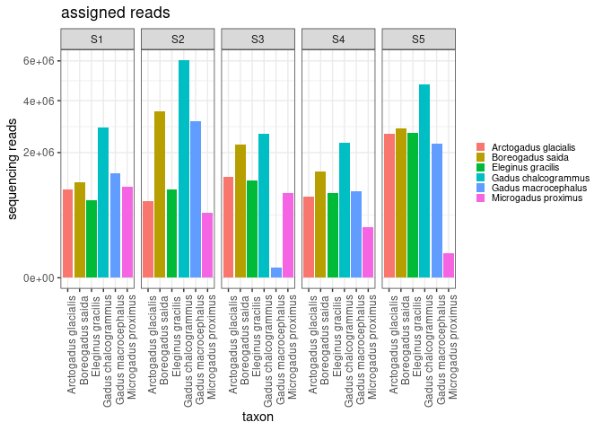<!-- -->

let’s read in metadata for the expected mock communities proportions to
use for comparison

``` r
mockc <- read.csv("/genetics/edna/workdir/gadids/20230111/mockcomm_metadata.csv") %>%
  select(!Common_name) %>%
  select(!DNA_Ratio) %>%
  rename(prop = Perc_Community) %>%
  rename(taxon = Species) %>%
  rename(shortID = Community) %>%
  mutate(SampleID = "expected") %>%
  mutate(primer_set = "expected") %>%
  mutate(replicate = 1) %>%
  mutate(seq_depth = NA)
```

``` r
join_long_prop <-join_long %>%
  group_by(SampleID) %>%
  mutate(sum=sum(reads)) %>%
  mutate(prop = reads/sum) %>%
  select(!reads) %>%
  select(!sum)
```

``` r
join_prop <- rbind(mockc, join_long_prop)
```

to use code from Shelton et al. I need to reformat some of this data i
am using the same col names (expect for changing ID_mifish to ID_gadid)
and adding a column for primer_set

``` r
for_est <- join_long %>% 
  unite(tech_rep, replicate:seq_depth, remove = F) %>%
  filter(seq_depth != "NA") %>% #remove non-mock community samples 
  rename(ID_gadid = taxon) %>%
  rename(community = shortID) %>%
  rename(nReads = reads) %>%
  select(!SampleID) %>%
  select(!replicate) %>%
  select(!seq_depth)

my_mc <- read.csv("/genetics/edna/workdir/gadids/20230111/mockcomm_metadata.csv") %>%
  select(!Common_name) %>%
  select(!Perc_Community) %>%
  rename(ID_gadid = Species) %>%
  rename(community = Community)
  
my_out <- for_est %>%
  left_join(my_mc) %>%
  mutate(start_conc_ng = DNA_Ratio*5*4) %>%
  select(!DNA_Ratio) %>%
  mutate(Cycles = 35)
```

    ## Joining, by = c("community", "ID_gadid")

``` r
write.csv(my_out, "/genetics/edna/workdir/gadids/20230111/gadid_mock_community_data_20220111.csv")
```

## now let’s check out data!

any sequences in PCR blanks?

``` r
join_long %>% 
  filter(seq_depth != "NA") %>%
  filter(shortID == "B") %>%
  ggplot(aes(x=SampleID, y=reads, fill=taxon)) +
  geom_bar(stat = "identity") + 
  scale_y_sqrt() +
  facet_grid(~primer_set, scales = 'free') +
  theme_bw() +
  labs(
    y = "sequencing reads",
    x = "sample",
    title = "PCR blanks") + 
  theme(
    axis.text.x = element_text(angle = 90, hjust = 0.95),
    legend.text = element_text(size = 8),
    legend.key.size = unit(0.3, "cm"),
    legend.position = "right",
    legend.title = element_blank()
  )
```

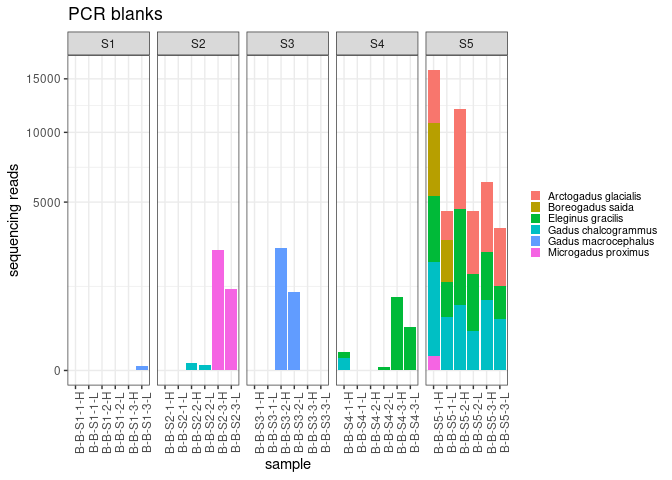<!-- -->

hmm… something went awry with the blanks from primer set 5.

## now let’s take a look at reads from the mock communities

### even

- each species should be \~16.6%

``` r
join_long %>% 
  filter(shortID == "E") %>%
  ggplot(aes(x=SampleID, y=reads, fill=taxon)) +
  geom_bar(stat = "identity") + 
  #scale_y_sqrt() +
  facet_grid(~primer_set, scales = 'free') +
  theme_bw() +
  labs(
    y = "sequencing reads",
    x = "sample",
    title = "Even - number of reads") + 
  theme(
    axis.text.x = element_text(angle = 90, hjust = 0.95),
    legend.text = element_text(size = 8),
    legend.key.size = unit(0.3, "cm"),
    legend.position = "right",
    legend.title = element_blank()
  )
```

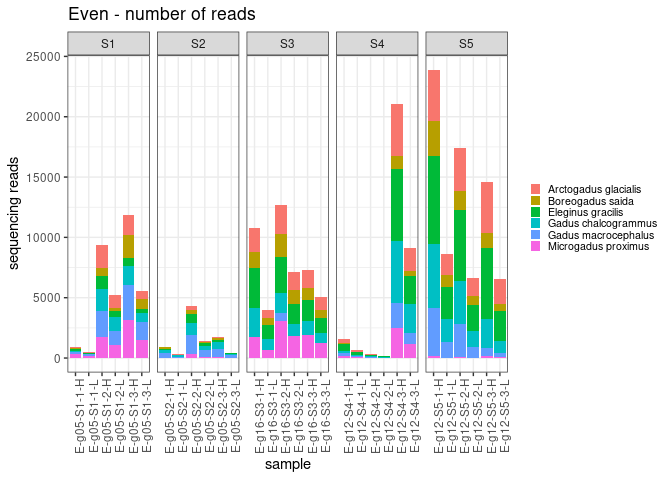<!-- -->

``` r
join_prop %>% 
  filter(shortID == "E") %>%
  ggplot(aes(x=SampleID, y=prop, fill=taxon)) +
  geom_bar(stat = "identity") + 
  facet_grid(~primer_set, scales = 'free') +
  theme_bw() +
  labs(
    y = "proportion of sequencing reads",
    x = "sample",
    title = "Even - proportion of reads") + 
  theme(
    axis.text.x = element_text(angle = 90, hjust = 0.95),
    legend.text = element_text(size = 8),
    legend.key.size = unit(0.3, "cm"),
    legend.position = "right",
    legend.title = element_blank()
  )
```

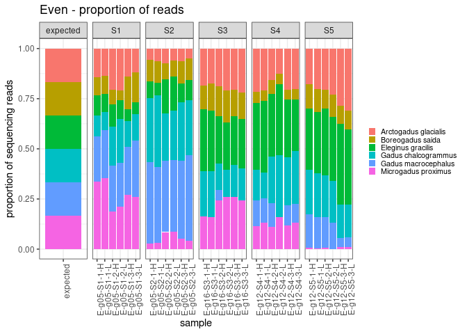<!-- -->

### north1

- A.glacilis (polar cod) = 25%
- B. saida (arctic cod) = 50%
- E. gracilis (saffron cod) = 5%
- G. chalcogrammus (Walleye pollock) = 10%
- G. macrocephalus (Pacific cod) = 5%
- M. proximus (tomcod) = 5%

``` r
join_long %>% 
  filter(shortID == "N1") %>%
  ggplot(aes(x=SampleID, y=reads, fill=taxon)) +
  geom_bar(stat = "identity") + 
  #scale_y_sqrt() +
  facet_grid(~primer_set, scales = 'free') +
  theme_bw() +
  labs(
    y = "sequencing reads",
    x = "sample",
    title = "North1 - number of reads") + 
  theme(
    axis.text.x = element_text(angle = 90, hjust = 0.95),
    legend.text = element_text(size = 8),
    legend.key.size = unit(0.3, "cm"),
    legend.position = "right",
    legend.title = element_blank()
  )
```

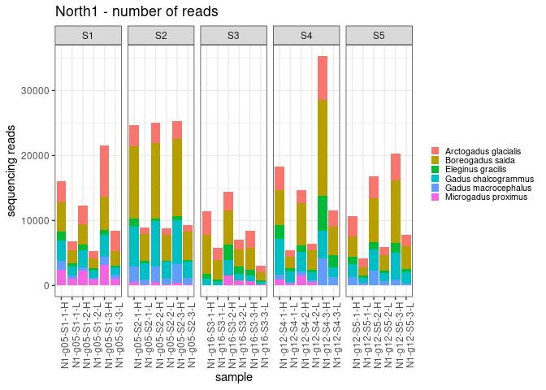<!-- -->

``` r
join_prop %>% 
  filter(shortID == "N1") %>%
  ggplot(aes(x=SampleID, y=prop, fill=taxon)) +
  geom_bar(stat = "identity") + 
  facet_grid(~primer_set, scales = 'free') +
  theme_bw() +
  labs(
    y = "proportion of sequencing reads",
    x = "sample",
    title = "North1 - proportion of reads") + 
  theme(
    axis.text.x = element_text(angle = 90, hjust = 0.95),
    legend.text = element_text(size = 8),
    legend.key.size = unit(0.3, "cm"),
    legend.position = "right",
    legend.title = element_blank()
  )
```

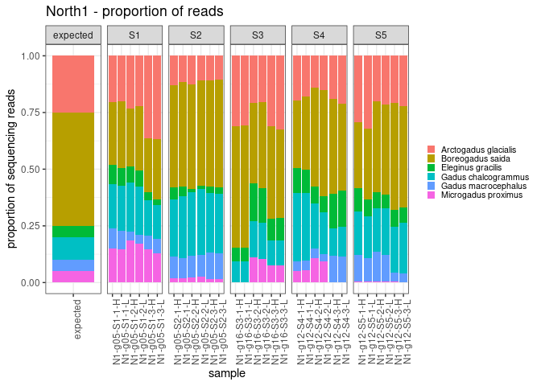<!-- -->

### north2

- A.glacilis (polar cod) = 10%
- B. saida (arctic cod) = 50%
- E. gracilis (saffron cod) = 5%
- G. chalcogrammus (Walleye pollock) = 25%
- G. macrocephalus (Pacific cod) = 5%
- M. proximus (tomcod) = 5%

``` r
join_long %>% 
  filter(shortID == "N2") %>%
  ggplot(aes(x=SampleID, y=reads, fill=taxon)) +
  geom_bar(stat = "identity") + 
  #scale_y_sqrt() +
  facet_grid(~primer_set, scales = 'free') +
  theme_bw() +
  labs(
    y = "sequencing reads",
    x = "sample",
    title = "North2 - number of reads") + 
  theme(
    axis.text.x = element_text(angle = 90, hjust = 0.95),
    legend.text = element_text(size = 8),
    legend.key.size = unit(0.3, "cm"),
    legend.position = "right",
    legend.title = element_blank()
  )
```

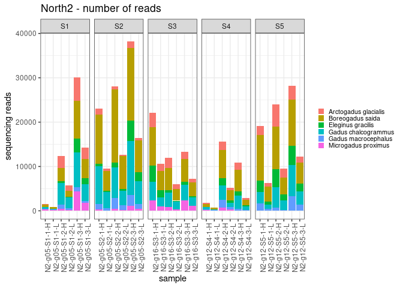<!-- -->

``` r
join_prop %>% 
  filter(shortID == "N2") %>%
  ggplot(aes(x=SampleID, y=prop, fill=taxon)) +
  geom_bar(stat = "identity") + 
  facet_grid(~primer_set, scales = 'free') +
  theme_bw() +
  labs(
    y = "proportion of sequencing reads",
    x = "sample",
    title = "North2 - proportion of reads") + 
  theme(
    axis.text.x = element_text(angle = 90, hjust = 0.95),
    legend.text = element_text(size = 8),
    legend.key.size = unit(0.3, "cm"),
    legend.position = "right",
    legend.title = element_blank()
  )
```

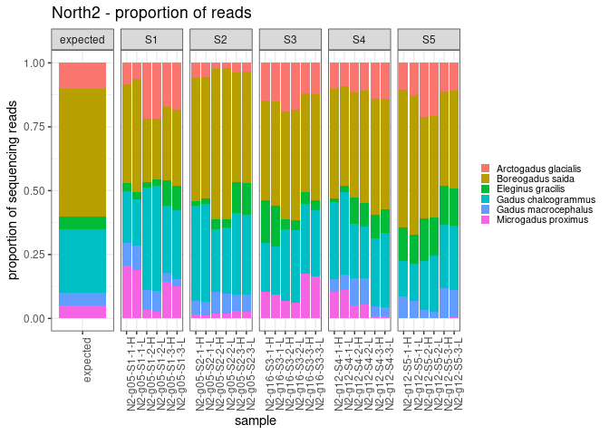<!-- -->

### south1

- A.glacilis (polar cod) = 5%
- B. saida (arctic cod) = 10%
- E. gracilis (saffron cod) = 5%
- G. chalcogrammus (Walleye pollock) = 50%
- G. macrocephalus (Pacific cod) = 25%
- M. proximus (tomcod) = 5%

``` r
join_long %>% 
  filter(shortID == "S1") %>%
  ggplot(aes(x=SampleID, y=reads, fill=taxon)) +
  geom_bar(stat = "identity") + 
  #scale_y_sqrt() +
  facet_grid(~primer_set, scales = 'free') +
  theme_bw() +
  labs(
    y = "sequencing reads",
    x = "sample",
    title = "South1 - number of reads") + 
  theme(
    axis.text.x = element_text(angle = 90, hjust = 0.95),
    legend.text = element_text(size = 8),
    legend.key.size = unit(0.3, "cm"),
    legend.position = "right",
    legend.title = element_blank()
  )
```

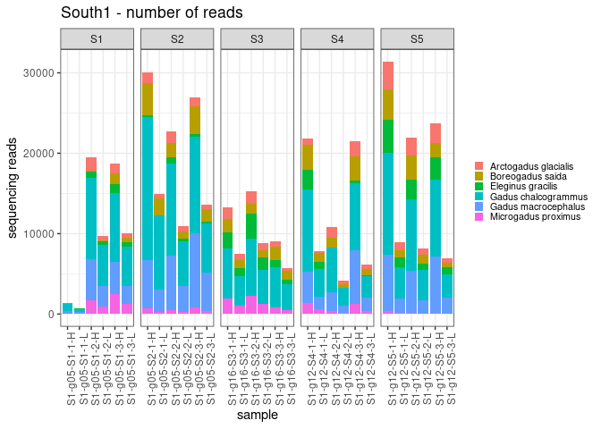<!-- -->

``` r
join_prop %>% 
  filter(shortID == "S1") %>%
  ggplot(aes(x=SampleID, y=prop, fill=taxon)) +
  geom_bar(stat = "identity") + 
  facet_grid(~primer_set, scales = 'free') +
  theme_bw() +
  labs(
    y = "proportion of sequencing reads",
    x = "sample",
    title = "South1 - proportion of reads") + 
  theme(
    axis.text.x = element_text(angle = 90, hjust = 0.95),
    legend.text = element_text(size = 8),
    legend.key.size = unit(0.3, "cm"),
    legend.position = "right",
    legend.title = element_blank()
  )
```

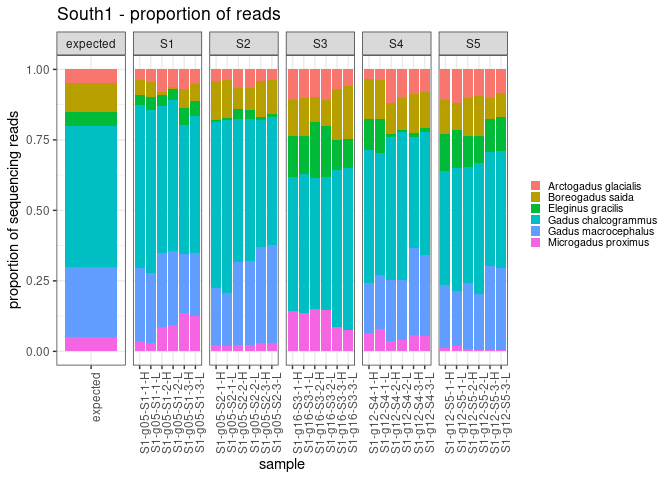<!-- -->

### south2

- A.glacilis (polar cod) = 5%
- B. saida (arctic cod) = 5%
- E. gracilis (saffron cod) = 25%
- G. chalcogrammus (Walleye pollock) = 50%
- G. macrocephalus (Pacific cod) = 10%
- M. proximus (tomcod) = 5%

``` r
join_long %>% 
  filter(shortID == "S2") %>%
  ggplot(aes(x=SampleID, y=reads, fill=taxon)) +
  geom_bar(stat = "identity") + 
  #scale_y_sqrt() +
  facet_grid(~primer_set, scales = 'free') +
  theme_bw() +
  labs(
    y = "sequencing reads",
    x = "sample",
    title = "South2 - number of reads") + 
  theme(
    axis.text.x = element_text(angle = 90, hjust = 0.95),
    legend.text = element_text(size = 8),
    legend.key.size = unit(0.3, "cm"),
    legend.position = "right",
    legend.title = element_blank()
  )
```

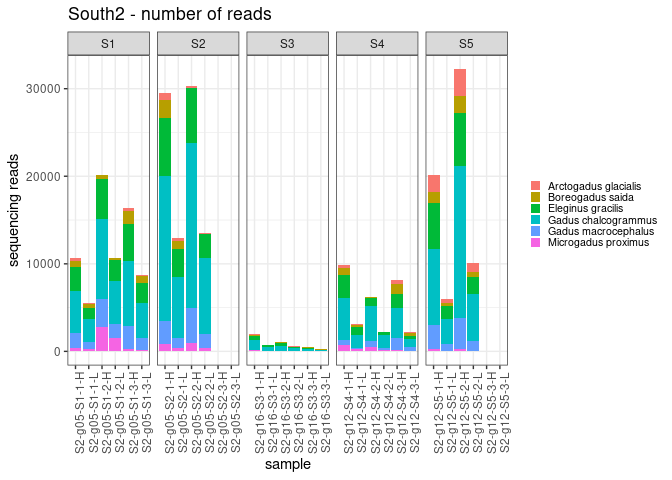<!-- -->

``` r
join_prop %>% 
  filter(shortID == "S2") %>%
  ggplot(aes(x=SampleID, y=prop, fill=taxon)) +
  geom_bar(stat = "identity") + 
  facet_grid(~primer_set, scales = 'free') +
  theme_bw() +
  labs(
    y = "proportion of sequencing reads",
    x = "sample",
    title = "South2 - proportion of reads") + 
  theme(
    axis.text.x = element_text(angle = 90, hjust = 0.95),
    legend.text = element_text(size = 8),
    legend.key.size = unit(0.3, "cm"),
    legend.position = "right",
    legend.title = element_blank()
  )
```

    ## Warning: Removed 18 rows containing missing values (`position_stack()`).

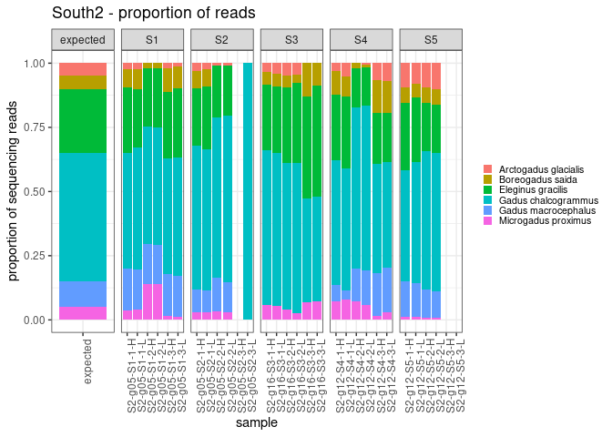<!-- -->

### middle

- A.glacilis (polar cod) = 5%
- B. saida (arctic cod) = 10%
- E. gracilis (saffron cod) = 5%
- G. chalcogrammus (Walleye pollock) = 25%
- G. macrocephalus (Pacific cod) = 50%
- M. proximus (tomcod) = 5%

``` r
join_long %>% 
  filter(shortID == "M1") %>%
  ggplot(aes(x=SampleID, y=reads, fill=taxon)) +
  geom_bar(stat = "identity") + 
  #scale_y_sqrt() +
  facet_grid(~primer_set, scales = 'free') +
  theme_bw() +
  labs(
    y = "sequencing reads",
    x = "sample",
    title = "Middle - number of reads") + 
  theme(
    axis.text.x = element_text(angle = 90, hjust = 0.95),
    legend.text = element_text(size = 8),
    legend.key.size = unit(0.3, "cm"),
    legend.position = "right",
    legend.title = element_blank()
  )
```

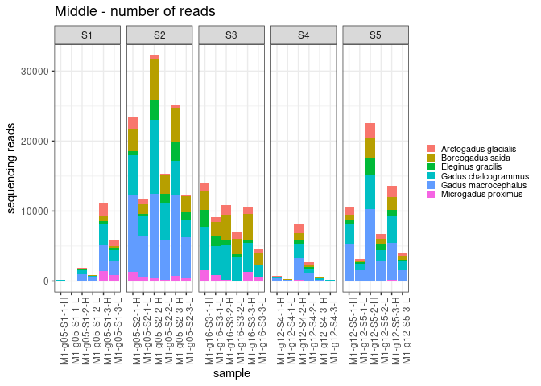<!-- -->

``` r
join_prop %>% 
  filter(shortID == "M1") %>%
  ggplot(aes(x=SampleID, y=prop, fill=taxon)) +
  geom_bar(stat = "identity") + 
  facet_grid(~primer_set, scales = 'free') +
  theme_bw() +
  labs(
    y = "proportion of sequencing reads",
    x = "sample",
    title = "Middle - proportion of reads") + 
  theme(
    axis.text.x = element_text(angle = 90, hjust = 0.95),
    legend.text = element_text(size = 8),
    legend.key.size = unit(0.3, "cm"),
    legend.position = "right",
    legend.title = element_blank()
  )
```

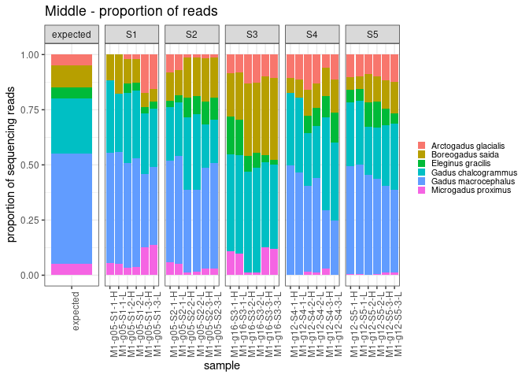<!-- -->

okay so is the issue with no pcod seqs in any of the mock communities
using primer set 3 an issue with the primers not amplifying pcod or
because i messed up the mock community? (primer set 3 was the only one
run on the ND5 mock community)

``` r
join_long %>%
  filter(primer_set == "S3") %>%
  filter(taxon == "Gadus macrocephalus") %>%
  filter(reads > 0)
```

    ## # A tibble: 4 × 7
    ##   SampleID           shortID primer_set replicate seq_depth taxon          reads
    ##   <chr>              <fct>   <fct>      <fct>     <fct>     <fct>          <dbl>
    ## 1 PcodPC-ND5-547-800 PC      S3         1         <NA>      Gadus macroce… 14912
    ## 2 E-g16-S3-2-H       E       S3         2         H         Gadus macroce…   674
    ## 3 B-B-S3-2-H         B       S3         2         H         Gadus macroce…  2653
    ## 4 B-B-S3-2-L         B       S3         2         L         Gadus macroce…  1080

hmm… so the S3 primers pick up the positive control Pcod. from what i
recall, the pcod used as the pc was almost always a separate ASV from
the pcod samples used in the mock community. maybe there is a enough
variation at the primer region to have the pcod sampled used in the mock
community not amplify? or maybe more likely i messed up making the
g16/ND5 mock community and pcod was not added. in this case the three
samples with pcod reads from S3 would be contamination??

## now i want to plot expected proportion by observed proportion

i’m re-reading in the mock community table here because i made changes
to it above… should eventually come back here and streamline

``` r
mockcomm <- read.csv("/genetics/edna/workdir/gadids/20230111/mockcomm_metadata.csv") %>%
  rename(Prop_Community = Perc_Community)
```

``` r
prop_table <- join_long %>%
  group_by(SampleID) %>%
  mutate(sum=sum(reads)) %>%
  mutate(prop = reads/sum) %>%
  filter(seq_depth != "NA") %>%
  rename(Community = shortID) %>%
  rename(Species = taxon) %>%
  left_join(mockcomm, by= c("Community", "Species")) %>%
  filter(Community != "B")    ### come back and include these later? 
```

``` r
prop_table %>% 
  ggplot(aes(x=Prop_Community, y=prop, color=Species)) +
  geom_point(aes(shape = Community)) + 
  facet_wrap(~primer_set, scales = 'free') +
  geom_smooth(method = "lm", alpha = 0.1, aes(fill = Species)) +
  theme_bw() +
  ylim(0, 0.75) +
  geom_abline(intercept = 0, slope = 1, linetype = 'dotted') +
  labs(
    y = "observed proportion",
    x = "true proportion",
    title = "comparison of known mock community with observed raw read proportion") 
```

    ## `geom_smooth()` using formula = 'y ~ x'

    ## Warning: Removed 19 rows containing non-finite values (`stat_smooth()`).

    ## Warning: Removed 19 rows containing missing values (`geom_point()`).

    ## Warning in max(ids, na.rm = TRUE): no non-missing arguments to max; returning -
    ## Inf

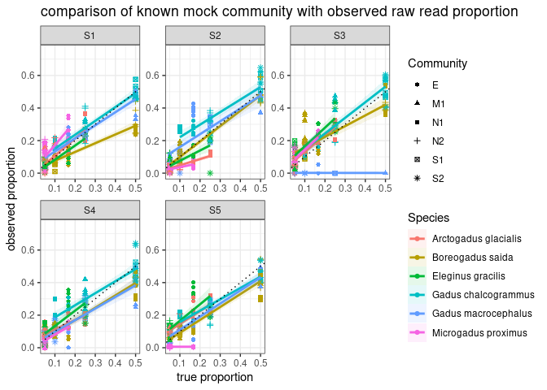<!-- -->

## plot true proportion by fold error (as in Shelton et al Appendix S1 Figure S2)

``` r
prop_table %>%
  mutate(fold_error = log(Prop_Community/prop)) %>%
  ggplot(aes(x=Prop_Community, y=fold_error, color=Species)) +
  geom_point(aes(shape = Community)) + 
  geom_hline(yintercept = 0, linetype = 'dotted') +
  facet_wrap(~primer_set, scales = 'free') +
  theme_bw() +
  ylim(-1.5,4) +
  labs(
    y = "Fold Error (log[true_prop/obs_prop])",
    x = "true proportion",
    title = "comparison of known mock community with error estimates") 
```

    ## Warning: Removed 20 rows containing missing values (`geom_point()`).

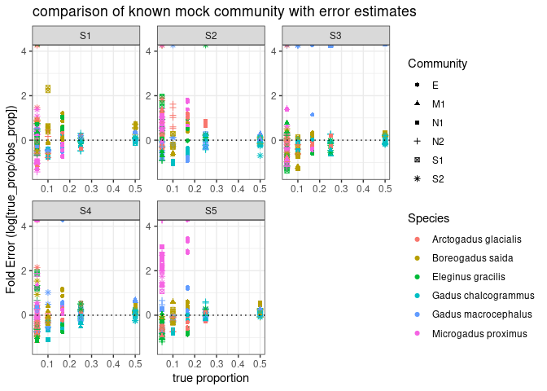<!-- -->

``` r
# prop_table %>%
#   mutate(fold_error = log(Prop_Community/prop)) %>%
#   mutate(Prop_Community = as.factor(Prop_Community)) %>%
#   ggplot(aes(x=Prop_Community, y=fold_error)) +
#   geom_boxplot() + 
#   geom_hline(yintercept = 0, linetype = 'dotted') +
#   facet_wrap(~primer_set, scales = 'free') +
#   theme_bw() +
#   ylim(-1.5,4) +
#   labs(
#     y = "Fold Error (log[true_prop/obs_prop])",
#     x = "true proportion",
#     title = "comparison of known mock community with error estimates") 
```

## use the slope of the true vs observed proportion line as amplifiction efficiency estimate

``` r
library(broom)
amp_est_95 <- prop_table %>%
  group_by(primer_set, Species) %>%
  do(tidy(lm(prop ~ Prop_Community, .), conf.int =TRUE, conf.level = 0.95)) %>%
  filter(term == "Prop_Community") %>%
  select(Species, estimate, conf.low, conf.high, p.value) %>%
  rename(u95 = conf.high) %>%
  rename(l95 = conf.low) 
```

    ## Adding missing grouping variables: `primer_set`

``` r
#amp_est_95

amp_est_50 <- prop_table %>%
  group_by(primer_set, Species) %>%
  do(tidy(lm(prop ~ Prop_Community, .), conf.int =TRUE, conf.level = 0.5)) %>%
  filter(term == "Prop_Community") %>%
  select(Species, estimate, conf.low, conf.high, p.value) %>%
  rename(u50 = conf.high) %>%
  rename(l50 = conf.low) 
```

    ## Adding missing grouping variables: `primer_set`

``` r
#amp_est_50

amp_est <- amp_est_95 %>%
  left_join(amp_est_50)
```

    ## Joining, by = c("primer_set", "Species", "estimate", "p.value")

``` r
amp_est
```

    ## # A tibble: 30 × 8
    ## # Groups:   primer_set, Species [30]
    ##    primer_set Species              estimate   l95   u95  p.value   l50   u50
    ##    <fct>      <chr>                   <dbl> <dbl> <dbl>    <dbl> <dbl> <dbl>
    ##  1 S1         Arctogadus glacialis    1.06  0.791 1.33  2.89e- 9 0.971 1.15 
    ##  2 S1         Boreogadus saida        0.537 0.449 0.625 3.39e-14 0.508 0.567
    ##  3 S1         Eleginus gracilis       0.866 0.708 1.02  6.50e-13 0.813 0.919
    ##  4 S1         Gadus chalcogrammus     0.852 0.717 0.986 1.32e-14 0.806 0.897
    ##  5 S1         Gadus macrocephalus     0.804 0.703 0.904 1.34e-17 0.770 0.837
    ##  6 S1         Microgadus proximus     1.45  0.983 1.93  3.97e- 7 1.30  1.61 
    ##  7 S2         Arctogadus glacialis    0.382 0.286 0.479 2.79e- 9 0.350 0.415
    ##  8 S2         Boreogadus saida        0.947 0.847 1.05  1.47e-19 0.914 0.981
    ##  9 S2         Eleginus gracilis       0.633 0.405 0.860 2.64e- 6 0.556 0.709
    ## 10 S2         Gadus chalcogrammus     0.893 0.659 1.13  6.03e- 9 0.814 0.971
    ## # … with 20 more rows

plot it

``` r
mock_amp_eff <- amp_est %>%
  ggplot() +
  geom_errorbarh(aes(xmin=l50,xmax=u50,y=Species),size=2,height=0) +
  geom_errorbarh(aes(xmin=l95,xmax=u95,y=Species),size=0.8,height=0) +
  geom_point(aes(x=estimate,y=Species,fill=Species,),size=3,shape=21) +
  geom_vline(xintercept=1,linetype="dashed") +
  facet_grid(rows = vars(primer_set)) +
  #facet_grid(~primer_set, vars(rows = 5, cols = 1)) +
  #scale_fill_manual(values=clr_alpha_sum$manual.col %>% as.character()) +
  scale_x_continuous("Amplification Efficiency (i.e. slope)") +
  scale_y_discrete(NULL) +
  theme_bw() +
  theme(legend.position = "none",
        axis.text.y = element_text(size=10))
```

    ## Warning: Using `size` aesthetic for lines was deprecated in ggplot2 3.4.0.
    ## ℹ Please use `linewidth` instead.

``` r
mock_amp_eff
```

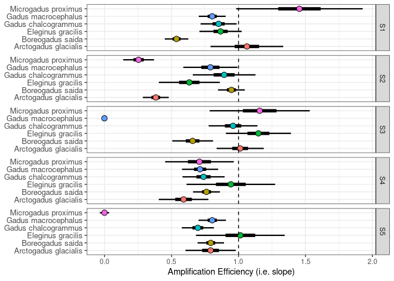<!-- -->
