asv analysis of gadid aquaria samples
================
Kimberly Ledger
2023-04-25

analysis of gadid sequences from April 21 2023 sequencing run  
samples are from the gadid aquaria mixtures

load libraries

``` r
library(tidyverse)
```

    ## ── Attaching packages ─────────────────────────────────────── tidyverse 1.3.2 ──
    ## ✔ ggplot2 3.4.0      ✔ purrr   0.3.5 
    ## ✔ tibble  3.1.8      ✔ dplyr   1.0.10
    ## ✔ tidyr   1.2.1      ✔ stringr 1.4.1 
    ## ✔ readr   2.1.3      ✔ forcats 0.5.2 
    ## ── Conflicts ────────────────────────────────────────── tidyverse_conflicts() ──
    ## ✖ dplyr::filter() masks stats::filter()
    ## ✖ dplyr::lag()    masks stats::lag()

``` r
library(ggplot2)
```

read in gadid metadata - includes sampleID, extractionID, alternativeID,
sample type, and prep replicate (A = no normalization; B = sequalprep
normalization; C = bead normalization)

``` r
metadata <- read.csv("/genetics/edna/workdir/gadids/20230421_aquaria/20230421_gadid_aquaria_metadata.csv")

#illumina output changed "_" to "-"
metadata$Sample_ID <- gsub("_", "-", metadata$Sample_ID) 
```

read in taxonomic identification tables and samples by asv tables

``` r
taxon_S1 <- read.csv("/genetics/edna/workdir/gadids/20230421_aquaria/trimmed/filtered/outputs/asv_taxonomy_blastn.csv", row.names = 1) 

asv_table_S1 <- read.csv("/genetics/edna/workdir/gadids/20230421_aquaria/trimmed/filtered/outputs/ASVtable.csv") %>%
  rename(Sample_ID = X)
```

how many initial ASV’s are there for each species?

``` r
taxon_S1 %>%
  group_by(taxon) %>%
  summarise(ASVs = n())
```

    ## # A tibble: 6 × 2
    ##   taxon                 ASVs
    ##   <chr>                <int>
    ## 1 Arctogadus glacialis     1
    ## 2 Boreogadus saida        31
    ## 3 Eleginus gracilis       15
    ## 4 Gadus chalcogrammus     75
    ## 5 Gadus macrocephalus     33
    ## 6 Microgadus proximus      2

there should not be any A. glacialis or M. proximus in this data… maybe
a lab contaimination or ASV taxonomic assignment issue? come back to
this later.

now, join taxon and asv tables

``` r
read_summary <- asv_table_S1 %>%
  pivot_longer(cols = starts_with("ASV"), names_to = "ASV", values_to = "count") %>%
  left_join(taxon_S1, by = "ASV") %>%
  filter(count > 0) %>%
  filter(taxon != "NA") %>%
  group_by(Sample_ID, taxon) %>%
  summarise(total_read_count = sum(count)) %>%
  pivot_wider(names_from = "taxon", values_from = "total_read_count") %>%
  replace(is.na(.), 0)
```

    ## `summarise()` has grouped output by 'Sample_ID'. You can override using the
    ## `.groups` argument.

now i’m going to go back and take a closer look at individual ASVs

``` r
asv_w_id <- asv_table_S1[-433,] %>% #removes "Undetermined" reads
  summarise(across(ASV1:ASV193, sum)) %>%
  pivot_longer(cols=starts_with("ASV"), names_to = "ASV", values_to = "reads") %>%
  left_join(taxon_S1, by = "ASV")
```

plot a histogram

    ## `stat_bin()` using `bins = 30`. Pick better value with `binwidth`.

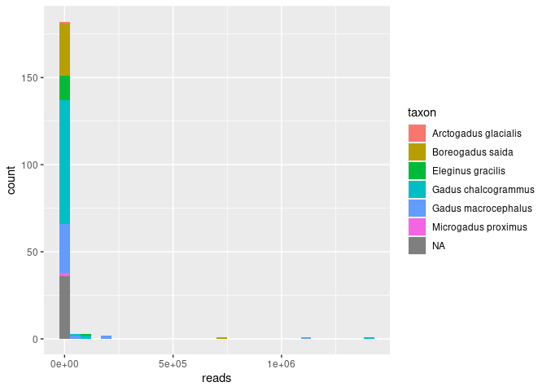<!-- -->

okay, a few ASVs with MANY reads, most with few…

filter the top few ASVs to get a better visualization

    ## `stat_bin()` using `bins = 30`. Pick better value with `binwidth`.

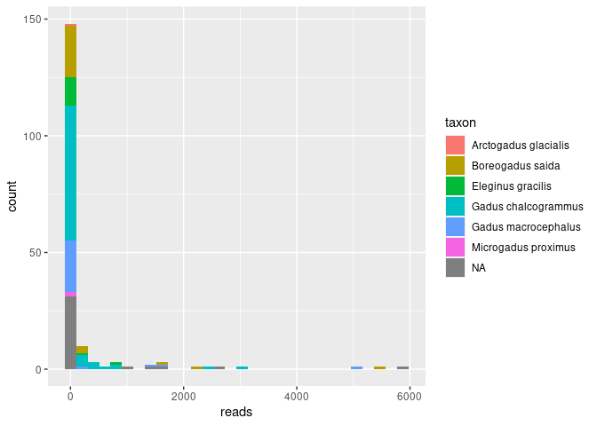<!-- -->

and again

    ## `stat_bin()` using `bins = 30`. Pick better value with `binwidth`.

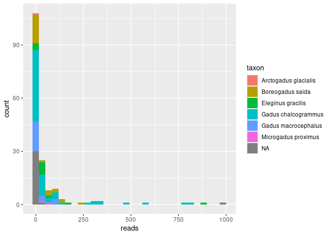<!-- -->

i will start by removing all ASVs with less than 250 reads.

``` r
asv_filtered <- asv_w_id %>%
  filter(reads > 250)
```

first let’s look at the proportion of reads for a species assigning to
individual ASV’s
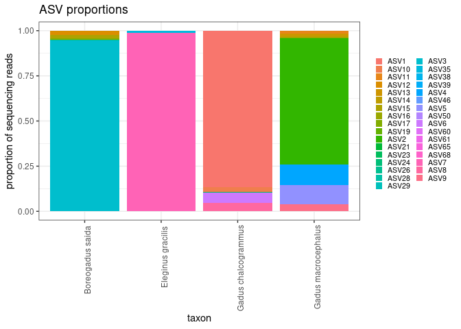<!-- -->

good, A. glacilis and M. proximus ASVs are now gone.

next, i’ll manually go through some of the ASVs to see if they should be
there or not…

asv summary table

``` r
asv_filtered %>%
  group_by(taxon) %>%
  filter(taxon != "NA") %>%
  mutate(sum=sum(reads)) %>%
  mutate(prop = reads/sum) %>%
  arrange(taxon)
```

    ## # A tibble: 33 × 6
    ## # Groups:   taxon [4]
    ##    ASV     reads taxon               taxonomic_level     sum    prop
    ##    <chr>   <int> <chr>               <chr>             <int>   <dbl>
    ##  1 ASV3   740362 Boreogadus saida    species          782164 0.947  
    ##  2 ASV12   18030 Boreogadus saida    species          782164 0.0231 
    ##  3 ASV15   14488 Boreogadus saida    species          782164 0.0185 
    ##  4 ASV17    5382 Boreogadus saida    species          782164 0.00688
    ##  5 ASV24    2311 Boreogadus saida    species          782164 0.00295
    ##  6 ASV26    1591 Boreogadus saida    species          782164 0.00203
    ##  7 ASV7    79916 Eleginus gracilis   species           80815 0.989  
    ##  8 ASV35     899 Eleginus gracilis   species           80815 0.0111 
    ##  9 ASV1  1402912 Gadus chalcogrammus species         1616932 0.868  
    ## 10 ASV6    90103 Gadus chalcogrammus species         1616932 0.0557 
    ## # … with 23 more rows

**E. gracilis** ASV7 = 99% E. gracilis reads okay so i know the most
about E. gracilis because it should only be in my positive controls. all
PCs have \>3000 reads of ASV7 and all contaminated samples have \<100
reads. the only other ASV assigned to E. gracilis is ASV35 and those
samples shouldn’t have an E. gracilis (unless this is some sort of
test…) for reference ASV35 = 99.1% match in blastn.

**B. saida** ASV3 = 94.7% B. saida reads (with ASV12 = 2.3%, ASV15 =
1.9%) for B. saida, most all ASV3 (100% blastn match). ASV12 is 99.5%
blastn match. samples with ASV12 have between 920-145 reads. this may be
legit… ASV12 is present in replicate samples a few times so i’m leaning
towards keeping ASV12 ASV15 is 99.5% blastn match and has 6000 to
hundreds of reads in a few samples.. probably keep

**G. chalcogrammus** ASV1 = 86% G. chalcogrammus (with ASV6 = 5.6%; ASV8
= 4.4%, ASV10 = 2.2%) keep ASV1. ASV6 has thousands to \>300 reads in
each sample. keep. ASV8 has touusands/hundreds for many samples. keep.
ASV10 has thousands to \>450 reads for samples. keep. ASV21 has 378-69
reads per sample.. there also ASV1’s in same samples… ASV23 has 288-146
read per sample.. there also ASV1’s in same samples… ASV38 has 200-76
reads per sample.. there also ASV1’s in same samples… ASV39 okay ASV46
okay … maybe bump up read threshold to 500 per ASV???

**G. macrocephalus** ASV2 = 70% G. macrocephalus (with ASV4 = 11%; ASV5
= 10%; ASV9 = 3.5%; ASV11 = 1.5%) keep ASV2, ASV4, ASV5, ASV9, ASV11, …
etc… keep all.

based on my initally poking around i will now filter out all ASV’s with
\<500 reads

``` r
asv_filtered2 <- asv_filtered %>%
  filter(reads > 499)
```

how many now many ASV’s are there for each species?

``` r
asv_filtered2 %>%
  group_by(taxon) %>%
  summarise(ASVs = n())
```

    ## # A tibble: 5 × 2
    ##   taxon                ASVs
    ##   <chr>               <int>
    ## 1 Boreogadus saida        6
    ## 2 Eleginus gracilis       2
    ## 3 Gadus chalcogrammus     9
    ## 4 Gadus macrocephalus    10
    ## 5 <NA>                    5

now, join taxon and asv tables

``` r
read_summary <- asv_table_S1 %>%
  pivot_longer(cols = starts_with("ASV"), names_to = "ASV", values_to = "count") %>%
  left_join(asv_filtered2, by = "ASV") %>%
  filter(count > 0) %>%
  filter(taxon != "NA") %>%
  group_by(Sample_ID, taxon) %>%
  summarise(total_read_count = sum(count)) %>%
  pivot_wider(names_from = "taxon", values_from = "total_read_count") %>%
  replace(is.na(.), 0)
```

    ## `summarise()` has grouped output by 'Sample_ID'. You can override using the
    ## `.groups` argument.

join to metadata - UPDATE COLUMN NUMBERS BELOW depending on input
read_summary data

``` r
join <- metadata %>%
  left_join(read_summary, by = c("Sample_ID"))

join_long <- join %>%
  pivot_longer(cols = 9:12, names_to = "taxon", values_to = "reads") %>%
  mutate(reads = ifelse(is.na(reads), 0, reads))

join_long$extraction_ID<- as.factor(join_long$extraction_ID)
join_long$alternative_ID <- as.factor(join_long$alternative_ID)
join_long$replicate <- as.factor(join_long$replicate)
join_long$taxon <- as.factor(join_long$taxon)
join_long$sample_type <- as.factor(join_long$sample_type)

summary(join_long)
```

    ##   Sample_ID         extraction_ID  alternative_ID           sample_type  
    ##  Length:1728        e02112 :  12   NC     :  96   extraction_blank:  96  
    ##  Class :character   e02113 :  12   10     :  24   PCR_blank       :  48  
    ##  Mode  :character   e02114 :  12   106    :  24   positive        :  24  
    ##                     e02115 :  12   107    :  24   sample          :1560  
    ##                     e02116 :  12   118    :  24                          
    ##                     e02117 :  12   (Other):1464                          
    ##                     (Other):1656   NA's   :  72                          
    ##  extraction_plate   extraction_well       DNA_conc      replicate
    ##  Length:1728        Length:1728        Min.   : 0.204   A:576    
    ##  Class :character   Class :character   1st Qu.: 1.306   B:576    
    ##  Mode  :character   Mode  :character   Median : 2.663   C:576    
    ##                                        Mean   : 6.261            
    ##                                        3rd Qu.: 6.083            
    ##                                        Max.   :31.500            
    ##                                                                  
    ##                  taxon         reads      
    ##  Boreogadus saida   :432   Min.   :    0  
    ##  Eleginus gracilis  :432   1st Qu.:    0  
    ##  Gadus chalcogrammus:432   Median :   54  
    ##  Gadus macrocephalus:432   Mean   : 2337  
    ##                            3rd Qu.: 3116  
    ##                            Max.   :20793  
    ## 

# now let’s check out data!

## take a look at the positive controls

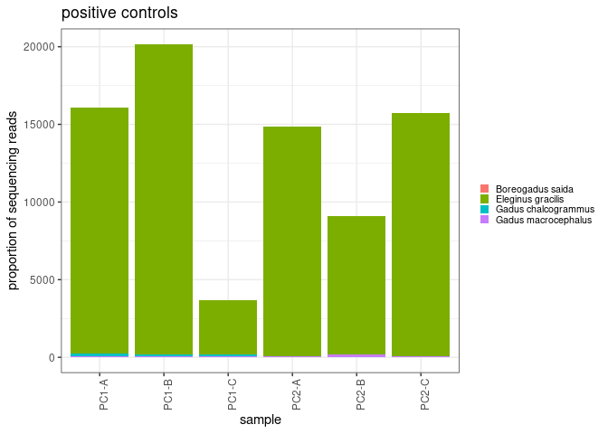<!-- -->

okay, in general this is pretty good. but will need to look into why a
few reads of species other than E. gracilis are in my PC.

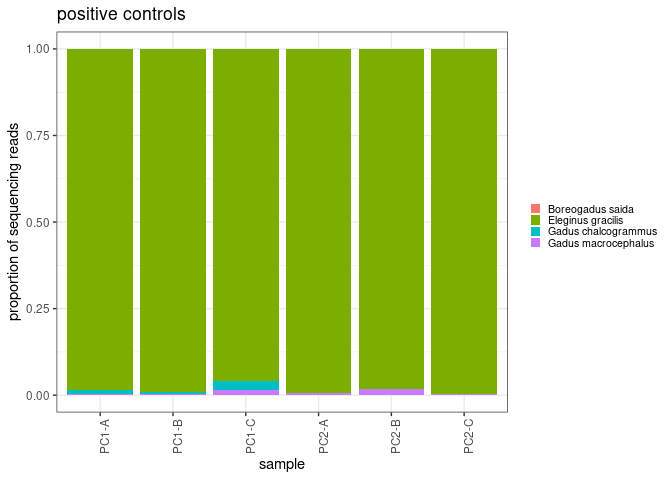<!-- -->

the proportion of reads for the species that shouldn’t be there are
quite low.

## any sequences in PCR blanks?

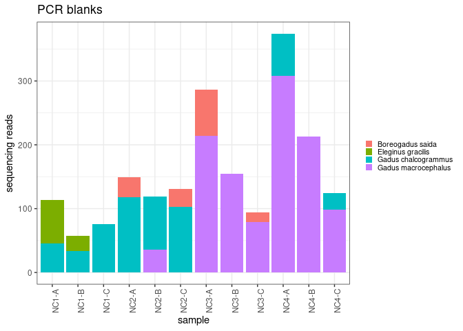<!-- -->

unfortunately there are some reads in the PCR negative controls… but the
read number are all fairly low (i.e. less than 400)

## any sequences in extraction blanks?

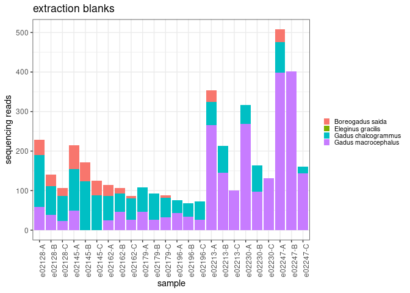<!-- -->

there are also some reads in the extraction controls. but again read
number is fairly low (less that 500). also a pretty clear trend of read
number across sample prep replicates (A\>B\>C).

## now let’s take a look at reads from the aquaria samples

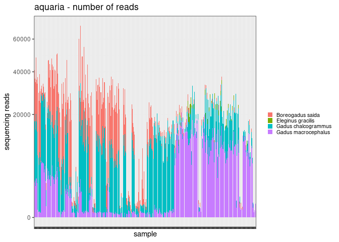<!-- -->

looks pretty good. but i know some of these should be “field blanks” and
have no reads.

based on the results of the negative controls. i will set a read count
filter for samples. any sample with \<600 reads total, set to 0

``` r
read_summary$total <- rowSums(read_summary[,2:5])
```

``` r
read_summary_filtered <- read_summary %>%
  filter(total > 599) %>%
  dplyr::select(!total)
```

``` r
join <- metadata %>%
  left_join(read_summary_filtered, by = c("Sample_ID"))

join_long <- join %>%
  pivot_longer(cols = 9:12, names_to = "taxon", values_to = "reads") %>%
  mutate(reads = ifelse(is.na(reads), 0, reads))

join_long$extraction_ID<- as.factor(join_long$extraction_ID)
join_long$alternative_ID <- as.factor(join_long$alternative_ID)
join_long$replicate <- as.factor(join_long$replicate)
join_long$taxon <- as.factor(join_long$taxon)
join_long$sample_type <- as.factor(join_long$sample_type)

summary(join_long)
```

    ##   Sample_ID         extraction_ID  alternative_ID           sample_type  
    ##  Length:1728        e02112 :  12   NC     :  96   extraction_blank:  96  
    ##  Class :character   e02113 :  12   10     :  24   PCR_blank       :  48  
    ##  Mode  :character   e02114 :  12   106    :  24   positive        :  24  
    ##                     e02115 :  12   107    :  24   sample          :1560  
    ##                     e02116 :  12   118    :  24                          
    ##                     e02117 :  12   (Other):1464                          
    ##                     (Other):1656   NA's   :  72                          
    ##  extraction_plate   extraction_well       DNA_conc      replicate
    ##  Length:1728        Length:1728        Min.   : 0.204   A:576    
    ##  Class :character   Class :character   1st Qu.: 1.306   B:576    
    ##  Mode  :character   Mode  :character   Median : 2.663   C:576    
    ##                                        Mean   : 6.261            
    ##                                        3rd Qu.: 6.083            
    ##                                        Max.   :31.500            
    ##                                                                  
    ##                  taxon         reads      
    ##  Boreogadus saida   :432   Min.   :    0  
    ##  Eleginus gracilis  :432   1st Qu.:    0  
    ##  Gadus chalcogrammus:432   Median :   22  
    ##  Gadus macrocephalus:432   Mean   : 2326  
    ##                            3rd Qu.: 3116  
    ##                            Max.   :20793  
    ## 

re-plot with the filtered dataset
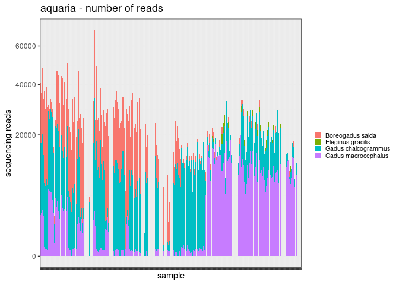<!-- -->

the only thing that concerns me is the E. glacilis reads in some of
these samples… the read counts for those go up to 206.  
maybe there also needs to be a filter for reads of individual species
within a sample??? i won’t do that for now but something to consider
later on perhaps.

## now i am working with an ASV read threshold of 500 reads and sample read threshold of 600 reads

export to use in other scripts

``` r
write.csv(join_long, "/genetics/edna/workdir/gadids/20230421_aquaria/20230421_filtered_readsummary.csv")
```

okay, it’s really too hard to see what is going on in the plots above.
i’ll try sub-setting to get a better look.
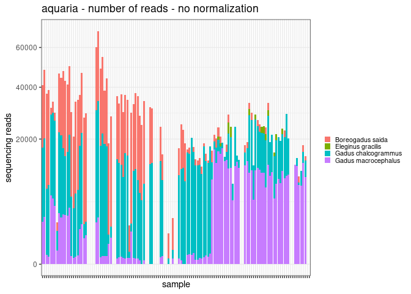<!-- -->

    ## Warning: Removed 88 rows containing missing values (`position_stack()`).

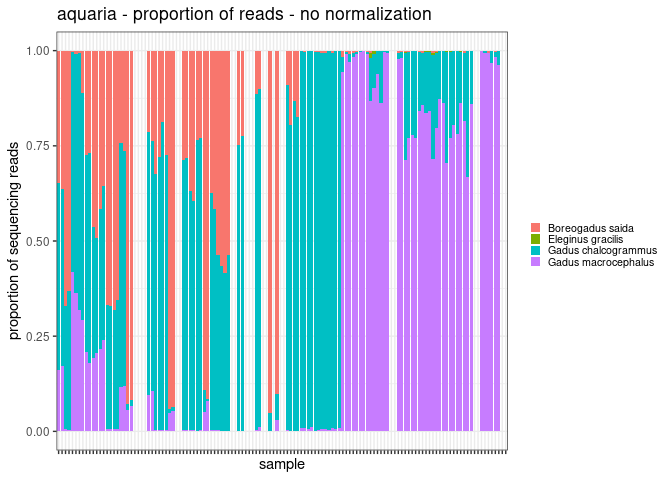<!-- -->

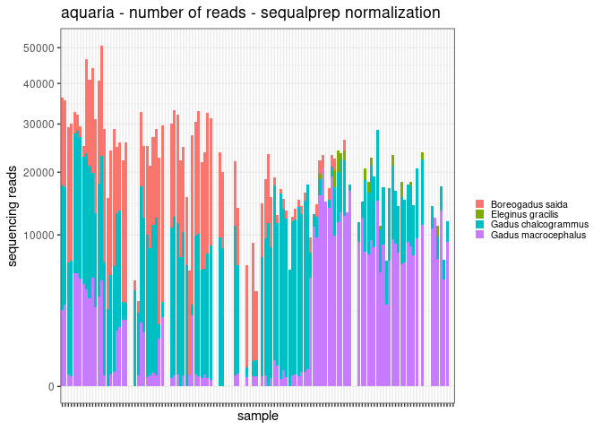<!-- -->

    ## Warning: Removed 80 rows containing missing values (`position_stack()`).

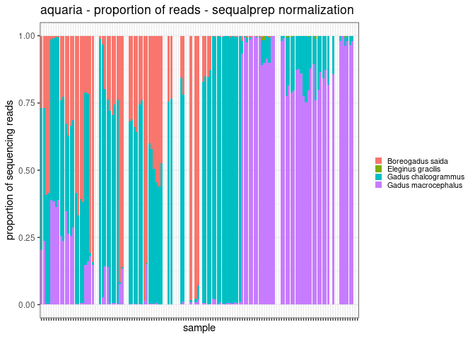<!-- -->

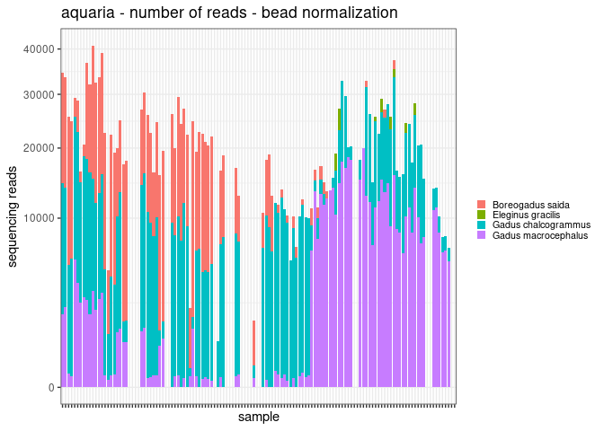<!-- -->

    ## Warning: Removed 88 rows containing missing values (`position_stack()`).

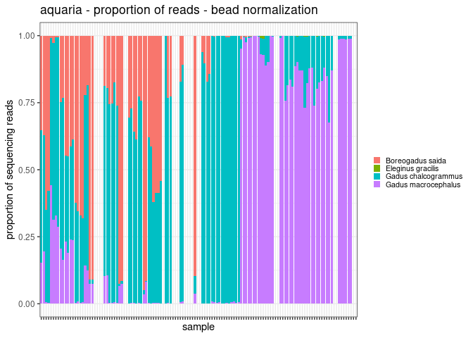<!-- -->

just eyeballing it, the read count replicates A, B, and C looks fairly
similar but with slightly A\>B\>C reads counts. the read proportions
also look fairly similar across replicates. will need to get more
quantitative about this next.

visual of extraction and prep replicates for just a few of the tank
samples

    ## Warning: Removed 40 rows containing missing values (`position_stack()`).

    ## Warning: Position guide is perpendicular to the intended axis
    ## ℹ Did you mean to specify a different guide `position`?

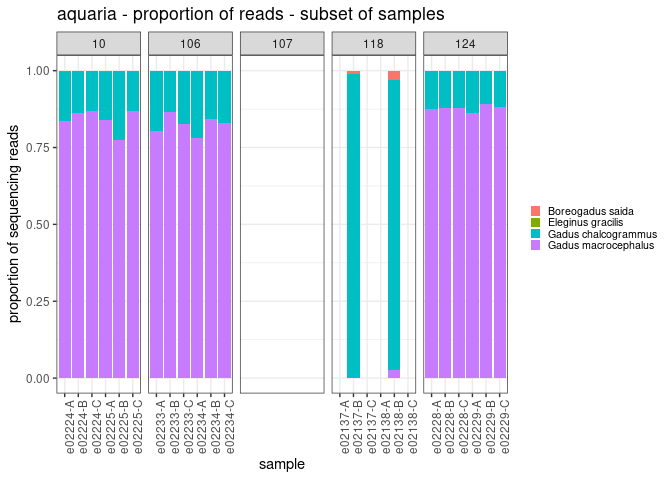<!-- -->

except for 118, extraction and prep replicates look very similar for
read proportions - read counts for 118 are 4040 and 1846. this is lower
than most. - maybe a higher read count threshold per sample is needed?

it would be nice to calculate average and 95%CI of read count for
samples with “good” assignments versus samples with “bad” assignments to
help establish this threshold. i will need more tank metadata in order
to do this… but for now.

considering that i’ve already done some filter for ASVs and read count,

``` r
join_long %>%
  group_by(Sample_ID) %>%
  mutate(sum=sum(reads)) %>%
  group_by(sample_type) %>%
  summarise(mean = mean(sum),
            median = median(sum),
            std_dev = sd(sum))
```

    ## # A tibble: 4 × 4
    ##   sample_type        mean median std_dev
    ##   <fct>             <dbl>  <dbl>   <dbl>
    ## 1 extraction_blank     0      0       0 
    ## 2 PCR_blank            0      0       0 
    ## 3 positive         13269. 15293    5482.
    ## 4 sample           10103. 11286.   5780.
