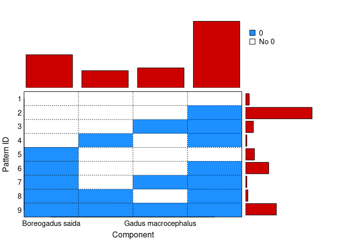
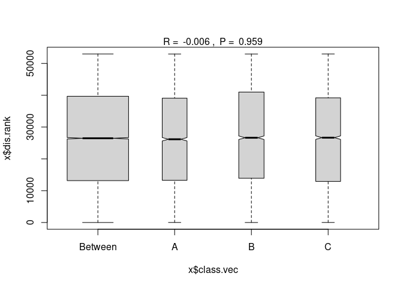
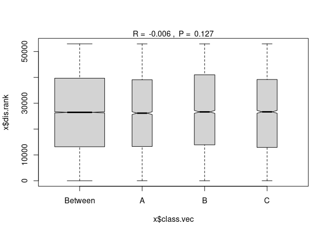
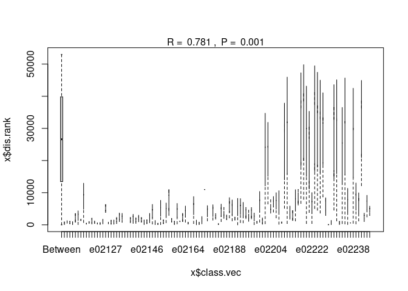

trying compositional data analyses
================
Kimberly Ledger
2023-04-26

running some stats on the gadid aquaria read data

load libraries

``` r
library(tidyverse)
```

    ## ── Attaching packages ─────────────────────────────────────── tidyverse 1.3.2 ──
    ## ✔ ggplot2 3.4.0      ✔ purrr   0.3.5 
    ## ✔ tibble  3.1.8      ✔ dplyr   1.0.10
    ## ✔ tidyr   1.2.1      ✔ stringr 1.4.1 
    ## ✔ readr   2.1.3      ✔ forcats 0.5.2 
    ## ── Conflicts ────────────────────────────────────────── tidyverse_conflicts() ──
    ## ✖ dplyr::filter() masks stats::filter()
    ## ✖ dplyr::lag()    masks stats::lag()

``` r
library(zCompositions) #for cmultRepl() 
```

    ## Loading required package: MASS
    ## 
    ## Attaching package: 'MASS'
    ## 
    ## The following object is masked from 'package:dplyr':
    ## 
    ##     select
    ## 
    ## Loading required package: NADA
    ## Loading required package: survival
    ## 
    ## Attaching package: 'NADA'
    ## 
    ## The following object is masked from 'package:stats':
    ## 
    ##     cor
    ## 
    ## Loading required package: truncnorm

``` r
library(compositions) #for clr()
```

    ## Welcome to compositions, a package for compositional data analysis.
    ## Find an intro with "? compositions"
    ## 
    ## 
    ## Attaching package: 'compositions'
    ## 
    ## The following object is masked from 'package:NADA':
    ## 
    ##     cor
    ## 
    ## The following objects are masked from 'package:stats':
    ## 
    ##     anova, cor, cov, dist, var
    ## 
    ## The following objects are masked from 'package:base':
    ## 
    ##     %*%, norm, scale, scale.default

``` r
library(vegan) #for vegdist()
```

    ## Loading required package: permute
    ## Loading required package: lattice
    ## This is vegan 2.6-4

load data

``` r
aquaria_dat <- read.csv("/genetics/edna/workdir/gadids/20230421_aquaria/20230421_filtered_readsummary.csv") %>%
  dplyr::select(!X) %>%
  dplyr::select(!extraction_plate) %>%
  dplyr::select(!extraction_well) %>%
  rename("prep" = "replicate")  ##rename replicate to not confuse as true replicates, these are the same sample but used different library prep methods
```

pivot data and remove PC as they don’t have ext_ID or alt_ID and mess
with code later on… should probably edit metadata later on so i can
include these

``` r
aquaria_wide <- aquaria_dat %>%
  pivot_wider(names_from = "taxon", values_from = "reads") %>%
  filter(alternative_ID != "NA")
```

we have to deal with the fact there are zeros. will use cmultRepl() from
zCompositions which is a method of imputing zeros for compositional
datasets. this assumes these are “count zeros”. defined as “where the
feature exists in the sample, but counting is not exhaustive enough to
see it at least once”. not sure that applies to my data but just going
with it for now.

``` r
#find zeros 
zPatterns(aquaria_wide[,7:10], label = 0)
```

<!-- -->

    ## Patterns ('+' means 0, '-' means No 0) 
    ## 
    ##  Patt.ID Boreogadus saida Gadus chalcogrammus Gadus macrocephalus
    ##        1                -                   -                   -
    ##        2                -                   -                   -
    ##        3                -                   -                   +
    ##        4                -                   +                   -
    ##        5                +                   -                   -
    ##        6                +                   -                   -
    ##        7                +                   -                   +
    ##        8                +                   +                   -
    ##        9                +                   +                   +
    ##  Eleginus gracilis No.Unobs Patt.Perc
    ##                  -        0      2.42
    ##                  +        1     46.14
    ##                  +        2      5.31
    ##                  +        2      0.72
    ##                  -        1      6.04
    ##                  +        2     15.94
    ##                  +        3      0.72
    ##                  +        3      1.45
    ##                  +        4     21.26
    ## 
    ## Percentage cells by component 
    ##    Boreogadus saida Gadus chalcogrammus Gadus macrocephalus   Eleginus gracilis 
    ##               45.41               23.43               27.29               91.55 
    ## 
    ## Overall percentage cells: 46.92%

``` r
#i think i have to remove rows with all zeros... this is just NC so it's okay for now. but will need to think more about this when using field data 
aquaria_wide$sum <- rowSums(aquaria_wide[,7:10])

aquaria_wide_no0_rows <- aquaria_wide %>%
  filter(sum > 0) %>%
  dplyr::select(!sum)

cdata <- aquaria_wide_no0_rows[,7:10]
cdata_no0 <- cmultRepl(cdata, output = "p-counts")  ## maybe i should remove E.gracilis from this because it is the PC? 
```

    ## Warning in cmultRepl(cdata, output = "p-counts"): Column(s) containing more than 80% zeros/unobserved values were found (check it out using zPatterns).
    ##                     (You can use the z.warning argument to modify the warning threshold).

    ## No. adjusted imputations:  6

``` r
head(cdata_no0)
```

    ##   Boreogadus saida Gadus chalcogrammus Gadus macrocephalus Eleginus gracilis
    ## 1             4959                7011                2321       0.007938110
    ## 2             6070                7766                2884       0.007943896
    ## 3            11580                5587                 106       0.007952077
    ## 4            11455                6587                  73       0.007953291
    ## 5               58                8320                6043       0.007932073
    ## 6              145                9461                5481       0.007933373

save metadata

``` r
aquaria_meta <- aquaria_wide_no0_rows[,1:6]
```

perform centered log-tranformation

``` r
aquaria_clr <- clr(cdata_no0)  #there is also a function codaSeq.clr() to potentially try out later on... 
head(aquaria_clr)
```

    ##      Boreogadus saida Gadus chalcogrammus Gadus macrocephalus Eleginus gracilis
    ## [1,]        3.4394923            3.785769           2.6802863         -9.905547
    ## [2,]        3.5110623            3.757459           2.7668819        -10.035403
    ## [3,]        4.9034474            4.174610           0.2098517         -9.287910
    ## [4,]        4.9473504            4.394022          -0.1083718         -9.233001
    ## [5,]       -0.1787259            4.787249           4.4674870         -9.076010
    ## [6,]        0.5007255            4.678925           4.1330346         -9.312685
    ## attr(,"class")
    ## [1] "rmult"

perform PERMANOVAs

i **think** the model set up is correct but it would be good to get a
second opinion  
there was an error when using clr transformed data… maybe the clr
transformation is done in the aitchison method?

does prep method effect composition (in general)?

``` r
adonis2(cdata_no0 ~ prep, data = aquaria_meta, permutations = 999, method = "aitchison")
```

    ## Permutation test for adonis under reduced model
    ## Terms added sequentially (first to last)
    ## Permutation: free
    ## Number of permutations: 999
    ## 
    ## adonis2(formula = cdata_no0 ~ prep, data = aquaria_meta, permutations = 999, method = "aitchison")
    ##           Df SumOfSqs      R2      F Pr(>F)
    ## prep       2     11.7 0.00145 0.2341  0.945
    ## Residual 323   8077.5 0.99855              
    ## Total    325   8089.2 1.00000

okay, so this tells me the prep method does not effect composition… but
should see if i can control for extraction_ID.

there is no specification of random effects in adonis2() but one can
control for extraction_ID/alt_ID by using the “strata =” term.

do prep methods differ while controlling for extractionID and altID?

``` r
adonis2(cdata_no0 ~ prep, data = aquaria_meta, strat = aquaria_meta$extraction_ID, permutations = 999, method = "aitchison")
```

    ## Permutation test for adonis under reduced model
    ## Terms added sequentially (first to last)
    ## Blocks:  strata 
    ## Permutation: free
    ## Number of permutations: 999
    ## 
    ## adonis2(formula = cdata_no0 ~ prep, data = aquaria_meta, permutations = 999, method = "aitchison", strata = aquaria_meta$extraction_ID)
    ##           Df SumOfSqs      R2      F Pr(>F)
    ## prep       2     11.7 0.00145 0.2341  0.251
    ## Residual 323   8077.5 0.99855              
    ## Total    325   8089.2 1.00000

``` r
adonis2(cdata_no0 ~ prep, data = aquaria_meta, strat = aquaria_meta$alternative_ID, permutations = 999, method = "aitchison")
```

    ## Permutation test for adonis under reduced model
    ## Terms added sequentially (first to last)
    ## Blocks:  strata 
    ## Permutation: free
    ## Number of permutations: 999
    ## 
    ## adonis2(formula = cdata_no0 ~ prep, data = aquaria_meta, permutations = 999, method = "aitchison", strata = aquaria_meta$alternative_ID)
    ##           Df SumOfSqs      R2      F Pr(>F)
    ## prep       2     11.7 0.00145 0.2341  0.251
    ## Residual 323   8077.5 0.99855              
    ## Total    325   8089.2 1.00000

alright so this is still not significant so prep method does not affect
composition.

does the alt_ID or extraction_ID affect composition?

``` r
adonis2(cdata_no0 ~ alternative_ID, data = aquaria_meta, permutations = 999, method = "aitchison")
```

    ## Permutation test for adonis under reduced model
    ## Terms added sequentially (first to last)
    ## Permutation: free
    ## Number of permutations: 999
    ## 
    ## adonis2(formula = cdata_no0 ~ alternative_ID, data = aquaria_meta, permutations = 999, method = "aitchison")
    ##                 Df SumOfSqs      R2      F Pr(>F)    
    ## alternative_ID  58   7112.8 0.87929 33.534  0.001 ***
    ## Residual       267    976.4 0.12071                  
    ## Total          325   8089.2 1.00000                  
    ## ---
    ## Signif. codes:  0 '***' 0.001 '**' 0.01 '*' 0.05 '.' 0.1 ' ' 1

``` r
adonis2(cdata_no0 ~ extraction_ID, data = aquaria_meta, permutations = 999, method = "aitchison")
```

    ## Permutation test for adonis under reduced model
    ## Terms added sequentially (first to last)
    ## Permutation: free
    ## Number of permutations: 999
    ## 
    ## adonis2(formula = cdata_no0 ~ extraction_ID, data = aquaria_meta, permutations = 999, method = "aitchison")
    ##                Df SumOfSqs      R2      F Pr(>F)    
    ## extraction_ID 111   7321.8 0.90513 18.395  0.001 ***
    ## Residual      214    767.4 0.09487                  
    ## Total         325   8089.2 1.00000                  
    ## ---
    ## Signif. codes:  0 '***' 0.001 '**' 0.01 '*' 0.05 '.' 0.1 ' ' 1

both alt_id and ext_id explain lot of the variability in composition.
this makes sense. samples are different. and i think the high R2 values
indicate that replicates of alt_id and ext_id are pretty similar.

do extraction IDs vary in their composition across multiple alt_IDs
(i.e. samples)?  
this notation means extraction_ID is nested within alternative_ID - this
takes a long time to run…

``` r
adonis2(cdata_no0 ~ alternative_ID / extraction_ID, data = aquaria_meta, strata = aquaria_meta$alternative_ID, by = "terms", method = "aitchison")
```

    ## Permutation test for adonis under reduced model
    ## Terms added sequentially (first to last)
    ## Blocks:  strata 
    ## Permutation: free
    ## Number of permutations: 999
    ## 
    ## adonis2(formula = cdata_no0 ~ alternative_ID/extraction_ID, data = aquaria_meta, method = "aitchison", by = "terms", strata = aquaria_meta$alternative_ID)
    ##                               Df SumOfSqs      R2       F Pr(>F)
    ## alternative_ID                58   7112.8 0.87929 34.1984  0.367
    ## alternative_ID:extraction_ID  53    209.0 0.02584  1.0998  0.367
    ## Residual                     214    767.4 0.09487               
    ## Total                        325   8089.2 1.00000

okay, i think this means that within an alt_ID (aka. sample) the
different extractions do not vary.

not sure if it is worth trying other combinations of variables in models
(?)

probably have to test for dispersion since that is an assumption of
permanovas

``` r
aquaria_dist <- vegdist(cdata_no0, method = "aitchison") 

disp_prep <- betadisper(aquaria_dist, aquaria_meta$prep)

disp_ext <- betadisper(aquaria_dist, aquaria_meta$extraction_ID)

disp_alt <- betadisper(aquaria_dist, aquaria_meta$alternative_ID)
```

``` r
set.seed(4)
permutest(disp_prep)
```

    ## 
    ## Permutation test for homogeneity of multivariate dispersions
    ## Permutation: free
    ## Number of permutations: 999
    ## 
    ## Response: Distances
    ##            Df  Sum Sq Mean Sq      F N.Perm Pr(>F)
    ## Groups      2    1.59  0.7963 0.2131    999  0.816
    ## Residuals 323 1207.19  3.7374

``` r
permutest(disp_ext)
```

    ## 
    ## Permutation test for homogeneity of multivariate dispersions
    ## Permutation: free
    ## Number of permutations: 999
    ## 
    ## Response: Distances
    ##            Df Sum Sq Mean Sq      F N.Perm Pr(>F)
    ## Groups    111 260.02  2.3426 0.9728    999  0.537
    ## Residuals 214 515.34  2.4081

``` r
permutest(disp_alt)
```

    ## 
    ## Permutation test for homogeneity of multivariate dispersions
    ## Permutation: free
    ## Number of permutations: 999
    ## 
    ## Response: Distances
    ##            Df Sum Sq Mean Sq     F N.Perm Pr(>F)    
    ## Groups     58 298.29  5.1430 2.703    999  0.001 ***
    ## Residuals 267 508.02  1.9027                        
    ## ---
    ## Signif. codes:  0 '***' 0.001 '**' 0.01 '*' 0.05 '.' 0.1 ' ' 1

okay, so there significant dispersion in the alternative_id. will have
to deal with that if moving forward with the test

Next: try anosim

does prep method effect composition (in general)?

``` r
#again i can't use non-positive data so not including clr transformation
ano_prep <- with(aquaria_meta, anosim(aquaria_dist, prep, permutations = 999))
summary(ano_prep)
```

    ## 
    ## Call:
    ## anosim(x = aquaria_dist, grouping = prep, permutations = 999) 
    ## Dissimilarity: aitchison 
    ## 
    ## ANOSIM statistic R: -0.005718 
    ##       Significance: 0.959 
    ## 
    ## Permutation: free
    ## Number of permutations: 999
    ## 
    ## Upper quantiles of permutations (null model):
    ##     90%     95%   97.5%     99% 
    ## 0.00665 0.00997 0.01214 0.01554 
    ## 
    ## Dissimilarity ranks between and within classes:
    ##         0%      25%     50%      75%  100%     N
    ## Between  1 13172.75 26480.0 39677.25 52975 35424
    ## A       10 13283.50 26167.5 39080.00 52961  5778
    ## B        5 13903.50 26648.0 41008.50 52960  5995
    ## C       11 12920.00 26675.5 39193.75 52967  5778

``` r
plot(ano_prep)
```

<!-- -->

this result also suggests prep method does not effect composition.

do prep methods differ while controlling for extractionID?

``` r
aquaria_dist <- vegdist(cdata_no0, method = "aitchison")  #again i can't use non-positive data so not including clr transformation
ano_prep_ext <- with(aquaria_meta, anosim(aquaria_dist, prep, strat = aquaria_meta$extraction_ID, permutations = 999))
summary(ano_prep_ext)
```

    ## 
    ## Call:
    ## anosim(x = aquaria_dist, grouping = prep, permutations = 999,      strata = aquaria_meta$extraction_ID) 
    ## Dissimilarity: aitchison 
    ## 
    ## ANOSIM statistic R: -0.005718 
    ##       Significance: 0.127 
    ## 
    ## Blocks:  strata 
    ## Permutation: free
    ## Number of permutations: 999
    ## 
    ## Upper quantiles of permutations (null model):
    ##      90%      95%    97.5%      99% 
    ## -0.00545 -0.00474 -0.00390 -0.00296 
    ## 
    ## Dissimilarity ranks between and within classes:
    ##         0%      25%     50%      75%  100%     N
    ## Between  1 13172.75 26480.0 39677.25 52975 35424
    ## A       10 13283.50 26167.5 39080.00 52961  5778
    ## B        5 13903.50 26648.0 41008.50 52960  5995
    ## C       11 12920.00 26675.5 39193.75 52967  5778

``` r
plot(ano_prep_ext)
```

<!-- -->

still not significant, so prep method does not affect composition

``` r
ano_alt <- with(aquaria_meta, anosim(aquaria_dist, alternative_ID, permutations = 999)) 
summary(ano_alt)
```

    ## 
    ## Call:
    ## anosim(x = aquaria_dist, grouping = alternative_ID, permutations = 999) 
    ## Dissimilarity: aitchison 
    ## 
    ## ANOSIM statistic R: 0.7804 
    ##       Significance: 0.001 
    ## 
    ## Permutation: free
    ## Number of permutations: 999
    ## 
    ## Upper quantiles of permutations (null model):
    ##    90%    95%  97.5%    99% 
    ## 0.0219 0.0282 0.0336 0.0419 
    ## 
    ## Dissimilarity ranks between and within classes:
    ##            0%     25%   50%      75%  100%     N
    ## Between     3 13742.0 26814 39924.00 52975 52189
    ## 10        325  4103.5 29102 33946.50 38147    15
    ## 106        47   295.5   755 24942.00 26188    15
    ## 118      8210  8210.0  8210  8210.00  8210     1
    ## 124         4    80.5   205   486.00  1319    15
    ## 133       314  4055.0  7780  8368.00 11724    15
    ## 141        11   795.5  2596  2695.50  3398    15
    ## 154         1   301.0  1057  4891.00  5761    15
    ## 178        NA      NA    NA       NA    NA     0
    ## 181      1129  2260.0  2997  4595.50  7391    15
    ## 199      1328  3030.0  3524  4857.50  7106    15
    ## 212         2  1055.5  6757  8492.00  9601    15
    ## 213        98   523.5   675  1298.00  2223    15
    ## 220        60   209.5   304   617.50  1261    15
    ## 224       285   796.0  1330  8701.50 10679    15
    ## 226       368   634.0  3952  4597.00  5649    15
    ## 273       211  1108.5  4167  5073.50  6469    15
    ## 275       171   521.0   615  1043.00  1373    15
    ## 284      1233  2734.5  4236  4646.00  5056     3
    ## 299        99   683.5  1860  3019.50  5378    15
    ## 300       330  1559.0  2875  4234.50  7031    15
    ## 301       293  2873.5 12199 32648.50 38553    15
    ## 313       496  2473.5  3379 29784.75 31939    10
    ## 314       263  6473.0 32727 36700.50 41424    15
    ## 332       115  4650.0 25210 31081.00 32569    15
    ## 340       419  5102.0  8369 26615.00 33293    15
    ## 35          8  1644.0  3679  5624.50  6022    15
    ## 351       140  4332.5 31172 32864.50 39397    15
    ## 358       229   885.5  1223  2799.50  4483    15
    ## 366        53  2338.5  3440  4619.00  6687    15
    ## 368      3632  5801.5  7803 20527.00 24449    15
    ## 370       875  5191.0  7943  9100.50 10883    15
    ## 377        57   462.0  1640  2192.50  2680    15
    ## 379       333  2249.5 28739 31967.00 36496    15
    ## 384       351  3208.0  7261  7518.50  8516    15
    ## 385        NA      NA    NA       NA    NA     0
    ## 388       358  2541.5 23821 24660.00 27935    15
    ## 391        95   587.0  1318  4768.50  5854    15
    ## 404        27   359.0  1082  5465.50  6593    15
    ## 406       268  1924.0  2942  4138.00  5513    15
    ## 408        49   359.5  5216  5671.00  6229    15
    ## 413       109   252.5   421   683.00  1601    15
    ## 417       502  1018.5  1188  1912.00  3541    15
    ## 420        52   660.0  4735  5623.00  8645    15
    ## 423       114   335.0   725   939.50  2018    15
    ## 429       184   767.5  7335  8235.00  8472    15
    ## 430     10961 10961.0 10961 10961.00 10961     1
    ## 443      1244  3615.5  5166  6186.00  7331    15
    ## 452       265   292.0   319   571.00   823     3
    ## 462       323   691.0  1283  2056.00  3708    15
    ## 481        56   827.5  1435  4529.00  5931    15
    ## 491        79   696.5  1908  2229.50  2484    15
    ## 495        42   298.0   837  1551.00  2296    15
    ## 500       344  1078.5  1813  1924.00  2035     3
    ## 59        118   378.5   647   912.00  1275    15
    ## 62         94  1061.0  1303  1799.50  3187    15
    ## 72        225  2698.0  4396  5905.50  7788    15
    ## 79        318  2392.5 22514 29516.00 31012    15
    ## 89        470  2880.5  5719  7480.50 10863    15
    ## 94        431  7097.5 26284 33744.00 41168    15

``` r
plot(ano_alt)
```

    ## Warning in (function (z, notch = FALSE, width = NULL, varwidth = FALSE, : some
    ## notches went outside hinges ('box'): maybe set notch=FALSE

<!-- -->

``` r
ano_ext <- with(aquaria_meta, anosim(aquaria_dist, extraction_ID, permutations = 999))
summary(ano_ext)
```

    ## 
    ## Call:
    ## anosim(x = aquaria_dist, grouping = extraction_ID, permutations = 999) 
    ## Dissimilarity: aitchison 
    ## 
    ## ANOSIM statistic R: 0.7806 
    ##       Significance: 0.001 
    ## 
    ## Permutation: free
    ## Number of permutations: 999
    ## 
    ## Upper quantiles of permutations (null model):
    ##    90%    95%  97.5%    99% 
    ## 0.0348 0.0460 0.0578 0.0639 
    ## 
    ## Dissimilarity ranks between and within classes:
    ##            0%     25%   50%     75%  100%     N
    ## Between     1 13448.5 26620 39809.5 52975 52655
    ## e02112    118   382.5   647   716.0   785     3
    ## e02113    565   704.5   844  1055.5  1267     3
    ## e02114    341   524.0   707   903.5  1100     3
    ## e02115    114   320.5   527   732.5   938     3
    ## e02116    810  1517.5  2225  2862.0  3499     3
    ## e02117     99  1473.0  2847  3114.0  3381     3
    ## e02118   1330  1419.5  1509  1615.5  1722     3
    ## e02119    735  4852.5  8970  9204.5  9439     3
    ## e02120    264   292.5   321   419.0   517     3
    ## e02121    583   604.5   626   830.5  1035     3
    ## e02122    261   787.5  1314  1651.0  1988     3
    ## e02123    548   611.5   675   916.0  1157     3
    ## e02124    221   332.0   443   491.0   539     3
    ## e02125    240   272.0   304   500.0   696     3
    ## e02126    307   769.5  1232  1343.5  1455     3
    ## e02127   3850  4566.0  5282  5739.5  6197     3
    ## e02129    327   471.0   615   692.5   770     3
    ## e02130    171   566.0   961  1123.5  1286     3
    ## e02131    206   521.5   837  1143.5  1450     3
    ## e02132    402  1027.0  1652  1802.5  1953     3
    ## e02133   1017  1806.5  2596  2997.0  3398     3
    ## e02134    789  1738.0  2687  2695.5  2704     3
    ## e02137     NA      NA    NA      NA    NA     0
    ## e02138     NA      NA    NA      NA    NA     0
    ## e02139    649  1170.0  1691  1905.0  2119     3
    ## e02140    497  1381.5  2266  2473.0  2680     3
    ## e02141    501  1048.5  1596  1752.0  1908     3
    ## e02142    965  1640.5  2316  2388.5  2461     3
    ## e02143    809  1237.5  1666  1929.5  2193     3
    ## e02144     94   534.0   974  1133.5  1293     3
    ## e02146    514   658.5   803  1193.0  1583     3
    ## e02147    674  1568.0  2462  2775.5  3089     3
    ## e02150    253  2280.0  4307  4529.0  4751     3
    ## e02151     56   475.0   894   981.5  1069     3
    ## e02152     96   189.5   283   386.5   490     3
    ## e02153     63  2639.5  5216  5278.5  5341     3
    ## e02154    368   646.5   925  1226.5  1528     3
    ## e02155    678  2718.0  4758  4944.5  5131     3
    ## e02156   2960  5191.0  7422  9102.5 10783     3
    ## e02157    875  1126.5  1378  1687.0  1996     3
    ## e02158     95   422.0   749   881.0  1013     3
    ## e02159    300  2394.5  4489  4768.5  5048     3
    ## e02160   1005  1018.5  1032  1110.0  1188     3
    ## e02161   1038  1610.5  2183  2862.0  3541     3
    ## e02163    829  2506.0  4183  4333.0  4483     3
    ## e02164    229   431.5   634   658.5   683     3
    ## e02166     NA      NA    NA      NA    NA     0
    ## e02167    418  3194.0  5970  6281.5  6593     3
    ## e02168     27   474.5   922  1071.5  1221     3
    ## e02172    265   292.0   319   571.0   823     3
    ## e02173    344  1078.5  1813  1924.0  2035     3
    ## e02176  10961 10961.0 10961 10961.0 10961     1
    ## e02178   1233  2734.5  4236  4646.0  5056     3
    ## e02180     NA      NA    NA      NA    NA     0
    ## e02182   1484  2946.5  4409  4961.0  5513     3
    ## e02183   2237  2270.5  2304  2888.5  3473     3
    ## e02184     67   150.5   234   289.5   345     3
    ## e02185   1029  2758.0  4487  4891.0  5295     3
    ## e02186   3026  3045.0  3064  4225.5  5387     3
    ## e02187   1699  1930.0  2161  2597.5  3034     3
    ## e02188   2172  4180.0  6188  6681.0  7174     3
    ## e02189   1244  3306.0  5368  5904.5  6441     3
    ## e02190   1478  1783.0  2088  2146.0  2204     3
    ## e02191      8  2818.5  5629  5665.0  5701     3
    ## e02192    727  3216.5  5706  5904.0  6102     3
    ## e02193    593  2664.0  4735  5137.5  5540     3
    ## e02194   2308  2799.5  3291  4334.0  5377     3
    ## e02195   2025  2118.5  2212  3382.0  4552     3
    ## e02197   2245  2735.0  3225  4277.0  5329     3
    ## e02198     53  1242.5  2432  2602.5  2773     3
    ## e02199    470   678.0   886   943.0  1000     3
    ## e02200    821  4020.5  7220  7480.5  7741     3
    ## e02201    479   687.5   896  1508.5  2121     3
    ## e02202    358 12089.5 23821 24026.5 24232     3
    ## e02203   6474 15073.0 23672 24060.5 24449     3
    ## e02204   4807  4888.5  4970  6386.5  7803     3
    ## e02205   3965  5600.5  7236  7322.0  7408     3
    ## e02206   2192  4866.0  7540  7551.5  7563     3
    ## e02207    184  3759.5  7335  7344.0  7353     3
    ## e02208    581   581.5   582   745.0   908     3
    ## e02209   5133 15529.0 25925 28610.5 31296     3
    ## e02210    429 15988.5 31548 31772.5 31997     3
    ## e02211   1773  2910.0  4047  4882.0  5717     3
    ## e02212   1345  2160.5  2976  3699.0  4422     3
    ## e02216   1206  4493.0  7780  7957.0  8134     3
    ## e02217   6754  7412.0  8070  9538.0 11006     3
    ## e02218   6651 19689.0 32727 35658.0 38589     3
    ## e02219   7950 21408.5 34867 37799.5 40732     3
    ## e02220    411 15023.5 29636 29838.0 30040     3
    ## e02221   3873 13545.5 23218 26801.5 30385     3
    ## e02222    431  3656.5  6882  7097.5  7313     3
    ## e02223   5083 19044.5 33006 37087.0 41168     3
    ## e02224   4543 18601.5 32660 34823.0 36986     3
    ## e02225   3664 17152.0 30640 32893.5 35147     3
    ## e02226   8697 19275.5 29854 31573.5 33293     3
    ## e02227   2912  4497.0  6082  7056.0  8030     3
    ## e02228      4    42.5    81   100.0   119     3
    ## e02229     80   401.5   723  1021.0  1319     3
    ## e02231   4593 16821.0 29049 32772.5 36496     3
    ## e02232   1213 15908.0 30603 31808.5 33014     3
    ## e02233    123   439.0   755   840.5   926     3
    ## e02234    383 12705.0 25027 25293.5 25560     3
    ## e02235    299 15735.5 31172 31641.5 32111     3
    ## e02236    140  3976.5  7813  7850.0  7887     3
    ## e02237    591   591.0   591   591.0   591     1
    ## e02238    496 14748.5 29001 29523.5 30046     3
    ## e02241    311  4538.5  8766  9183.5  9601     3
    ## e02242   1208  3982.5  6757  7486.5  8216     3
    ## e02243  12199 22551.0 32903 35728.0 38553     3
    ## e02244   1062  1918.0  2774  2874.5  2975     3
    ## e02245   2465  4680.5  6896  7197.0  7498     3
    ## e02246   2931  3885.0  4839  4954.0  5069     3

``` r
plot(ano_ext)
```

    ## Warning in (function (z, notch = FALSE, width = NULL, varwidth = FALSE, : some
    ## notches went outside hinges ('box'): maybe set notch=FALSE

<!-- -->

conclusions: - can treat prep methods as replicates - can treat
extraction replicates and replicates
