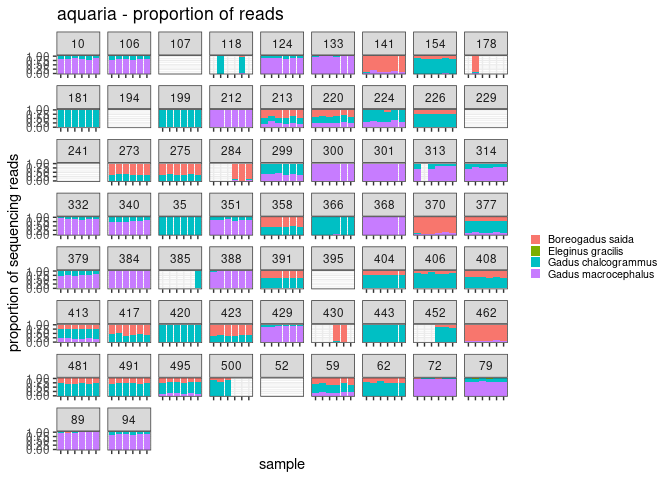
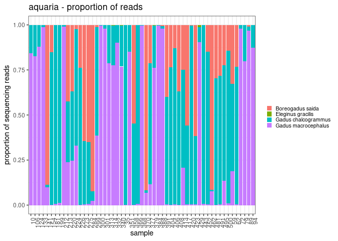

summary of aquaria reads
================
Kimberly Ledger
2023-04-27

this code summarizes the aquaria results after doing some initial test
for filter in the code “gadid_ASV_analysis_20230421_aquaria.Rmd” and
testing for differences across treatments in the code
“gadid_aquaria_20230421_stats.Rmd”.

load libraries

``` r
library(tidyverse)
```

    ## ── Attaching packages ─────────────────────────────────────── tidyverse 1.3.2 ──
    ## ✔ ggplot2 3.4.0      ✔ purrr   0.3.5 
    ## ✔ tibble  3.1.8      ✔ dplyr   1.0.10
    ## ✔ tidyr   1.2.1      ✔ stringr 1.4.1 
    ## ✔ readr   2.1.3      ✔ forcats 0.5.2 
    ## ── Conflicts ────────────────────────────────────────── tidyverse_conflicts() ──
    ## ✖ dplyr::filter() masks stats::filter()
    ## ✖ dplyr::lag()    masks stats::lag()

``` r
library(ggplot2)
```

load data

``` r
aquaria_dat <- read.csv("/genetics/edna/workdir/gadids/20230421_aquaria/20230421_filtered_readsummary.csv") %>%
  dplyr::select(!X) %>%
  dplyr::select(!extraction_plate) %>%
  dplyr::select(!extraction_well) %>%
  rename("prep" = "replicate")  ##rename replicate to not confuse as true replicates, these are the same sample but used different library prep methods
```

since we’ve learned that the prep method and the extraction replicate do
not significantly affect the composition of samples, i will treat the
different Sample_IDs within an alternative_ID as replicates.

    ## Warning: Removed 256 rows containing missing values (`position_stack()`).

    ## Warning: Position guide is perpendicular to the intended axis
    ## ℹ Did you mean to specify a different guide `position`?
    ## Position guide is perpendicular to the intended axis
    ## ℹ Did you mean to specify a different guide `position`?
    ## Position guide is perpendicular to the intended axis
    ## ℹ Did you mean to specify a different guide `position`?
    ## Position guide is perpendicular to the intended axis
    ## ℹ Did you mean to specify a different guide `position`?
    ## Position guide is perpendicular to the intended axis
    ## ℹ Did you mean to specify a different guide `position`?
    ## Position guide is perpendicular to the intended axis
    ## ℹ Did you mean to specify a different guide `position`?

<!-- -->

my guess is that any alt_IDs with 4 or more 0’s out of the six
replicates was probably a “field blank”. let’s make a list of those.

``` r
possible_field_blanks <- aquaria_dat %>% 
  filter(sample_type == "sample") %>%
  group_by(alternative_ID, Sample_ID) %>%
  mutate(sum=sum(reads)) %>%
  mutate(prop = reads/sum) %>%
  summarise(count = sum(sum == 0)/4) %>%
  group_by(alternative_ID) %>%
  summarize(num_of_zeros = sum(count)) %>%
  filter(num_of_zeros >= 4)
```

    ## `summarise()` has grouped output by 'alternative_ID'. You can override using
    ## the `.groups` argument.

``` r
possible_field_blanks
```

    ## # A tibble: 10 × 2
    ##    alternative_ID num_of_zeros
    ##    <chr>                 <dbl>
    ##  1 107                       6
    ##  2 118                       4
    ##  3 178                       5
    ##  4 194                       6
    ##  5 229                       6
    ##  6 241                       6
    ##  7 385                       5
    ##  8 395                       6
    ##  9 430                       4
    ## 10 52                        6

next i will remove the samples i think might be field blanks, and then i
will average the compostion in the replicates and plot. just averaging
for now to make a visual. likely want to retain replicates in actual
analyses (?)

``` r
blanks <- possible_field_blanks$alternative_ID

sample_avg <- aquaria_dat %>% 
  filter(sample_type == "sample") %>%
  filter(alternative_ID != 107) %>%  #for some reason filtering by "blanks" didn't work so i'm going the long way... 
  filter(alternative_ID != 118) %>%
  filter(alternative_ID != 178) %>%
  filter(alternative_ID != 194) %>%
  filter(alternative_ID != 229) %>%
  filter(alternative_ID != 241) %>%
  filter(alternative_ID != 385) %>%
  filter(alternative_ID != 395) %>%
  filter(alternative_ID != 430) %>%
  filter(alternative_ID != 52) %>%
  group_by(Sample_ID) %>%
  mutate(sum=sum(reads)) %>%
  mutate(prop = reads/sum) %>%  
  group_by(alternative_ID, taxon) %>%
  summarize(avg_prop = mean(prop, na.rm = TRUE),
            sd_prop = sd(prop))
```

    ## `summarise()` has grouped output by 'alternative_ID'. You can override using
    ## the `.groups` argument.

``` r
sample_avg %>%
  arrange(taxon, avg_prop) %>%
  ggplot(aes(x=alternative_ID, y=avg_prop, fill=taxon)) +
  geom_bar(stat = "identity") + 
  theme_bw() +
  labs(
    y = "proportion of sequencing reads",
    x = "sample",
    title = "aquaria - proportion of reads") + 
  theme(
    axis.text.x = element_text(angle = 90, hjust = 0.95),
    legend.text = element_text(size = 8),
    legend.key.size = unit(0.3, "cm"),
    legend.position = "right",
    legend.title = element_blank()
  )
```

<!-- -->

think of a way to include errors in proportions into a visual… is there
a way to arrange the order of these stacked barplot by prop of the taxa?

next it would be great to have some metadata for these samples to know
replicates and species proportions
