asv analysis
================
Kimberly Ledger
2023-03-01

analysis of gadid sequences from Feb 16 2023 MiSeq run

load libraries

``` r
library(tidyverse)
```

    ## ── Attaching packages ─────────────────────────────────────── tidyverse 1.3.2 ──
    ## ✔ ggplot2 3.4.0      ✔ purrr   0.3.5 
    ## ✔ tibble  3.1.8      ✔ dplyr   1.0.10
    ## ✔ tidyr   1.2.1      ✔ stringr 1.4.1 
    ## ✔ readr   2.1.3      ✔ forcats 0.5.2 
    ## ── Conflicts ────────────────────────────────────────── tidyverse_conflicts() ──
    ## ✖ dplyr::filter() masks stats::filter()
    ## ✖ dplyr::lag()    masks stats::lag()

``` r
library(ggplot2)
```

read in gadid metadata

``` r
#20230216 has same sample metadata as the run on 20230221 so i'll just use that 
metadata <- read.csv("/genetics/edna/workdir/gadids/20230221/20230221_gadidmetadata.csv")

#illumina output changed "_" to "-"
metadata$SampleID <- gsub("_", "-", metadata$SampleID) 

metadata$primer_set[which(metadata$primer_set == "ND1")] <- "S1"
metadata$primer_set[which(metadata$primer_set == "ND5")] <- "S3"
```

read in all primer set’s taxonomic identification tables and samples by
asv tables

``` r
taxon_S1 <- read.csv("/genetics/edna/workdir/gadids/20230216/S1_ND1/trimmed/filtered/outputs/asv_taxonomy_blastn.csv", row.names = 1) 
taxon_S3 <- read.csv("/genetics/edna/workdir/gadids/20230216/S3_ND5/trimmed/filtered/outputs/asv_taxonomy_blastn.csv", row.names = 1) 

asv_table_S1 <- read.csv("/genetics/edna/workdir/gadids/20230216/S1_ND1/trimmed/filtered/outputs/ASVtable.csv") %>%
  rename(SampleID = X)
asv_table_S3 <- read.csv("/genetics/edna/workdir/gadids/20230216/S3_ND5/trimmed/filtered/outputs/ASVtable.csv") %>%
  rename(SampleID = X)
```

look at the number of ASVs for each species by primer set

``` r
asvs1 <- taxon_S1 %>%
  group_by(taxon) %>%
  summarise(S1_ASVs = n())
asvs3 <- taxon_S3 %>%
  group_by(taxon) %>%
  summarise(S3_ASVs = n())


merge(asvs1,asvs3)
```

    ##                  taxon S1_ASVs S3_ASVs
    ## 1 Arctogadus glacialis       9       2
    ## 2     Boreogadus saida       6       3
    ## 3    Eleginus gracilis      11       6
    ## 4  Gadus chalcogrammus      67      60
    ## 5  Gadus macrocephalus       8      10
    ## 6  Microgadus proximus      13       3

quite a bit of variation for some of the species

now, join taxon and asv tables for each primer set separately

``` r
read_summary_S1 <- asv_table_S1 %>%
  pivot_longer(cols = starts_with("ASV"), names_to = "ASV", values_to = "count") %>%
  left_join(taxon_S1, by = "ASV") %>%
  filter(count > 0) %>%
  filter(taxon != "NA") %>%
  group_by(SampleID, taxon) %>%
  summarise(total_read_count = sum(count)) %>%
  pivot_wider(names_from = "taxon", values_from = "total_read_count") %>%
  replace(is.na(.), 0) %>%
  mutate(primer_set = "S1")
```

    ## `summarise()` has grouped output by 'SampleID'. You can override using the
    ## `.groups` argument.

``` r
read_summary_S3 <- asv_table_S3 %>%
  pivot_longer(cols = starts_with("ASV"), names_to = "ASV", values_to = "count") %>%
  left_join(taxon_S3, by = "ASV") %>%
  filter(count > 0) %>%
  filter(taxon != "NA") %>%
  group_by(SampleID, taxon) %>%
  summarise(total_read_count = sum(count)) %>%
  pivot_wider(names_from = "taxon", values_from = "total_read_count") %>%
  replace(is.na(.), 0) %>%
  mutate(primer_set = "S3")
```

    ## `summarise()` has grouped output by 'SampleID'. You can override using the
    ## `.groups` argument.

join to metadata

``` r
read_summary_all <- bind_rows(read_summary_S1, read_summary_S3)

join <- metadata %>%
  left_join(read_summary_all, by = c("SampleID", "primer_set"))

join_long <- join %>%
  pivot_longer(cols = 6:11, names_to = "taxon", values_to = "reads") %>%
  mutate(reads = ifelse(is.na(reads), 0, reads))

join_long$Project<- as.factor(join_long$Project)
join_long$shortID<- as.factor(join_long$shortID)
join_long$primer_set <- as.factor(join_long$primer_set)
join_long$replicate <- as.factor(join_long$replicate)
join_long$taxon <- as.factor(join_long$taxon)

summary(join_long)
```

    ##    SampleID         Project      shortID    primer_set replicate 
    ##  Length:792         egg:156   NC     : 72   S1:396     1   :276  
    ##  Class :character   MC :252   even   : 36   S3:396     2   :276  
    ##  Mode  :character   NBS:384   middle : 36              3   : 84  
    ##                               north1 : 36              NA's:156  
    ##                               north2 : 36                        
    ##                               pcod   : 36                        
    ##                               (Other):540                        
    ##                   taxon         reads        
    ##  Arctogadus glacialis:132   Min.   :    0.0  
    ##  Boreogadus saida    :132   1st Qu.:    0.0  
    ##  Eleginus gracilis   :132   Median :    0.0  
    ##  Gadus chalcogrammus :132   Mean   : 1104.7  
    ##  Gadus macrocephalus :132   3rd Qu.:  724.2  
    ##  Microgadus proximus :132   Max.   :28429.0  
    ## 

## take a look at the gadid egg samples

``` r
eggs <- join_long %>%
  filter(Project == "egg")
```

make some general plots for read counts

``` r
eggs %>%
  ggplot(aes(x= SampleID, y = reads, fill = taxon)) +
  geom_bar(stat = "identity") + 
  scale_y_sqrt() +
  facet_grid(~primer_set, scales = 'free') + 
  theme_bw() +
  labs(
    y = "sequencing reads",
    x = "taxon",
    title = "assigned reads") + 
  theme(
    axis.text.x = element_text(angle = 90, hjust = 0.95),
    legend.text = element_text(size = 8),
    legend.key.size = unit(0.3, "cm"),
    legend.position = "right",
    legend.title = element_blank()
  )
```

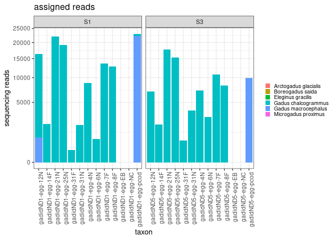<!-- -->

``` r
eggs_prop <- eggs %>%
  group_by(SampleID) %>%
  mutate(sum=sum(reads)) %>%
  mutate(prop = reads/sum) %>%
  select(!reads) %>%
  select(!sum)
```

``` r
eggs_prop %>% 
  ggplot(aes(x=SampleID, y=prop, fill=taxon)) +
  geom_bar(stat = "identity") + 
  facet_grid(~primer_set, scales = 'free') +
  theme_bw() +
  labs(
    y = "proportion of sequencing reads",
    x = "sample",
    title = "Gadid Eggs") + 
  theme(
    axis.text.x = element_text(angle = 90, hjust = 0.95),
    legend.text = element_text(size = 8),
    legend.key.size = unit(0.3, "cm"),
    legend.position = "right",
    legend.title = element_blank()
  )
```

    ## Warning: Removed 24 rows containing missing values (`position_stack()`).

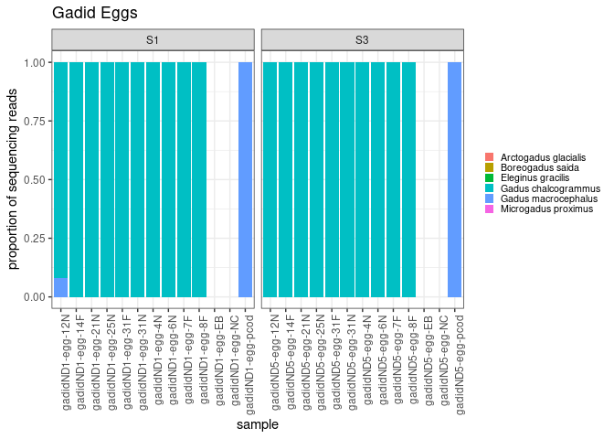<!-- -->

how many pcod reads were detected in sample 12N with primer S1?

``` r
eggs %>%
  filter(shortID == "12N") %>%
  filter(primer_set == "S1")
```

    ## # A tibble: 6 × 7
    ##   SampleID         Project shortID primer_set replicate taxon              reads
    ##   <chr>            <fct>   <fct>   <fct>      <fct>     <fct>              <dbl>
    ## 1 gadidND1-egg-12N egg     12N     S1         <NA>      Gadus chalcogramm…  9754
    ## 2 gadidND1-egg-12N egg     12N     S1         <NA>      Gadus macrocephal…   856
    ## 3 gadidND1-egg-12N egg     12N     S1         <NA>      Arctogadus glacia…     0
    ## 4 gadidND1-egg-12N egg     12N     S1         <NA>      Boreogadus saida       0
    ## 5 gadidND1-egg-12N egg     12N     S1         <NA>      Eleginus gracilis      0
    ## 6 gadidND1-egg-12N egg     12N     S1         <NA>      Microgadus proxim…     0

okay, so many reads of pcod are present. is it same exact ASV as the
positive control or something different?

``` r
asv_table_S1 %>%
  filter(SampleID == "gadidND1-egg-12N") %>%
  select_if(~ !is.numeric(.) || sum(.) !=0) %>%
  pivot_longer(cols = c(2:9), names_to = "ASV", values_to = "reads") %>%
  left_join(taxon_S1, by = "ASV")
```

    ## # A tibble: 8 × 5
    ##   SampleID         ASV    reads taxon               taxonomic_level
    ##   <chr>            <chr>  <int> <chr>               <chr>          
    ## 1 gadidND1-egg-12N ASV1    9086 Gadus chalcogrammus species        
    ## 2 gadidND1-egg-12N ASV4     668 Gadus chalcogrammus species        
    ## 3 gadidND1-egg-12N ASV18    856 Gadus macrocephalus species        
    ## 4 gadidND1-egg-12N ASV19    152 <NA>                <NA>           
    ## 5 gadidND1-egg-12N ASV71    171 <NA>                <NA>           
    ## 6 gadidND1-egg-12N ASV75    156 <NA>                <NA>           
    ## 7 gadidND1-egg-12N ASV114    84 <NA>                <NA>           
    ## 8 gadidND1-egg-12N ASV120    79 <NA>                <NA>

pcod from sample 12N is ASV18

``` r
asv_table_S1 %>%
  filter(SampleID == "gadidND1-egg-pcod") %>%
  select_if(~ !is.numeric(.) || sum(.) !=0) %>%
  pivot_longer(cols = c(2:4), names_to = "ASV", values_to = "reads") %>%
  left_join(taxon_S1, by = "ASV")
```

    ## # A tibble: 3 × 5
    ##   SampleID          ASV    reads taxon               taxonomic_level
    ##   <chr>             <chr>  <int> <chr>               <chr>          
    ## 1 gadidND1-egg-pcod ASV3   22206 Gadus macrocephalus species        
    ## 2 gadidND1-egg-pcod ASV27    213 <NA>                <NA>           
    ## 3 gadidND1-egg-pcod ASV237     6 Gadus chalcogrammus species

the positive control pcod is entirely ASV3. this may suggest that the
pcod in 12N is NOT lab contamination (at least from the positive
control).

conclusion: the majority of eggs are walleye pollock. maybe a few
pacific cod eggs are in sample 12N. i may want to compare ASV3 and ASV18
to see how similar they are.

## now take a look at the gblock mock communities

``` r
MC <- join_long %>%
  filter(Project == "MC")
```

make some general plots for read counts

``` r
MC %>%
  ggplot(aes(x= taxon, y = reads, fill = taxon)) +
  geom_bar(stat = "identity") + 
  scale_y_sqrt() +
  facet_grid(~primer_set, scales = 'free') + 
  theme_bw() +
  labs(
    y = "sequencing reads",
    x = "taxon",
    title = "assigned reads") + 
  theme(
    axis.text.x = element_text(angle = 90, hjust = 0.95),
    legend.text = element_text(size = 8),
    legend.key.size = unit(0.3, "cm"),
    legend.position = "right",
    legend.title = element_blank()
  )
```

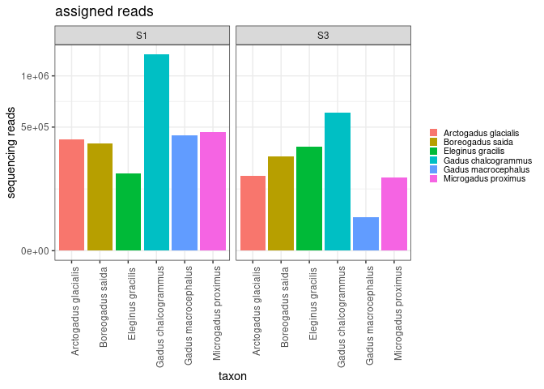<!-- -->

``` r
MC_prop <- MC %>%
  group_by(SampleID) %>%
  mutate(sum=sum(reads)) %>%
  mutate(prop = reads/sum) %>%
  select(!reads) %>%
  select(!sum)
```

``` r
MC_prop %>% 
  ggplot(aes(x=SampleID, y=prop, fill=taxon)) +
  geom_bar(stat = "identity") + 
  facet_grid(~primer_set, scales = 'free') +
  theme_bw() +
  labs(
    y = "proportion of sequencing reads",
    x = "sample",
    title = "mock community") + 
  theme(
    axis.text.x = element_text(angle = 90, hjust = 0.95),
    legend.text = element_text(size = 8),
    legend.key.size = unit(0.3, "cm"),
    legend.position = "right",
    legend.title = element_blank()
  )
```

    ## Warning: Removed 42 rows containing missing values (`position_stack()`).

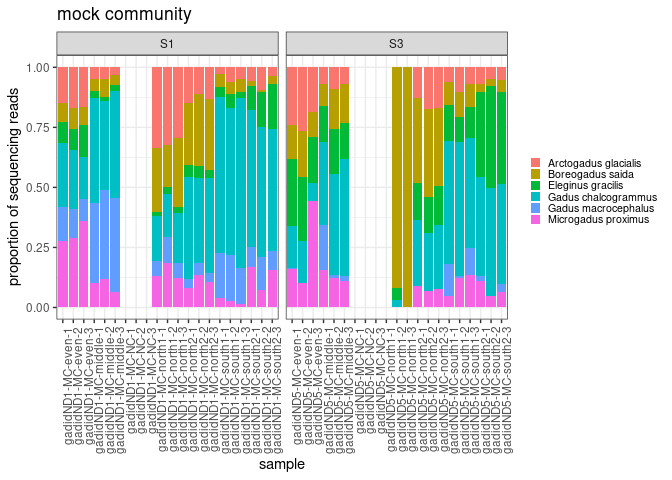<!-- -->

let’s read in metadata for the expected mock communities proportions to
use for comparison

``` r
mockc <- read.csv("/genetics/edna/workdir/gadids/20230221/mockcomm_metadata_20230221.csv") %>%
  rename(prop = Perc_Community) %>%
  rename(taxon = Species) %>%
  rename(shortID = Community) %>%
  mutate(Project = "MC") %>%
  mutate(SampleID = "expected") %>%
  mutate(primer_set = "expected") %>%
  mutate(replicate = 1)
```

``` r
MC_prop <- rbind(mockc, MC_prop)
```

## now let’s check out data!

any sequences in PCR blanks?

``` r
MC %>% 
  filter(shortID == "NC") %>%
  ggplot(aes(x=SampleID, y=reads, fill=taxon)) +
  geom_bar(stat = "identity") + 
  scale_y_sqrt() +
  facet_grid(~primer_set, scales = 'free') +
  theme_bw() +
  labs(
    y = "sequencing reads",
    x = "sample",
    title = "PCR blanks") + 
  theme(
    axis.text.x = element_text(angle = 90, hjust = 0.95),
    legend.text = element_text(size = 8),
    legend.key.size = unit(0.3, "cm"),
    legend.position = "right",
    legend.title = element_blank()
  )
```

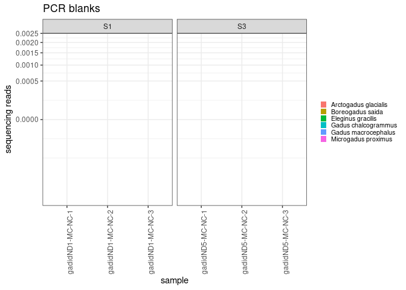<!-- -->

cool. no reads in negative controls.

## now let’s take a look at reads from the mock communities

### even

- each species should be \~16.6%

``` r
MC %>% 
  filter(shortID == "even") %>%
  ggplot(aes(x=SampleID, y=reads, fill=taxon)) +
  geom_bar(stat = "identity") + 
  #scale_y_sqrt() +
  facet_grid(~primer_set, scales = 'free') +
  theme_bw() +
  labs(
    y = "sequencing reads",
    x = "sample",
    title = "Even - number of reads") + 
  theme(
    axis.text.x = element_text(angle = 90, hjust = 0.95),
    legend.text = element_text(size = 8),
    legend.key.size = unit(0.3, "cm"),
    legend.position = "right",
    legend.title = element_blank()
  )
```

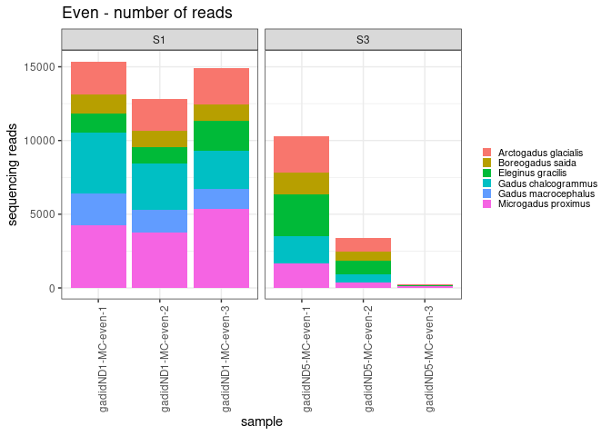<!-- -->

``` r
MC_prop %>% 
  filter(shortID == "even") %>%
  ggplot(aes(x=SampleID, y=prop, fill=taxon)) +
  geom_bar(stat = "identity") + 
  facet_grid(~primer_set, scales = 'free') +
  theme_bw() +
  labs(
    y = "proportion of sequencing reads",
    x = "sample",
    title = "Even - proportion of reads") + 
  theme(
    axis.text.x = element_text(angle = 90, hjust = 0.95),
    legend.text = element_text(size = 8),
    legend.key.size = unit(0.3, "cm"),
    legend.position = "right",
    legend.title = element_blank()
  )
```

<!-- -->

even now that i’m using gblocks, primer S3 is still having trouble with
Pcod

### north1

- A.glacilis (polar cod) = 25%
- B. saida (arctic cod) = 50%
- E. gracilis (saffron cod) = 5%
- G. chalcogrammus (Walleye pollock) = 10%
- G. macrocephalus (Pacific cod) = 5%
- M. proximus (tomcod) = 5%

``` r
MC %>% 
  filter(shortID == "north1") %>%
  ggplot(aes(x=SampleID, y=reads, fill=taxon)) +
  geom_bar(stat = "identity") + 
  #scale_y_sqrt() +
  facet_grid(~primer_set, scales = 'free') +
  theme_bw() +
  labs(
    y = "sequencing reads",
    x = "sample",
    title = "North1 - number of reads") + 
  theme(
    axis.text.x = element_text(angle = 90, hjust = 0.95),
    legend.text = element_text(size = 8),
    legend.key.size = unit(0.3, "cm"),
    legend.position = "right",
    legend.title = element_blank()
  )
```

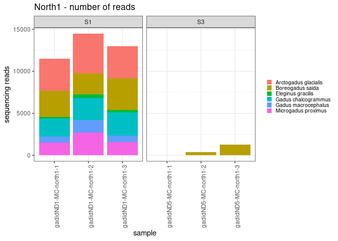<!-- -->

``` r
MC_prop %>% 
  filter(shortID == "north1") %>%
  ggplot(aes(x=SampleID, y=prop, fill=taxon)) +
  geom_bar(stat = "identity") + 
  facet_grid(~primer_set, scales = 'free') +
  theme_bw() +
  labs(
    y = "proportion of sequencing reads",
    x = "sample",
    title = "North1 - proportion of reads") + 
  theme(
    axis.text.x = element_text(angle = 90, hjust = 0.95),
    legend.text = element_text(size = 8),
    legend.key.size = unit(0.3, "cm"),
    legend.position = "right",
    legend.title = element_blank()
  )
```

    ## Warning: Removed 6 rows containing missing values (`position_stack()`).

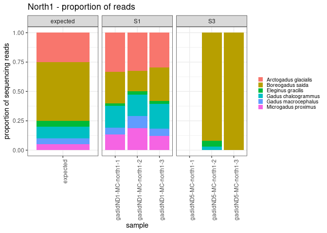<!-- -->

### north2

- A.glacilis (polar cod) = 10%
- B. saida (arctic cod) = 50%
- E. gracilis (saffron cod) = 5%
- G. chalcogrammus (Walleye pollock) = 25%
- G. macrocephalus (Pacific cod) = 5%
- M. proximus (tomcod) = 5%

``` r
MC %>% 
  filter(shortID == "north2") %>%
  ggplot(aes(x=SampleID, y=reads, fill=taxon)) +
  geom_bar(stat = "identity") + 
  #scale_y_sqrt() +
  facet_grid(~primer_set, scales = 'free') +
  theme_bw() +
  labs(
    y = "sequencing reads",
    x = "sample",
    title = "North2 - number of reads") + 
  theme(
    axis.text.x = element_text(angle = 90, hjust = 0.95),
    legend.text = element_text(size = 8),
    legend.key.size = unit(0.3, "cm"),
    legend.position = "right",
    legend.title = element_blank()
  )
```

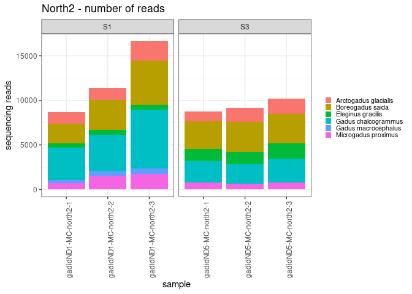<!-- -->

``` r
MC_prop %>% 
  filter(shortID == "north2") %>%
  ggplot(aes(x=SampleID, y=prop, fill=taxon)) +
  geom_bar(stat = "identity") + 
  facet_grid(~primer_set, scales = 'free') +
  theme_bw() +
  labs(
    y = "proportion of sequencing reads",
    x = "sample",
    title = "North2 - proportion of reads") + 
  theme(
    axis.text.x = element_text(angle = 90, hjust = 0.95),
    legend.text = element_text(size = 8),
    legend.key.size = unit(0.3, "cm"),
    legend.position = "right",
    legend.title = element_blank()
  )
```

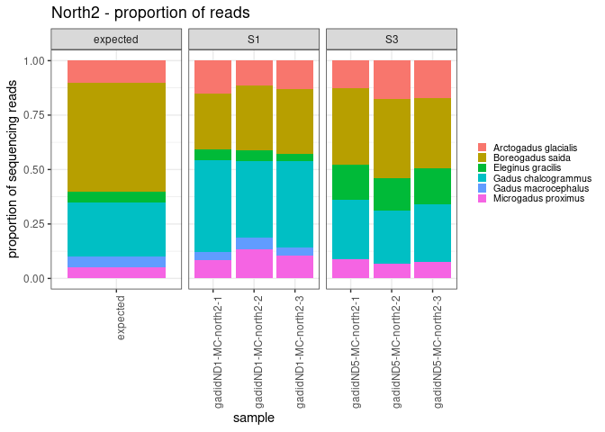<!-- -->

### south1

- A.glacilis (polar cod) = 5%
- B. saida (arctic cod) = 10%
- E. gracilis (saffron cod) = 5%
- G. chalcogrammus (Walleye pollock) = 50%
- G. macrocephalus (Pacific cod) = 25%
- M. proximus (tomcod) = 5%

``` r
MC %>% 
  filter(shortID == "south1") %>%
  ggplot(aes(x=SampleID, y=reads, fill=taxon)) +
  geom_bar(stat = "identity") + 
  #scale_y_sqrt() +
  facet_grid(~primer_set, scales = 'free') +
  theme_bw() +
  labs(
    y = "sequencing reads",
    x = "sample",
    title = "South1 - number of reads") + 
  theme(
    axis.text.x = element_text(angle = 90, hjust = 0.95),
    legend.text = element_text(size = 8),
    legend.key.size = unit(0.3, "cm"),
    legend.position = "right",
    legend.title = element_blank()
  )
```

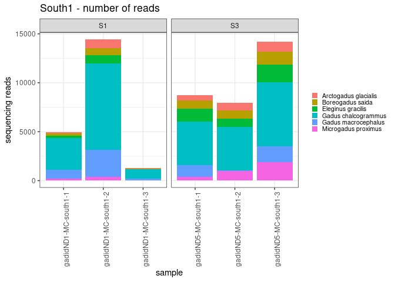<!-- -->

``` r
MC_prop %>% 
  filter(shortID == "south1") %>%
  ggplot(aes(x=SampleID, y=prop, fill=taxon)) +
  geom_bar(stat = "identity") + 
  facet_grid(~primer_set, scales = 'free') +
  theme_bw() +
  labs(
    y = "proportion of sequencing reads",
    x = "sample",
    title = "South1 - proportion of reads") + 
  theme(
    axis.text.x = element_text(angle = 90, hjust = 0.95),
    legend.text = element_text(size = 8),
    legend.key.size = unit(0.3, "cm"),
    legend.position = "right",
    legend.title = element_blank()
  )
```

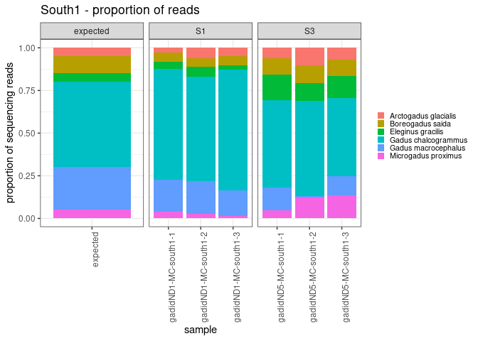<!-- -->

### south2

- A.glacilis (polar cod) = 5%
- B. saida (arctic cod) = 5%
- E. gracilis (saffron cod) = 25%
- G. chalcogrammus (Walleye pollock) = 50%
- G. macrocephalus (Pacific cod) = 10%
- M. proximus (tomcod) = 5%

``` r
MC %>% 
  filter(shortID == "south2") %>%
  ggplot(aes(x=SampleID, y=reads, fill=taxon)) +
  geom_bar(stat = "identity") + 
  #scale_y_sqrt() +
  facet_grid(~primer_set, scales = 'free') +
  theme_bw() +
  labs(
    y = "sequencing reads",
    x = "sample",
    title = "South2 - number of reads") + 
  theme(
    axis.text.x = element_text(angle = 90, hjust = 0.95),
    legend.text = element_text(size = 8),
    legend.key.size = unit(0.3, "cm"),
    legend.position = "right",
    legend.title = element_blank()
  )
```

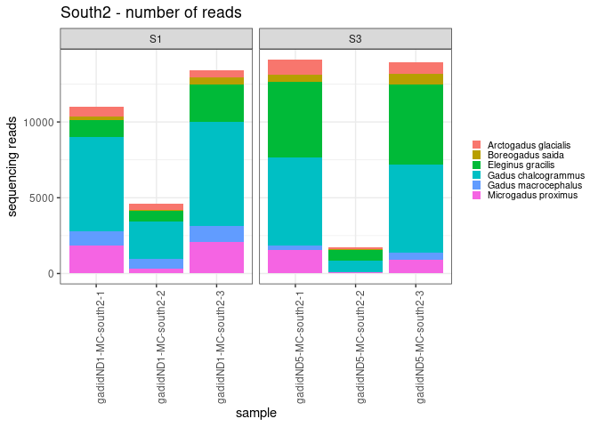<!-- -->

``` r
MC_prop %>% 
  filter(shortID == "south2") %>%
  ggplot(aes(x=SampleID, y=prop, fill=taxon)) +
  geom_bar(stat = "identity") + 
  facet_grid(~primer_set, scales = 'free') +
  theme_bw() +
  labs(
    y = "proportion of sequencing reads",
    x = "sample",
    title = "South2 - proportion of reads") + 
  theme(
    axis.text.x = element_text(angle = 90, hjust = 0.95),
    legend.text = element_text(size = 8),
    legend.key.size = unit(0.3, "cm"),
    legend.position = "right",
    legend.title = element_blank()
  )
```

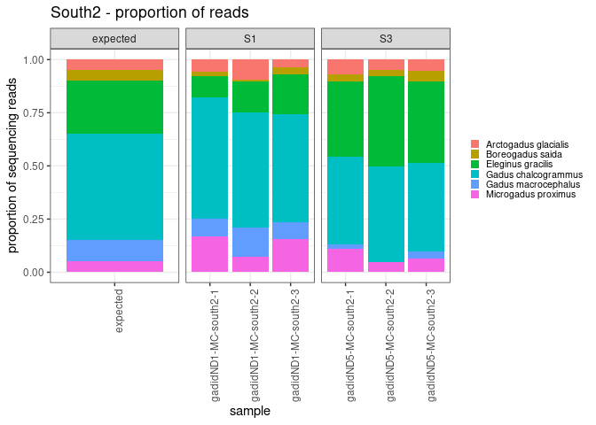<!-- -->

### middle

- A.glacilis (polar cod) = 5%
- B. saida (arctic cod) = 10%
- E. gracilis (saffron cod) = 5%
- G. chalcogrammus (Walleye pollock) = 25%
- G. macrocephalus (Pacific cod) = 50%
- M. proximus (tomcod) = 5%

``` r
MC %>% 
  filter(shortID == "middle") %>%
  ggplot(aes(x=SampleID, y=reads, fill=taxon)) +
  geom_bar(stat = "identity") + 
  #scale_y_sqrt() +
  facet_grid(~primer_set, scales = 'free') +
  theme_bw() +
  labs(
    y = "sequencing reads",
    x = "sample",
    title = "Middle - number of reads") + 
  theme(
    axis.text.x = element_text(angle = 90, hjust = 0.95),
    legend.text = element_text(size = 8),
    legend.key.size = unit(0.3, "cm"),
    legend.position = "right",
    legend.title = element_blank()
  )
```

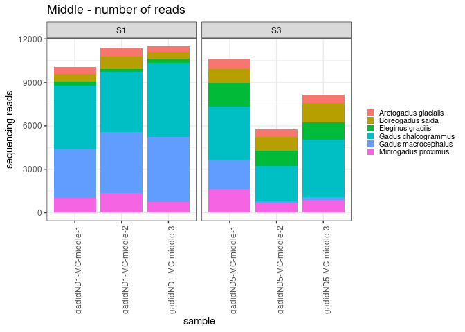<!-- -->

``` r
MC_prop %>% 
  filter(shortID == "middle") %>%
  ggplot(aes(x=SampleID, y=prop, fill=taxon)) +
  geom_bar(stat = "identity") + 
  facet_grid(~primer_set, scales = 'free') +
  theme_bw() +
  labs(
    y = "proportion of sequencing reads",
    x = "sample",
    title = "Middle - proportion of reads") + 
  theme(
    axis.text.x = element_text(angle = 90, hjust = 0.95),
    legend.text = element_text(size = 8),
    legend.key.size = unit(0.3, "cm"),
    legend.position = "right",
    legend.title = element_blank()
  )
```

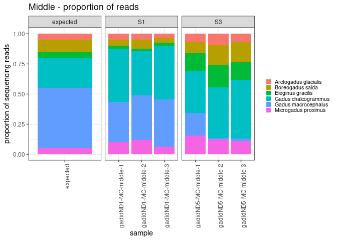<!-- -->

if there are less around 1000 reads for a sample, the mock community
proportions noticeably deviate from what is expected. later on, i should
filter samples to only include ones with \>1000 reads for consideration
in calibration.

## now i want to plot expected proportion by observed proportion

i’m re-reading in the mock community table here because i made changes
to it above… should eventually come back here and streamline

``` r
mockcomm <- read.csv("/genetics/edna/workdir/gadids/20230221/mockcomm_metadata_20230221.csv") %>%
  rename(Prop_Community = Perc_Community)
```

``` r
MC_table <- MC %>%
  group_by(SampleID) %>%
  mutate(sum=sum(reads)) %>%
  mutate(prop = reads/sum) %>%
  rename(Community = shortID) %>%
  rename(Species = taxon) %>%
  left_join(mockcomm, by= c("Community", "Species")) %>%
  filter(Community != "NC")    ### come back and include these later? 
```

``` r
MC_table %>% 
  ggplot(aes(x=Prop_Community, y=prop, color=Species)) +
  geom_point(aes(shape = Community)) + 
  facet_wrap(~primer_set, scales = 'free') +
  geom_smooth(method = "lm", alpha = 0.1, aes(fill = Species)) +
  theme_bw() +
  ylim(0, 0.75) +
  geom_abline(intercept = 0, slope = 1, linetype = 'dotted') +
  labs(
    y = "observed proportion",
    x = "true proportion",
    title = "comparison of known mock community with observed raw read proportion") 
```

    ## `geom_smooth()` using formula = 'y ~ x'

    ## Warning: Removed 8 rows containing non-finite values (`stat_smooth()`).

    ## Warning: Removed 8 rows containing missing values (`geom_point()`).

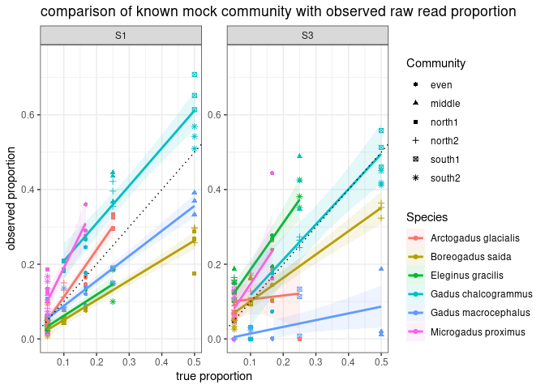<!-- -->

so, it doesn’t greater sequencing depth changed this much (ie 20230221
is quite similar)

## plot true proportion by fold error (as in Shelton et al Appendix S1 Figure S2)

``` r
# MC_table %>%
#   mutate(fold_error = log(Prop_Community/prop)) %>%
#   ggplot(aes(x=Prop_Community, y=fold_error, color=Species)) +
#   geom_point(aes(shape = Community)) + 
#   geom_hline(yintercept = 0, linetype = 'dotted') +
#   facet_wrap(~primer_set, scales = 'free') +
#   theme_bw() +
#   ylim(-1.5,4) +
#   labs(
#     y = "Fold Error (log[true_prop/obs_prop])",
#     x = "true proportion",
#     title = "comparison of known mock community with error estimates") 
```

``` r
# prop_table %>%
#   mutate(fold_error = log(Prop_Community/prop)) %>%
#   mutate(Prop_Community = as.factor(Prop_Community)) %>%
#   ggplot(aes(x=Prop_Community, y=fold_error)) +
#   geom_boxplot() + 
#   geom_hline(yintercept = 0, linetype = 'dotted') +
#   facet_wrap(~primer_set, scales = 'free') +
#   theme_bw() +
#   ylim(-1.5,4) +
#   labs(
#     y = "Fold Error (log[true_prop/obs_prop])",
#     x = "true proportion",
#     title = "comparison of known mock community with error estimates") 
```

## use the slope of the true vs observed proportion line as amplifiction efficiency estimate

``` r
library(broom)
amp_est_95 <- MC_table %>%
  group_by(primer_set, Species) %>%
  do(tidy(lm(prop ~ Prop_Community, .), conf.int =TRUE, conf.level = 0.95)) %>%
  filter(term == "Prop_Community") %>%
  select(Species, estimate, conf.low, conf.high, p.value) %>%
  rename(u95 = conf.high) %>%
  rename(l95 = conf.low) 
```

    ## Adding missing grouping variables: `primer_set`

``` r
#amp_est_95

amp_est_50 <- MC_table %>%
  group_by(primer_set, Species) %>%
  do(tidy(lm(prop ~ Prop_Community, .), conf.int =TRUE, conf.level = 0.5)) %>%
  filter(term == "Prop_Community") %>%
  select(Species, estimate, conf.low, conf.high, p.value) %>%
  rename(u50 = conf.high) %>%
  rename(l50 = conf.low) 
```

    ## Adding missing grouping variables: `primer_set`

``` r
#amp_est_50

amp_est <- amp_est_95 %>%
  left_join(amp_est_50)
```

    ## Joining, by = c("primer_set", "Species", "estimate", "p.value")

``` r
amp_est
```

    ## # A tibble: 12 × 8
    ## # Groups:   primer_set, Species [12]
    ##    primer_set Species              estimate     l95   u95  p.value     l50   u50
    ##    <fct>      <chr>                   <dbl>   <dbl> <dbl>    <dbl>   <dbl> <dbl>
    ##  1 S1         Arctogadus glacialis    1.26   1.08   1.43  5.26e-11  1.20   1.31 
    ##  2 S1         Boreogadus saida        0.531  0.459  0.603 4.02e-11  0.508  0.555
    ##  3 S1         Eleginus gracilis       0.564  0.430  0.697 1.27e- 7  0.520  0.607
    ##  4 S1         Gadus chalcogrammus     1.01   0.812  1.20  8.15e- 9  0.944  1.07 
    ##  5 S1         Gadus macrocephalus     0.670  0.585  0.754 1.45e-11  0.642  0.697
    ##  6 S1         Microgadus proximus     1.78   1.21   2.36  6.78e- 6  1.60   1.97 
    ##  7 S3         Arctogadus glacialis    0.103 -0.486  0.693 7.14e- 1 -0.0879 0.295
    ##  8 S3         Boreogadus saida        1.22   0.719  1.72  1.08e- 4  1.06   1.38 
    ##  9 S3         Eleginus gracilis       1.25   0.912  1.58  9.76e- 7  1.14   1.36 
    ## 10 S3         Gadus chalcogrammus     0.943  0.611  1.28  2.23e- 5  0.836  1.05 
    ## 11 S3         Gadus macrocephalus     0.181  0.0167 0.344 3.30e- 2  0.127  0.234
    ## 12 S3         Microgadus proximus     1.32   0.388  2.25  8.62e- 3  1.02   1.62

plot it

``` r
mock_amp_eff <- amp_est %>%
  ggplot() +
  geom_errorbarh(aes(xmin=l50,xmax=u50,y=Species),size=2,height=0) +
  geom_errorbarh(aes(xmin=l95,xmax=u95,y=Species),size=0.8,height=0) +
  geom_point(aes(x=estimate,y=Species,fill=Species,),size=3,shape=21) +
  geom_vline(xintercept=1,linetype="dashed") +
  facet_grid(rows = vars(primer_set)) +
  #facet_grid(~primer_set, vars(rows = 5, cols = 1)) +
  #scale_fill_manual(values=clr_alpha_sum$manual.col %>% as.character()) +
  scale_x_continuous("Amplification Efficiency (i.e. slope)") +
  scale_y_discrete(NULL) +
  theme_bw() +
  theme(legend.position = "none",
        axis.text.y = element_text(size=10))
```

    ## Warning: Using `size` aesthetic for lines was deprecated in ggplot2 3.4.0.
    ## ℹ Please use `linewidth` instead.

``` r
mock_amp_eff
```

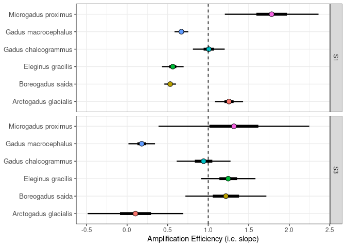<!-- -->

okay, so primer set S1 is looking good. the only thing is that it over
amplifies tomcod. but this is likely not a huge issue when it comes to
field samples because tomcod are not as common as other cod species.

## if i filter samples by total read count assigned to ASV’s, does this improve performance?

``` r
few_reads <- MC_table %>%
  group_by(SampleID) %>%
  summarize(read_total = sum(reads)) %>%
  filter(read_total < 1000) 

few_reads
```

    ## # A tibble: 3 × 2
    ##   SampleID             read_total
    ##   <chr>                     <dbl>
    ## 1 gadidND5-MC-even-3          232
    ## 2 gadidND5-MC-north1-1          0
    ## 3 gadidND5-MC-north1-2        378

``` r
MC_table %>%
  filter(!(SampleID %in% few_reads$SampleID)) %>%
  ggplot(aes(x=Prop_Community, y=prop, color=Species)) +
  geom_point(aes(shape = Community)) + 
  facet_wrap(~primer_set, scales = 'free') +
  geom_smooth(method = "lm", alpha = 0.1, aes(fill = Species)) +
  theme_bw() +
  ylim(0, 0.75) +
  geom_abline(intercept = 0, slope = 1, linetype = 'dotted') +
  labs(
    y = "observed proportion",
    x = "true proportion",
    title = "comparison of known mock community with observed raw read proportion") 
```

    ## `geom_smooth()` using formula = 'y ~ x'

    ## Warning: Removed 1 rows containing non-finite values (`stat_smooth()`).

    ## Warning: Removed 1 rows containing missing values (`geom_point()`).

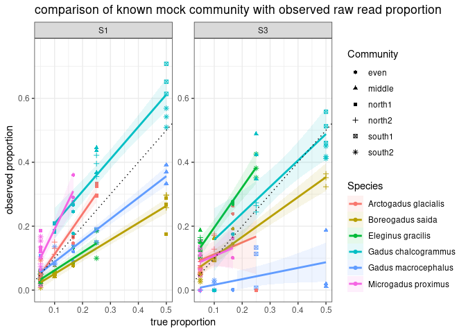<!-- -->

S1 doesn’t change, but S3 does improve a bit… for some reason, S3
doesn’t like Pcod.

to do next: run through Shelton et al. code to see if calibration
methods improve read estimates

## take a look at the NBS samples

``` r
NBS <- join_long %>%
  filter(Project == "NBS")
```

make some general plots for read counts

``` r
NBS %>%
  ggplot(aes(x= SampleID, y = reads, fill = taxon)) +
  geom_bar(stat = "identity") + 
  scale_y_sqrt() +
  facet_grid(~primer_set, scales = 'free') + 
  theme_bw() +
  labs(
    y = "sequencing reads",
    x = "taxon",
    title = "assigned reads") + 
  theme(
    axis.text.x = element_text(angle = 90, hjust = 0.95),
    legend.text = element_text(size = 8),
    legend.key.size = unit(0.3, "cm"),
    legend.position = "right",
    legend.title = element_blank()
  )
```

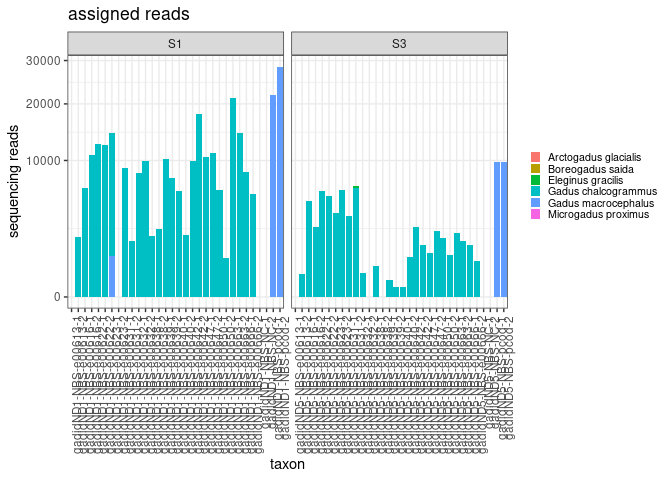<!-- -->

if you look closely, there are saffron cod reads.

``` r
NBS_prop <- NBS %>%
  group_by(SampleID) %>%
  mutate(sum=sum(reads)) %>%
  mutate(prop = reads/sum) %>%
  select(!reads) %>%
  select(!sum)
```

``` r
NBS_prop %>% 
  ggplot(aes(x=SampleID, y=prop, fill=taxon)) +
  geom_bar(stat = "identity") + 
  facet_grid(~primer_set, scales = 'free') +
  theme_bw() +
  labs(
    y = "proportion of sequencing reads",
    x = "sample",
    title = "NBS") + 
  theme(
    axis.text.x = element_text(angle = 90, hjust = 0.95),
    legend.text = element_text(size = 8),
    legend.key.size = unit(0.3, "cm"),
    legend.position = "right",
    legend.title = element_blank()
  )
```

    ## Warning: Removed 54 rows containing missing values (`position_stack()`).

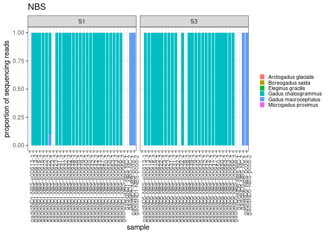<!-- -->

so it looks like pollock really dominated the samples. let’s just do
another quick check for the other species.

``` r
NBS %>%
  filter(taxon != "Gadus chalcogrammus") %>%
  filter(reads > 0)
```

    ## # A tibble: 6 × 7
    ##   SampleID              Project shortID primer_set replicate taxon         reads
    ##   <chr>                 <fct>   <fct>   <fct>      <fct>     <fct>         <dbl>
    ## 1 gadidND1-NBS-e00623-1 NBS     e00623  S1         1         Gadus macroc…   901
    ## 2 gadidND1-NBS-pcod-1   NBS     pcod    S1         1         Gadus macroc… 21841
    ## 3 gadidND1-NBS-pcod-2   NBS     pcod    S1         2         Gadus macroc… 28429
    ## 4 gadidND5-NBS-pcod-1   NBS     pcod    S3         1         Gadus macroc…  9833
    ## 5 gadidND5-NBS-e00631-2 NBS     e00631  S3         2         Eleginus gra…     3
    ## 6 gadidND5-NBS-pcod-2   NBS     pcod    S3         2         Gadus macroc…  9757

okay, so apart of the Pcod positive controls, only one field sample had
Pcod and one field sample had saffron cod reads.

perhaps if i want to be conservative in my composition estimates, i
should only include samples with \>1000 total reads. let’s filter for
overall read count and plot.

``` r
few_reads <- NBS %>%
  group_by(SampleID) %>%
  summarize(read_total = sum(reads)) %>%
  filter(read_total < 1000) 

few_reads
```

    ## # A tibble: 19 × 2
    ##    SampleID              read_total
    ##    <chr>                      <dbl>
    ##  1 gadidND1-NBS-e00613-1          0
    ##  2 gadidND1-NBS-e00623-2          0
    ##  3 gadidND1-NBS-e00650-2        831
    ##  4 gadidND1-NBS-NC-1              0
    ##  5 gadidND1-NBS-NC-2              0
    ##  6 gadidND5-NBS-e00613-1          0
    ##  7 gadidND5-NBS-e00613-2        282
    ##  8 gadidND5-NBS-e00632-1        319
    ##  9 gadidND5-NBS-e00632-2          0
    ## 10 gadidND5-NBS-e00638-1        507
    ## 11 gadidND5-NBS-e00638-2          0
    ## 12 gadidND5-NBS-e00639-1        146
    ## 13 gadidND5-NBS-e00639-2         55
    ## 14 gadidND5-NBS-e00640-1         58
    ## 15 gadidND5-NBS-e00640-2        842
    ## 16 gadidND5-NBS-e00650-2        964
    ## 17 gadidND5-NBS-e00666-2        705
    ## 18 gadidND5-NBS-NC-1              0
    ## 19 gadidND5-NBS-NC-2              0

``` r
NBS %>%
  filter(!(SampleID %in% few_reads$SampleID)) %>%
  ggplot(aes(x= SampleID, y = reads, fill = taxon)) +
  geom_bar(stat = "identity") + 
  scale_y_sqrt() +
  facet_grid(~primer_set, scales = 'free') + 
  theme_bw() +
  labs(
    y = "sequencing reads",
    x = "taxon",
    title = "assigned reads") + 
  theme(
    axis.text.x = element_text(angle = 90, hjust = 0.95),
    legend.text = element_text(size = 8),
    legend.key.size = unit(0.3, "cm"),
    legend.position = "right",
    legend.title = element_blank()
  )
```

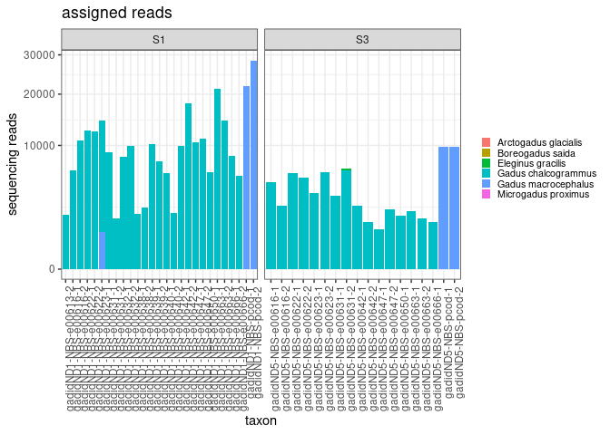<!-- -->

### now let’s compare to the NBS data analysis completed previously with the MiFish primers and insect taxonomic analysis

``` r
nbs_meta <- read.csv("/home/kimberly.ledger/NBS_eDNA/NBS_eDNA/NBS_2021_metadata_kjl.csv") %>%
  select(!X) %>%
  arrange(Sample_ID)
```

keeping just the Gadiformes reads

``` r
taxon_12s <- read.csv("/home/kimberly.ledger/NBS_eDNA/NBS_eDNA/taxon_table.csv", row.names = 1) %>%
  filter(order == "Gadiformes")
```

reformat

``` r
mytax <- taxon_12s$taxon

nbs.df <- taxon_12s %>%
  select(!taxID:species)

row.names(nbs.df) <- mytax

nbs.df.trans <- data.frame(t(nbs.df))

mysamples <- row.names(nbs.df.trans)

nbs.df.trans$Sample_ID <- mysamples

df <- nbs_meta %>%
  left_join(nbs.df.trans, by = "Sample_ID")
```

pivot table

``` r
df_long <- df %>%
  pivot_longer(Gadidae:Gadoidei, names_to = "taxon", values_to = "reads")
```

keep only the samples that i also used the gadid specific primers with

``` r
ids <- NBS %>%
  select(shortID) %>%
  unique()
```

remove positive and negative control from list

``` r
ids <- ids[-c(15:16),]
```

``` r
df_reduced <- df_long %>%
  filter(Extraction_ID %in% ids$shortID)
```

plot

``` r
df_reduced %>%
  ggplot(aes(x= Sample_ID, y = reads, fill = taxon)) +
  geom_bar(stat = "identity") + 
  scale_y_sqrt() +
  theme_bw() +
  labs(
    y = "sequencing reads",
    x = "taxon",
    title = "assigned reads - 12S") + 
  theme(
    axis.text.x = element_text(angle = 90, hjust = 0.95),
    legend.text = element_text(size = 8),
    legend.key.size = unit(0.3, "cm"),
    legend.position = "right",
    legend.title = element_blank()
  )
```

<!-- -->

what field sample had saffron cod?

``` r
df_long %>%
  filter(taxon == "Eleginus.gracilis") %>%
  filter(reads > 0)
```

    ## # A tibble: 5 × 13
    ##    Sort Extracti…¹ Sampl…² Stati…³ Depth Sampl…⁴ Extac…⁵ Sampl…⁶ Ext_I…⁷ Ext_D…⁸
    ##   <int> <chr>      <chr>     <int> <int> <chr>   <chr>   <chr>   <chr>   <chr>  
    ## 1   636 e00636     e00636…      20    10 No      No      9/5/20… MP      2/23/2…
    ## 2   653 e00653     e00653…      23    10 No      No      9/9/20… MP      2/23/2…
    ## 3   653 e00653     e00653…      23    10 No      No      9/9/20… MP      2/23/2…
    ## 4   653 e00653     e00653…      23    10 No      No      9/9/20… MP      2/23/2…
    ## 5   655 e00655     e00655…      23    10 No      No      9/9/20… MP      2/23/2…
    ## # … with 3 more variables: Ext_Plate <chr>, taxon <chr>, reads <int>, and
    ## #   abbreviated variable names ¹​Extraction_ID, ²​Sample_ID, ³​Station_ID,
    ## #   ⁴​Sample_blank, ⁵​Extaction_blank, ⁶​Sample_Date, ⁷​Ext_Initials, ⁸​Ext_Date

unfortunately, i did not use the gadid primers with any of these :(

what field sample had Pcod?

``` r
df_reduced %>%
  filter(taxon == "Gadus.macrocephalus") %>%
  filter(reads > 0)
```

    ## # A tibble: 3 × 13
    ##    Sort Extracti…¹ Sampl…² Stati…³ Depth Sampl…⁴ Extac…⁵ Sampl…⁶ Ext_I…⁷ Ext_D…⁸
    ##   <int> <chr>      <chr>     <int> <int> <chr>   <chr>   <chr>   <chr>   <chr>  
    ## 1   613 e00613     e00613…       2    10 No      No      8/30/2… MP      2/23/2…
    ## 2   638 e00638     e00638…      23    40 No      No      9/6/20… MP      2/23/2…
    ## 3   642 e00642     e00642…      23    10 No      No      9/6/20… MP      2/23/2…
    ## # … with 3 more variables: Ext_Plate <chr>, taxon <chr>, reads <int>, and
    ## #   abbreviated variable names ¹​Extraction_ID, ²​Sample_ID, ³​Station_ID,
    ## #   ⁴​Sample_blank, ⁵​Extaction_blank, ⁶​Sample_Date, ⁷​Ext_Initials, ⁸​Ext_Date

okay, so three field samples that i included in the gadid primers had
pcod when using MiFish primers with the insect assignment. but none of
those samples amplified pcod when using either of the gadid primers.

with the information we have, it is not possible to know if the MiFish
primers/insect classifier misidentified the pcod, or if the gadid
specific primers are missing pcod in those three samples.
